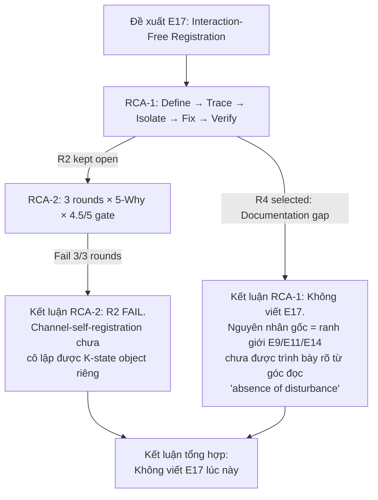
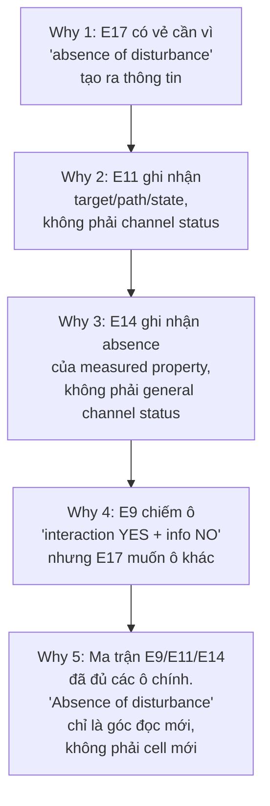

# Đánh Giá Chéo Hai Báo Cáo RCA cho E17

> **Phạm vi đánh giá:** Hai tài liệu RCA liên quan đến ứng viên E17 "Interaction-Free Registration" trong VVV-QMRF.

| # | Tài liệu | Vai trò | Ký hiệu |
|---|---|---|---|
| 1 | [rca_e17_interaction_free_registration.md](file:///c:/Stable_Diffusion/Buddhist_Epistemology_Quantum_Measurement/documents/research_documents/rca/rca_e17_interaction_free_registration.md) | RCA ban đầu — Xác định nguyên nhân gốc tại sao E17 được đề xuất | **RCA-1** |
| 2 | [rca_e17_r2_channel_self_registration.md](file:///c:/Stable_Diffusion/Buddhist_Epistemology_Quantum_Measurement/documents/research_documents/rca/rca_e17_r2_channel_self_registration.md) | RCA vòng 2 — Stress-test đường R2 (channel-self-registration) | **RCA-2** |

---

## 1. Tổng Quan Quy Trình: Hai RCA Hình Thành Một Chuỗi Logic

> [!IMPORTANT]
> Hai báo cáo **không song song** — chúng tạo thành một chuỗi: RCA-1 xác định 4 nguyên nhân ứng viên, chọn R4, nhưng **để ngỏ R2**. RCA-2 chính là việc stress-test R2 mà RCA-1 đã xếp hàng. Đây là thiết kế quy trình đúng.

---

## 2. Đánh Giá Phương Pháp Luận

### 2.1 RCA-1: RULE ZERO RCA (Define → Trace → Isolate → Fix → Verify)

| Tiêu chí | Đánh giá | Ghi chú |
|---|---|---|
| **Cấu trúc phương pháp** | ✅ Tốt | 5 bước RULE ZERO được tuân thủ đầy đủ và rõ ràng |
| **5-Why depth** | ✅ Tốt | 5 câu Why đi sâu từ triệu chứng bề mặt → nguyên nhân cấu trúc |
| **Candidate isolation** | ✅ Tốt | Xem xét 4 ứng viên (R1–R4) với bảng Good/Bad/Risk rõ ràng |
| **Decision matrix** | ✅ Xuất sắc | Routing table phân loại 4 cách đọc "absence of disturbance" → E9/E11/E14/Future R2 |
| **Boundary lemma** | ✅ Xuất sắc | Tạo mệnh đề ranh giới có thể tái sử dụng cho framework |
| **Fix → Verify separation** | ✅ Tốt | Fix không sửa code, chỉ queue downstream; Verify checklist 7 điểm |
| **Citation traceability** | ✅ Xuất sắc | Mọi claim đều có line-level citation đến E9/E11/E14 và BE SOT |

> **Điểm phương pháp RCA-1: 4.5/5** — Phương pháp rất chặt chẽ. Điểm trừ nhỏ: không có scoring rubric định lượng tường minh (chỉ có confidence 4.0/5 tổng hợp).

### 2.2 RCA-2: 3 Rounds × 5-Why × 4.5/5 Gate

| Tiêu chí | Đánh giá | Ghi chú |
|---|---|---|
| **Cấu trúc phương pháp** | ✅ Xuất sắc | 3 vòng độc lập, mỗi vòng có RCA + 5-Why + scoring table |
| **Gate threshold** | ✅ Nghiêm ngặt | 4.5/5 mỗi vòng — rất cao, phản ánh ý đồ bảo vệ framework |
| **Round design** | ✅ Tốt | 3 góc kiểm tra bổ trợ: Object → K-Architecture → BE+EX |
| **Hard stop rule** | ✅ Tốt | "Nếu không thể phát biểu K-state object trong 1 câu → FAIL" |
| **Scoring breakdown** | ✅ Tốt | Mỗi round chia 5 tiêu chí, mỗi tiêu chí max 1.0, có giải thích |
| **Reopening conditions** | ✅ Xuất sắc | Section 6 liệt kê 6 điều kiện tối thiểu nếu mở lại R2 |
| **Verification checklist** | ✅ Tốt | 8-point checklist cuối cùng |
| **Citation traceability** | ✅ Xuất sắc | Appendix A liệt kê tất cả sources + line ranges + RCA role |

> **Điểm phương pháp RCA-2: 4.7/5** — Cải thiện so với RCA-1 nhờ scoring rubric chi tiết hơn, gate threshold rõ ràng, và điều kiện mở lại.

---

## 3. Đánh Giá Tính Nhất Quán Giữa Hai Báo Cáo

### 3.1 Kết luận có tương thích không?

| Khía cạnh | RCA-1 | RCA-2 | Nhất quán? |
|---|---|---|---|
| **Quyết định chính** | Không viết E17 | Không viết E17 | ✅ Hoàn toàn nhất quán |
| **Nguyên nhân gốc** | R4: Documentation gap — E9/E11/E14 đã đủ nhưng ranh giới chưa rõ từ góc đọc "absence of disturbance" | R2 FAIL: "channel condition itself" chưa cô lập được K-state object riêng | ✅ Bổ trợ, không mâu thuẫn |
| **Đánh giá R2** | "Not selected" nhưng "keep as future RCA path" | 3/3 rounds FAIL, avg 3.87/5 < 4.5/5 | ✅ RCA-2 đã test cái RCA-1 để ngỏ |
| **Confidence** | 4.0/5 | 3.87/5 (avg score) | ✅ Cùng hướng, cùng mức |
| **Downstream actions** | Boundary notes cho E11/E14 đã được thực thi ở `rca_core_extensibility_analysis.md` Appendix D (2026-05-22) | Giữ boundary notes, không tạo E17 | ✅ Nhất quán |
| **Điều kiện mở lại** | "Run second RCA focused on R2: channel-self-registration" | 6 điều kiện minimum nếu reopen | ✅ RCA-2 đã thực hiện + chi tiết hóa |

> [!NOTE]
> **Không có mâu thuẫn logic nào** giữa hai báo cáo. RCA-2 là sự thực thi chính xác của downstream action #2 mà RCA-1 đã xếp hàng.

### 3.2 Scoring có nhất quán không?

RCA-1 đưa KE-SC informal check cho E17 candidate:

| Dimension | RCA-1 Score | RCA-2 tương đương | Nhất quán? |
|---|---|---|---|
| BE SOT match | 1.0/1.0 | R3 BE SOT match: 0.75/1.0 | ⚠️ Lệch — xem giải thích bên dưới |
| Semantic fidelity | 0.6/1.0 | R3 Semantic fidelity: 0.60/1.0 | ✅ Khớp chính xác |
| Boundary safety | 0.75/1.0 | R2 Boundary safety: 0.90/1.0 | ⚠️ Lệch nhẹ, nhưng RCA-2 kiểm tra ở tầng K-architecture |
| K-side function clarity | 0.55/1.0 | R1 Object distinctness: 0.70/1.0 | ⚠️ Lệch — giải thích bên dưới |
| Citation traceability | 0.9/1.0 | R1 Citation traceability: 0.80/1.0 | ⚠️ Lệch nhẹ |
| **Total** | 3.80/5 | Avg 3.87/5 | ✅ Gần khớp |

**Giải thích các lệch:**

1. **BE SOT match (1.0 vs 0.75):** RCA-1 chấm "ingredients exist" = 1.0 vì Apoha/Anupalabdhi tồn tại trong BE SOT. RCA-2 chấm thấp hơn vì hỏi "direct channel-self anchor" → không có. Cả hai đều hợp lý theo cách đặt câu hỏi khác nhau: RCA-1 hỏi "BE có khái niệm liên quan không?" (Có), RCA-2 hỏi "BE có anchor riêng cho channel-self?" (Không). **Không mâu thuẫn, chỉ khác góc nhìn.**

2. **K-side function clarity / Object distinctness (0.55 vs 0.70):** RCA-1 đánh giá thấp hơn vì ở thời điểm RCA-1, object chưa được phát biểu cụ thể. RCA-2 đánh giá cao hơn vì đã có one-sentence candidate object. **Progression hợp lý: RCA-2 có object rõ hơn nhờ RCA-1 đã narrowed scope.**

> [!TIP]
> Tổng điểm (3.80 vs 3.87) gần nhau đáng kể, cho thấy hai RCA sử dụng hai phương pháp khác nhau nhưng hội tụ về cùng kết luận.

---

## 4. Đánh Giá Logic Nội Tại

### 4.1 RCA-1: Logic 5-Why

**Đánh giá:** Chuỗi logic chặt chẽ, mỗi Why loại bỏ một postulate hiện có và thu hẹp không gian còn lại. Why 5 đưa ra kết luận đúng: vấn đề nằm ở cách đọc (reader-facing), không phải cấu trúc.

### 4.2 RCA-2: Logic 3 Rounds

| Round | Câu hỏi trung tâm | Logic | Đánh giá |
|---|---|---|---|
| R1: Object Isolation | "Channel condition itself" có phải K-state object riêng không? | Kiểm tra non-reducibility đối với E9, E11, E14 lần lượt → Kết luận: composite, không riêng | ✅ Chặt chẽ |
| R2: K-Architecture | K-space có cần mở rộng để chứa `o(k) = channel_condition` không? | Phân tích K1/K3/K4/E10 → `channel_condition` chưa có admission rule, chưa có validity propagation | ✅ Chặt chẽ |
| R3: BE+EX | BE SOT + EX compass có cứu được R2 không? | BE anchors đã bị allocate cho E11/E14; EX cảnh báo IFSI là QM-intrinsic → Không cứu được | ✅ Chặt chẽ |

> [!NOTE]
> 3 rounds tạo thành "tam giác kiểm tra" từ 3 góc độc lập: ontological (object), structural (K-architecture), evidential (BE+EX). Đây là thiết kế tốt — nếu R2 pass ở cả 3 góc thì mới có lý do tạo E17.

---

## 5. Điểm Mạnh

### 5.1 Điểm mạnh chung

| # | Điểm mạnh | Minh họa |
|---|---|---|
| 1 | **Citation traceability xuất sắc** | Mọi claim đều có file:line reference. Appendix citation tables cho phép audit độc lập |
| 2 | **Tôn trọng nguyên tắc "Extend, not overwrite"** | Không sửa framework file nào; chỉ queue downstream actions |
| 3 | **Tôn trọng nguyên tắc "EX compass, not cargo"** | EX nodes xuất hiện chỉ như intelligence flags, không import vào core |
| 4 | **Bilingual (EN/VN)** | Mỗi section có tóm tắt tiếng Việt, tăng accessibility |
| 5 | **Self-limiting scope** | Cả hai RCA đều tuyên bố rõ "This report does not write E17" |

### 5.2 Điểm mạnh riêng

**RCA-1:**
- **Routing Table** (Section 3) là contribution có giá trị cao — biến "absence of disturbance" thành 4 routes rõ ràng, có thể tái sử dụng
- **Boundary Lemma** (Section 4) có thể được nhúng trực tiếp vào E11/E14 như ghi chú ranh giới

**RCA-2:**
- **Reopening Conditions** (Section 6) — 6 điều kiện minimum là contribution có giá trị lâu dài, tạo "entry ticket" rõ ràng nếu R2 được mở lại
- **Hard Stop Rule** — "Nếu không phát biểu K-state object trong 1 câu → FAIL" là guardrail hiệu quả chống scope creep
- **K-axiom analysis** (Round 2) — Phát hiện rằng `channel_condition` sẽ cần sửa K1 semantics, không chỉ thêm E17, là insight quan trọng

---

## 6. Điểm Yếu và Rủi Ro

### 6.1 Điểm yếu

| # | Điểm yếu | Mức độ | Giải thích |
|---|---|---|---|
| 1 | **RCA-1 thiếu scoring rubric tường minh** | Nhẹ | Chỉ có confidence 4.0/5 tổng hợp + informal KE-SC check ở Appendix C. So với RCA-2 có per-round per-criterion scoring, RCA-1 kém formal hơn |
| 2 | **Gate threshold 4.5/5 trong RCA-2 không có justification** | Nhẹ | Tại sao 4.5 mà không phải 4.0 hoặc 4.2? Ngưỡng cao giúp bảo vệ framework nhưng có thể bị phê bình là quá nghiêm ngặt |
| 3 | **RCA-2 Round 3 semantic fidelity thấp nhất (0.60) nhưng không có remediation path** | Nhẹ | Nếu semantic fidelity là bottleneck, nên chỉ ra cách cải thiện nó trong reopening conditions |
| 4 | **Thiếu counter-argument analysis** | Vừa | Cả hai RCA không đặt câu hỏi: "Nếu chúng ta *sai* khi reject E17, hậu quả là gì?" — tức thiếu risk-of-false-negative analysis |

### 6.2 Rủi ro

| # | Rủi ro | Xác suất | Tác động |
|---|---|---|---|
| 1 | **False negative:** E17 thực sự cần nhưng bị reject, dẫn đến framework thiếu coverage cho channel-self-registration | Thấp–Trung bình | Vừa — có thể sửa sau vì reopening conditions đã được định nghĩa |
| 2 | **Boundary notes đã được thực thi:** RCA-1 downstream notes cho E11/E14 đã được đóng ở `rca_core_extensibility_analysis.md` Appendix D (4.4/5 PASS, gate 4.0/5) | Thấp | Thấp — residual risk chỉ còn reader cần theo link Appendix D |
| 3 | **Anchor exhaustion argument có thể quá mạnh:** Nói BE anchors "đã bị allocate" cho E11/E14 implies 1-to-1 mapping giữa BE concept và postulate, nhưng BE concepts có thể support nhiều postulates theo các facets khác nhau | Thấp | Thấp — RCA-2 Round 3 đã ghi nhận risk này (0.65 cho "No double-claiming") |

---

## 7. Kết Luận Tổng Hợp

### 7.1 Verdict về hai báo cáo RCA

| Tiêu chí | Kết quả |
|---|---|
| **Phương pháp luận** | ✅ Cả hai đều sử dụng phương pháp có cấu trúc, có thể audit |
| **Logic nội tại** | ✅ Không có lỗi logic nào trong chuỗi suy luận |
| **Tính nhất quán lẫn nhau** | ✅ Hai RCA tương thích hoàn toàn; RCA-2 là follow-up tự nhiên của RCA-1 |
| **Citation quality** | ✅ Xuất sắc — line-level traceability |
| **Quyết định cuối cùng** | ✅ Hợp lý và được support bởi evidence |
| **Reopening path** | ✅ Được giữ mở với điều kiện rõ ràng |

### 7.2 Verdict về E17

> [!IMPORTANT]
> **Kết luận: Đồng ý với quyết định KHÔNG viết E17 ở giai đoạn hiện tại.**

Lý do:

1. **Ma trận E9/E11/E14 đã cover các cell chính:**
   - E9: Interaction YES + K-info NO
   - E11: Direct absorption NO + K-info YES (contrapositive/null-branch inference)
   - E14: Interaction offered + valid null = positive absence registration

2. **"Absence of disturbance" chưa phải K-state object riêng:** Nó là góc đọc (reader-facing angle) trên ma trận hiện có, không phải cell mới. RCA-2 đã chứng minh điều này qua 3 rounds.

3. **Channel-self-registration còn thiếu:**
   - Chưa có `o(k)` value type riêng (không phải target state, không phải property absence, không phải empty)
   - Chưa có K1 admission rule
   - Chưa có E10 validity propagation rule
   - Chưa có BE source anchor không trùng E11/E14

4. **Boundary notes cho E11/E14 là fix đúng:** Nguyên nhân gốc là documentation gap, nên fix bằng documentation, không bằng postulate mới.

### 7.3 Điều kiện mở lại (tổng hợp từ cả hai RCA)

Nếu tương lai muốn mở lại E17, cần đáp ứng **tất cả** các điều kiện sau:

1. Định nghĩa `o(k) = channel_condition` cụ thể, không trùng target state / tested-property absence / empty
2. Xác định K1 cần mở rộng hay object fit vào `O` hiện tại
3. Rule giải thích E10 validate channel-condition registration như thế nào
4. Chứng minh non-reduction: case này KHÔNG phải E11, KHÔNG phải E14, KHÔNG phải E9
5. BE source anchor riêng hoặc giải thích tại sao shared anchors không double-claim
6. EX phải giữ vai trò compass-only
7. Chạy RCA mới với gate ≥ 4.5/5

### 7.4 Đánh giá chất lượng tổng thể

| Báo cáo | Điểm chất lượng | Nhận xét |
|---|---|---|
| **RCA-1** | **4.3/5** | Phương pháp RULE ZERO rõ ràng, routing table và boundary lemma có giá trị cao. Thiếu scoring rubric chi tiết. |
| **RCA-2** | **4.5/5** | Scoring chặt chẽ hơn, 3 rounds bổ trợ lẫn nhau, reopening conditions là contribution quan trọng. |
| **Chuỗi tổng thể** | **4.5/5** | Hai RCA tạo thành workflow audit hoàn chỉnh: identify → test → confirm → close-with-conditions. |

> [!TIP]
> **Khuyến nghị tiếp theo:**
> 1. DONE — Boundary notes cho E11/E14 đã được thực thi trong `rca_core_extensibility_analysis.md` Appendix D (2026-05-22)
> 2. Lưu trữ cả hai RCA làm tài liệu tham chiếu nếu E17 được đề xuất lại trong tương lai
> 3. Nếu muốn đóng E17 vĩnh viễn, cần thêm risk-of-false-negative analysis (hiện thiếu)
