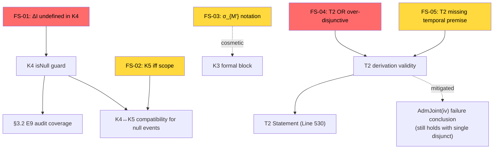

# RCA — Formula-Structural Issues in K_Space_Axiomatization.md (v1.5)

**Scope:** Chỉ các lỗi ảnh hưởng **cấu trúc công thức** — biến undefined, premise thiếu, kết luận không follow từ premises, scope ambiguity, notation inconsistency trong formal blocks.
**Không bao gồm:** Presentation ordering, claim classification, boundary wording, BE lineage (đã covered trong RCA tổng thể).

---

## Tổng quan 5 lỗi công thức

| # | Vị trí | Mức độ | Tóm tắt |
|---|--------|:------:|---------|
| **FS-01** | K4 Line 192 | 🔴 | `ΔI(k)` — biến undefined trong frozen axiom |
| **FS-02** | K5 Line 251 | ⚠️ | `iff` biconditional — scope không loại trừ K4 definitional V=0 |
| **FS-03** | K3 Line 169 | ⚠️ | `σ_{M'}(M)` — index type không nhất quán với definition σ_R |
| **FS-04** | T2 Line 542 | 🔴 | `OR V_prov(k_B) → 0` — kết luận over-disjunctive, không follow từ premises |
| **FS-05** | T2 Lines 539–542 | ⚠️ | Missing temporal premise — K5 cần `k_A <_joint k_B` nhưng T2 không state |

---

## FS-01: `ΔI(k)` undefined trong K4 isNull guard

### Vị trí
[K4 Line 192](file:///C:/Stable_Diffusion/Buddhist_Epistemology_Quantum_Measurement/documents/research_documents/meta_architecture/K_Space_Axiomatization.md#L192):
```
isNull(k) :=  o(k) = ∅  ∧  ΔI(k) = 0
              (E9 null event: interaction occurred but zero information transfer)
```

### Root Cause

K1 (Line 74) defines the K-state tuple as `k = ⟨M, o, cert, t, V⟩` — **5 fields**. The isNull predicate in K4 uses `ΔI(k) = 0` ("zero information transfer"), but `ΔI` is **not one of the 5 tuple fields** and is **not defined anywhere** in K1–K8 or in the upstream [registration_layer_formalization.md](file:///C:/Stable_Diffusion/Buddhist_Epistemology_Quantum_Measurement/documents/research_documents/meta_architecture/vvv_qmrf_meta_architecture_registration_layer_formalization.md).

This means a **frozen axiom** (K4) references an **undefined primitive** (`ΔI`). The formula is not well-formed because `ΔI(k)` has no declared domain, no formal semantics, and cannot be evaluated.

### Impact on derivation chain

| Downstream | Impact |
|------------|--------|
| K4 isNull guard | **Broken** — cannot formally evaluate `isNull(k)` without `ΔI` definition |
| K4 E9 null event rule | **Affected** — `V(k_null) = 0` depends on isNull, which depends on undefined ΔI |
| §3.2 E9 audit (Line 753) | **Affected** — claims E9 is "COVERED" by K4, but K4's coverage depends on undefined ΔI |
| §7.2 K4 check (Line 907) | **Unaffected** — concrete model uses `o ≠ ∅` only (non-null check), never evaluates ΔI |
| T2 proof attempt | **Unaffected** — no null events in concrete model |

### Severity: 🔴 HIGH (formula well-formedness)

The formula is syntactically ill-formed in a frozen axiom. Even though the concrete model avoids it, any general application of K4 isNull requires ΔI.

### Proposed fix

**Option A (minimal):** Simplify isNull to use only tuple fields:
```
isNull(k) := o(k) = ∅
```
Rationale: If `o = ∅` already signals "no outcome registered," the ΔI conjunction is redundant for K4's purpose (guarding the V=1 default). The E9 "zero information transfer" can be a semantic annotation, not a formal predicate.

**Option B (complete):** Add ΔI to the K-state tuple in K1:
```
k = ⟨M, o, cert, t, V, ΔI⟩    (6-field tuple)
ΔI ∈ ℝ≥0  — information transfer quantity
```
This changes K1 (frozen axiom), which is a more invasive fix but formally correct.

> [!IMPORTANT]
> **Recommendation:** Option A. Không cần thay đổi K1. ΔI có thể là derived quantity từ o (nếu o = ∅ thì ΔI = 0 by definition), không cần là independent field.

---

## FS-02: K5 `iff` biconditional — scope không loại trừ K4 definitional V=0

### Vị trí
[K5 Line 251](file:///C:/Stable_Diffusion/Buddhist_Epistemology_Quantum_Measurement/documents/research_documents/meta_architecture/K_Space_Axiomatization.md#L251):
```
V(k1) → 0  iff  ∃k2 ∈ K_R such that:
  (i)   k1 <_R k2
  (ii)  k2 ⊥ k1  within shared C_K
  (iii) k2 has valid cross-registration authority
```

### Root Cause

K5 uses **biconditional** (`iff`):
- **Forward (→):** V(k1) → 0 **if** conditions (i)–(iii) hold. ✅ No issue.
- **Backward (←):** V(k1) → 0 **only if** conditions (i)–(iii) hold. ⚠️ Problem.

K4 already establishes `V(k_null) = 0` for null events — this is a **definitional** V=0, not via K5 conditions (i)–(iii). K4's V=0 occurs without any k2, without ⊥, without Auth.

The backward direction of K5's `iff` literally says: "V can ONLY go to 0 through the three-condition mechanism." But K4 already sends V to 0 via a different mechanism (isNull guard).

### Formal conflict analysis

```
K4 says: isNull(k_null) → V(k_null) = 0      [definitional, no K5 involvement]
K5 says: V(k1) → 0  ONLY IF  ∃k2 with (i)∧(ii)∧(iii)

For k_null: V(k_null) = 0 (by K4), but ¬∃k2 with K5 conditions.
→ K5 backward direction violated for k_null.
```

### Why the document's intent is clear but the formula is not

K5 intends to govern **transitions** from V=1 to V=0 (invalidation of previously valid events). K4 governs **initial assignment** (V is set to 0 at instantiation for null events, never set to 1 first). These are different operations — but K5's `iff` doesn't distinguish them. The formula treats V=0 as a monolithic state, not as a transition.

### Impact on derivation chain

| Downstream | Impact |
|------------|--------|
| K5 as standalone axiom | **Formally inconsistent** with K4 for null events |
| §7 Concrete model | **Unaffected** — no null events in the model |
| T2 derivation | **Unaffected** — T2 uses non-null events |
| E9 audit (§3.2) | **Affected** — the E9 coverage claim depends on K4/K5 compatibility |

### Severity: ⚠️ MEDIUM (scope ambiguity in frozen axiom)

No practical derivation is broken, but the formal statement is technically inconsistent with K4 for null events.

### Proposed fix

Add explicit scope restriction to K5:
```diff
-V(k1) → 0  iff  ∃k2 ∈ K_R such that:
+For k1 ∈ K_R with V(k1) = 1 (initially valid, non-null):
+  V(k1) → 0  iff  ∃k2 ∈ K_R such that:
```

This scopes K5 to **transitions from V=1 to V=0** and leaves K4's definitional V=0 for null events untouched.

> [!NOTE]
> Thêm qualifier `V(k1) = 1` vào đầu K5 formula loại trừ null events (vốn có V=0 from instantiation), khiến K4 và K5 không conflict.

---

## FS-03: `σ_{M'}(M)` — index type không nhất quán

### Vị trí
[K3 Line 169](file:///C:/Stable_Diffusion/Buddhist_Epistemology_Quantum_Measurement/documents/research_documents/meta_architecture/K_Space_Axiomatization.md#L169):
```
σ_R(M) does not require ∃M′ ≠ M such that σ_{M′}(M) = 1.
```

### Root Cause

K3 defines σ as **R-indexed** (subscript = registering system):
```
σ_R: M_K → {0,1}          (Line 159)
```

But Line 169 uses σ as **M'-indexed** (subscript = measurement act):
```
σ_{M′}(M) = 1
```

Trong K3 definition, σ lấy subscript R (registering system), không phải M' (measurement act). `σ_{M'}(M)` không thuộc type signature đã declared — nó mix two different indexing schemes.

### Intended meaning

Dòng 169 muốn nói: "Không cần act M' khác để certify M." Formal expression đúng type nên là:
```
¬∃R', M' (R' ≠ R ∧ M' ≠ M) such that cert(k) depends on σ_{R'}(M')
```
Hoặc đơn giản:
```
σ_R(M) does not require ∃M′ ≠ M in any R' to evaluate to 1.
```

### Impact on derivation chain

| Downstream | Impact |
|------------|--------|
| K3 formal semantics | **Minor confusion** — reader may interpret σ as doubly-indexed (both R and M as subscripts) |
| K3→K4→K5 chain | **Unaffected** — no downstream formula uses σ_{M'} |
| §7 Concrete model K3 check | **Unaffected** — uses σ_F, σ_W (R-indexed) correctly |

### Severity: ⚠️ LOW-MEDIUM (notation inconsistency in frozen axiom)

### Proposed fix

```diff
-σ_R(M) does not require ∃M′ ≠ M such that σ_{M′}(M) = 1.
+σ_R(M) does not require ∃R′ ≠ R, ∃M′ ≠ M such that σ_{R′}(M′) = 1
+  as a precondition for σ_R(M) = 1.
```

> [!NOTE]
> Giữ nguyên index type R-subscript cho σ, nhất quán với Line 159 definition.

---

## FS-04: T2 `OR V_prov(k_B) → 0` — kết luận over-disjunctive

### Vị trí
[T2 Lines 539–542](file:///C:/Stable_Diffusion/Buddhist_Epistemology_Quantum_Measurement/documents/research_documents/meta_architecture/K_Space_Axiomatization.md#L539):
```
Under candidate K_joint, ∃k_A ∈ i_A(K_A), k_B ∈ i_B(K_B) such that
  k_B ⊥ k_A within C_K (registered contradiction)
  AND Auth(k_B → k_A, C_K) = 1 (cross-registration authority)
  → K5 forces V_prov(k_A) → 0  OR  V_prov(k_B) → 0
```

### Root Cause — Non sequitur in conclusion

T2's premises fix a **specific direction**:

| Premise | Direction đã fix |
|---------|------------------|
| `k_B ⊥ k_A` | k_B contradicts k_A (k_B is the contradicting act) |
| `Auth(k_B → k_A)` | k_B has authority **over k_A** (k_B is the invalidator) |

K5 formal definition (Line 251–256):
```
V(k1) → 0  iff  ∃k2:
  (i)   k1 <_R k2          ← k1 is earlier (the invalidated party)
  (ii)  k2 ⊥ k1            ← k2 contradicts k1
  (iii) Auth(k2 → k1)      ← k2 has authority over k1
```

Mapping T2 premises onto K5:
- k1 = k_A (the one being invalidated)
- k2 = k_B (the invalidator)
- K5 condition (ii): k_B ⊥ k_A ✅
- K5 condition (iii): Auth(k_B → k_A) ✅
- K5 conclusion: **V(k_A) → 0** (chỉ k_A, không phải k_B)

Conclusion **should be:**
```
→ K5 forces V_prov(k_A) → 0
```

The `OR V_prov(k_B) → 0` **does not follow** from the stated premises. For V(k_B) → 0, one would need a SEPARATE K5 instance with:
- k_A ⊥ k_B (reverse direction)
- Auth(k_A → k_B) (reverse authority)
- k_B <_joint k_A (k_B earlier)

These premises are **not stated** in T2. The `OR` is a non sequitur.

### Cross-check with concrete model

[§7.5 Step 6 (Lines 1181–1192)](file:///C:/Stable_Diffusion/Buddhist_Epistemology_Quantum_Measurement/documents/research_documents/meta_architecture/K_Space_Axiomatization.md#L1181) correctly derives:
```
→ K5: V_prov(i_F(k_F)) → 0         [K5 pre-closure invalidation]
```
**Only** k_F is invalidated. k_W retains V=1. The concrete model gets this right — it's the general T2 formula that's wrong.

[§7.3 L4-7 (Lines 1089–1090)](file:///C:/Stable_Diffusion/Buddhist_Epistemology_Quantum_Measurement/documents/research_documents/meta_architecture/K_Space_Axiomatization.md#L1089) also correctly says:
```
→ K5 FIRES: V(i_F(k_F)) → 0                                    ⚠ CONFLICT
For i_W(k_W): C1-C6 → no later event contradicts k_W in K_joint. OK.  ✅
```

### Impact on derivation chain

| Downstream | Impact |
|------------|--------|
| T2 → AdmJoint(iv) conclusion | **Materially UNAFFECTED** — `V_prov(k_A) → 0` alone suffices to violate AdmJoint(iv) ("no V_prov invalidation while both claimed jointly valid"). The OR adds a spurious disjunct but does not alter the conclusion. |
| T2 Statement (Line 530) | **AFFECTED** — Statement says "forces V(k_A) → 0 **or** V(k_B) → 0" which propagates the same over-disjunction |
| T3 Bridge_EWF derivation | **Unaffected** — T3 Line 641 correctly says `V(k_F) → 0 OR V(k_W) → 0` in the general case, but the concrete model gets the specific direction right |
| §7 Concrete model | **Unaffected** — correctly uses specific direction |

### Severity: 🔴 HIGH (non sequitur in theorem derivation)

The conclusion does not follow from the premises as stated. The practical impact is mitigated (AdmJoint failure still holds), but the derivation step is formally invalid.

### Proposed fix

**In T2 derivation block (Lines 539–542):**
```diff
   Under candidate K_joint, ∃k_A ∈ i_A(K_A), k_B ∈ i_B(K_B) such that
+  k_A <_joint k_B                                               [T1: temporal ordering in K_joint]
   k_B ⊥ k_A within C_K (registered contradiction)               [K5 primitive, Level 4 §4.4]
   AND Auth(k_B → k_A, C_K) = 1 (cross-registration authority)   [K6]
-  → K5 forces V_prov(k_A) → 0  OR  V_prov(k_B) → 0            [K5 pre-closure]
+  → K5 forces V_prov(k_A) → 0                                   [K5 conditions (i)+(ii)+(iii) satisfied for k_A]
```

**In T2 Statement (Line 530):**
```diff
-any candidate K_joint forces V(k_A) → 0 or V(k_B) → 0 while both are claimed as jointly valid.
+any candidate K_joint forces V(k_A) → 0 (where k_A is the earlier event with Auth against it)
+while both are claimed as jointly valid.
```

> [!IMPORTANT]
> Fix FS-04 đồng thời fix FS-05 (missing temporal premise) — thêm `k_A <_joint k_B` vào premises.

---

## FS-05: T2 missing temporal premise for K5 firing

### Vị trí
[T2 Lines 539–542](file:///C:/Stable_Diffusion/Buddhist_Epistemology_Quantum_Measurement/documents/research_documents/meta_architecture/K_Space_Axiomatization.md#L539) (same block as FS-04)

### Root Cause

K5 has **three** conditions for firing:
```
(i)   k1 <_R k2              ← TEMPORAL: k2 is later
(ii)  k2 ⊥ k1  within C_K   ← CONTRADICTION
(iii) Auth(k2 → k1, C_K)    ← AUTHORITY
```

T2's derivation block provides:
- Condition (ii): `k_B ⊥ k_A within C_K` ✅
- Condition (iii): `Auth(k_B → k_A, C_K) = 1` ✅
- Condition (i): **NOT STATED** ❌

The temporal ordering `k_A <_joint k_B` is **missing** from T2's premises. Without it, K5 cannot fire — K5 explicitly requires the invalidated event to be earlier than the invalidating event.

### Cross-check with concrete model

[§7.5 Step 6 Line 1184](file:///C:/Stable_Diffusion/Buddhist_Epistemology_Quantum_Measurement/documents/research_documents/meta_architecture/K_Space_Axiomatization.md#L1184) correctly states:
```
i_F(k_F) <_joint i_W(k_W)                          [K2: t_F < t_W]
```

The concrete model **includes** the temporal premise. The general T2 formula **omits** it.

### Impact

This is coupled with FS-04. Together they mean the T2 derivation block is missing one premise and has one extra disjunct in the conclusion. The derivation is **formally invalid** as written, though the concrete model §7.5 correctly supplies all three premises.

### Severity: ⚠️ MEDIUM (missing premise, fixable by adding one line)

### Proposed fix

See FS-04 fix above — adding `k_A <_joint k_B` to the premise block resolves both FS-04 and FS-05 simultaneously.

---

## Bonus: E6 audit row stale label (không phải formula block nhưng ảnh hưởng formal claim)

### Vị trí
[§3.1 E6 audit row, Line 741](file:///C:/Stable_Diffusion/Buddhist_Epistemology_Quantum_Measurement/documents/research_documents/meta_architecture/K_Space_Axiomatization.md#L741):
```
K2 directly instantiates the temporal order as a strict partial order.
```

### Root Cause

K2 was corrected from "strict partial order" to "strict **total** order" in v1.2 (documented in K2 Line 149). The E6 audit row was **not updated** to match. This is not a formula block but it is a formal claim about K2's order type that contradicts the corrected K2 definition.

### Proposed fix
```diff
-K2 directly instantiates the temporal order as a strict partial order.
+K2 directly instantiates the temporal order as a strict total order (chain).
```

---

## Dependency Map — Các lỗi ảnh hưởng lẫn nhau



## Tóm tắt khuyến nghị cho v1.6

| Ưu tiên | Fix | Axiom/Theorem bị ảnh hưởng | Invasiveness |
|:-------:|-----|---------------------------|:------------:|
| **1** | FS-04 + FS-05: Sửa T2 derivation block — thêm temporal premise, bỏ `OR V_prov(k_B)→0` | T2 (Layer 2, updatable) | **Low** — T2 is updatable |
| **2** | FS-01: Simplify `isNull(k) := o(k) = ∅` (remove ΔI) | K4 (Layer 1, frozen) | **Medium** — changes frozen axiom text |
| **3** | FS-02: Scope K5 `iff` to `V(k1)=1` events | K5 (Layer 1, frozen) | **Medium** — changes frozen axiom text |
| **4** | FS-03: Fix σ_{M'} → σ_{R'} notation | K3 (Layer 1, frozen) | **Low** — cosmetic notation fix |
| **5** | E6 audit: "partial" → "total" | §3.1 audit table | **Trivial** |

> [!WARNING]
> FS-01 và FS-02 yêu cầu thay đổi frozen Layer 1 axioms (K4, K5). Nếu "frozen" nghĩa là **absolutely no text changes**, thì cần document các lỗi này như errata. Nếu "frozen" cho phép **bugfix-level corrections** (sửa lỗi formal mà không thay đổi semantics), thì các fix đề xuất đều giữ nguyên semantic intent và chỉ sửa well-formedness.
>
> FS-04/FS-05 nằm trong T2 (Layer 2, updatable) nên không có rào cản freeze.
