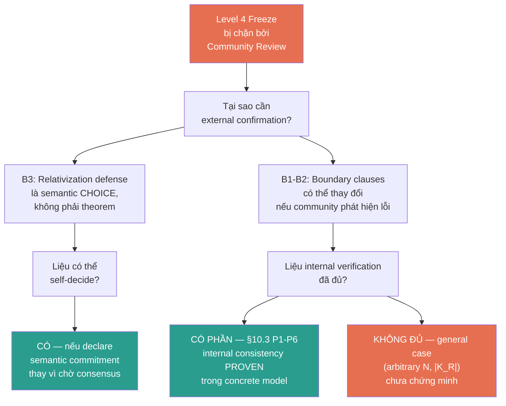
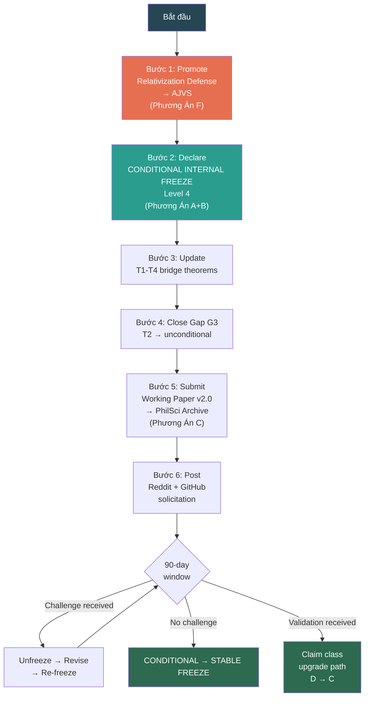

# RCA: Các Phương Án Khi Community Review Không Thực Hiện Được

## 0. Bối cảnh — Tại sao Community Review cần cho Level 4 Freeze?

Từ [RCA Level 4 Unlock](file:///C:/Users/PC/.gemini/antigravity-ide/brain/e63ad821-58ba-436e-b6bf-6ee03a2df5fa/rca_level_4_unlock.md), Level 4 freeze yêu cầu community đồng ý 3 blockers:

| Blocker | Nội dung | Tại sao cần community? |
|---------|----------|----------------------|
| **B1** | ⊥_K boundary clauses frozen | Community xác nhận "not null event", "not physical erasure", "not invalid when both sides independently valid" là đúng/đủ |
| **B2** | AdmJoint/D_joint definitions frozen | Community xác nhận 5 conditions (i)-(v) và operational conditions A-E nhất quán |
| **B3** | Relativization defense chấp nhận | Community đồng ý "meta-descriptions do not satisfy D_joint" là semantic stance hợp lệ |

---

## 1. Khi nào Community Review "không thực hiện được"?

5 kịch bản:

| # | Kịch bản | Nguyên nhân gốc | Severity |
|---|---------|-----------------|----------|
| S1 | **Không có reviewer** | Paper quá niche (Buddhist epistemology + quantum measurement) — không tìm được reviewer đủ chuyên môn cả hai lĩnh vực | 🔴 High |
| S2 | **Review kéo dài vô thời hạn** | Zenodo/PhilSci là preprint archive — không có cơ chế enforce review timeline | 🟡 Medium |
| S3 | **Review superficial** | Reviewer không đi sâu vào Level 4 formal chain — chỉ phản hồi bề mặt (framing, notation) | 🟡 Medium |
| S4 | **Review rejection** | Community phản đối framing (Buddhist + QM), từ chối engage với nội dung kỹ thuật | 🟠 Medium-High |
| S5 | **Contradictory review** | Nhiều reviewer đưa feedback mâu thuẫn nhau — không có consensus để freeze | 🟠 Medium-High |

---

## 2. Phân tích Root Cause: Tại sao community review là bottleneck?



### Root Cause chính xác:

> [!IMPORTANT]
> Community review thực chất serve **2 mục đích khác nhau**:
> 1. **Validation** — xác nhận definitions đúng/nhất quán (→ CÓ THỂ thay thế bằng internal verification)
> 2. **Legitimation** — community chấp nhận semantic choices (→ KHÔNG THỂ thay thế, nhưng CÓ THỂ defer)

---

## 3. Sáu Phương Án Thay Thế

### Phương Án A: Internal Self-Freeze (Tự đóng băng)

**Mô tả:** Freeze Level 4 dựa trên internal consistency verification đã hoàn thành (§10.3 P1-P6), không chờ community.

**Cơ sở:**
- [K_Space_Axiomatization_v1_5.md §10.5](file:///c:/Stable_Diffusion/Buddhist_Epistemology_Quantum_Measurement/papers/Testable_Prediction_Section/extended_wigners_friend_k_side_incommensurability/K_Space_Axiomatization_v1_5.md#L1272-L1280): Internal consistency PROVEN cho concrete model. Confidence: MEDIUM-HIGH.
- P1-P6 đã proven: K1-K8 nhất quán, Level 4 definitions expressible, derivation chain well-defined, no circular reasoning, K5 verifiable without invoking full Level 4 ⊥

**Thực hiện:**
1. Declare Level 4 = FROZEN (internal), kèm documented semantic commitment (relativization defense)
2. Update T1-T4 bridge theorems
3. Ghi rõ: "Frozen by internal consistency verification. Community review pending."

**Risk/Benefit:**

| Aspect | Đánh giá |
|--------|---------|
| ✅ Unblocks T1-T4, Gap G3, T2 unconditional | Lợi ích lớn nhất — mở đường cho downstream work |
| ✅ Hoàn toàn legitimate | §10.5 verdict đã ghi: "Level 4 CAN freeze with one documented framework-level semantic commitment" |
| ⚠️ Community có thể challenge sau | Freeze phải REVERSIBLE — nếu community feedback đến sau, có thể unfreeze |
| ❌ General case chưa proven | Chỉ valid cho concrete model (2 observers, 1 event each) |

---

### Phương Án B: Conditional Freeze (Đóng băng có điều kiện)

**Mô tả:** Freeze Level 4 với explicit conditions — nếu bất kỳ condition nào bị violated bởi community feedback sau này, tự động unfreeze.

**Thực hiện:**
1. Declare: "Level 4 FROZEN under the following conditions:"
   - C1: Relativization defense remains as stated in §4.5
   - C2: ⊥_K boundary clauses (§4.4) unchanged
   - C3: AdmJoint conditions (i)-(v) unchanged
2. Any community feedback that challenges C1/C2/C3 → automatic unfreeze + T1-T4 review
3. Downstream work (T1-T4 update, Gap G3 closure) proceeds immediately

**Risk/Benefit:**

| Aspect | Đánh giá |
|--------|---------|
| ✅ Unblocks downstream immediately | Same benefit as Phương Án A |
| ✅ Built-in safety mechanism | Conditional = reversible by design |
| ✅ Transparent | Community biết đây là conditional freeze, không phải claimed-as-proven |
| ⚠️ Adds complexity | Phải track conditional status across all documents |

---

### Phương Án C: Phased Review via Published Preprint (Review qua preprint)

**Mô tả:** Thay vì chờ community review tự phát, chủ động publish preprint lên nhiều kênh để maximize visibility, tạo điều kiện cho review xảy ra.

**Kênh review thay thế:**

| Kênh | Loại | Community |
|------|------|-----------|
| **Zenodo** (đã có) | DOI-stamped preprint | Broad academic |
| **PhilSci Archive** | Philosophy of Physics preprint | Philosophy of QM community — [PhilSci Plan](file:///c:/Stable_Diffusion/Buddhist_Epistemology_Quantum_Measurement/papers/PhilSci_Archive/vvv_qmrf_ps_01/VVV-QMRF_PhilSci_Submission_Plan.md) đã chuẩn bị |
| **arXiv quant-ph** | Physics preprint | Quantum foundations community |
| **Reddit r/PhilosophyOfScience** | Community discussion | [Đã có draft](file:///c:/Stable_Diffusion/Buddhist_Epistemology_Quantum_Measurement/papers/PhilSci_Archive/vvv_qmrf_ps_01/VVV-QMRF_PhilSci_Submission_Plan.md#L518-L542) |
| **Reddit r/QuantumPhysics** | Community discussion | [Đã có draft](file:///c:/Stable_Diffusion/Buddhist_Epistemology_Quantum_Measurement/papers/PhilSci_Archive/vvv_qmrf_ps_01/VVV-QMRF_PhilSci_Submission_Plan.md#L544-L572) |

**Risk/Benefit:**

| Aspect | Đánh giá |
|--------|---------|
| ✅ Creates actual review opportunity | Preprint trên nhiều kênh = visibility |
| ✅ Documented community engagement | Evidence for academic credibility |
| ⚠️ Review quality unpredictable | Reddit ≠ peer review; PhilSci comments may be sparse |
| ❌ Still requires waiting | Không giải quyết bottleneck nếu không ai respond |
| ❌ arXiv may reject | Endorsement required; cross-disciplinary topic may not fit quant-ph |

---

### Phương Án D: Formal Proof Upgrade (Nâng cấp chứng minh formal)

**Mô tả:** Thay vì community review, tăng cường internal verification lên mức formal proof đầy đủ — machine-checkable hoặc structural induction proof cho general case.

**Cụ thể:**
1. Formalize K1-K8 + Level 4 definitions trong proof assistant (Lean4, Coq, Isabelle)
2. Machine-verify consistency cho general case (arbitrary N, |K_R|)
3. Machine-verify T2 derivation chain
4. Publish formal proof artifact cùng với paper

**Risk/Benefit:**

| Aspect | Đánh giá |
|--------|---------|
| ✅ Strongest verification | Machine proof > community opinion |
| ✅ Closes E3 gap | General case proven, not just concrete model |
| ✅ Academic credibility | Machine-checkable proofs are gold standard |
| ❌ Very high effort | Formalization in proof assistant = weeks/months of work |
| ❌ Does NOT resolve B3 | Relativization defense is a SEMANTIC CHOICE — proof assistants don't judge semantic stances |
| ⚠️ Partial solution only | Closes B1+B2 but not B3 |

---

### Phương Án E: Hybrid — Internal Self-Freeze + PhilSci Publication (RECOMMENDED)

**Mô tả:** Kết hợp Phương Án A + B + C — freeze internally (conditional), đồng thời publish lên PhilSci Archive để tạo kênh review.

**Thực hiện:**
```
Step 1: Declare CONDITIONAL INTERNAL FREEZE
  → Level 4 = FROZEN (conditional on C1-C3)
  → Update T1-T4 bridge theorems
  → Close Gap G3
  → T2 → unconditional

Step 2: Execute PhilSci Submission
  → Follow existing PhilSci Plan (Phase 0-4)
  → Submit Working Paper v2.0 to PhilSci Archive
  → Include K-Space Axiomatization as companion document

Step 3: Active Community Solicitation
  → Reddit r/PhilosophyOfScience (existing draft)
  → Reddit r/QuantumPhysics (existing draft)
  → GitHub Discussions
  → Direct outreach to relevant researchers

Step 4: Review Integration Window (30-90 days)
  → If substantive feedback challenges C1/C2/C3:
      → Unfreeze → revise → re-freeze
  → If no challenge after 90 days:
      → Upgrade from CONDITIONAL FREEZE → STABLE FREEZE
  → If feedback validates:
      → Upgrade claim classes (D → C where applicable)
```

**Risk/Benefit:**

| Aspect | Đánh giá |
|--------|---------|
| ✅ Unblocks ALL downstream work immediately | T1-T4, Gap G3, T2 unconditional, claim class upgrade path |
| ✅ Creates actual review opportunity | PhilSci + Reddit + GitHub = multiple channels |
| ✅ Built-in safety mechanism | Conditional freeze = reversible |
| ✅ Time-bounded | 90-day window prevents indefinite waiting |
| ✅ Already prepared | PhilSci Plan + Reddit drafts already exist |
| ⚠️ Requires execution | PhilSci submission, Reddit posts, outreach — all need to actually happen |
| ⚠️ May get no response | But conditional freeze still unblocks work |

---

### Phương Án F: Axiom of Joint Validity Semantics (AJVS) — Độc lập hóa B3

**Mô tả:** Thay vì chờ community chấp nhận relativization defense, **promote** nó thành một declared axiom riêng (ngoài K1-K8), tương tự cách EP được promote thành K8 trong v1.4.

**Cơ sở:** Action Item A1 trong [K_Space_Axiomatization_v1_5.md §10.6](file:///c:/Stable_Diffusion/Buddhist_Epistemology_Quantum_Measurement/papers/Testable_Prediction_Section/extended_wigners_friend_k_side_incommensurability/K_Space_Axiomatization_v1_5.md#L1286):
> "Document relativization defense as 'Axiom of Joint Validity Semantics' (separate from K1-K8)"

**Thực hiện:**
1. Define AJVS: "Meta-descriptions of registration contents do not satisfy the joint-validity demand D_joint. Relativizing contents to observer-relative descriptions abandons D_joint rather than satisfying it."
2. AJVS is NOT K9 — it is a framework-level semantic axiom, declared separately
3. T3 derivation explicitly states: "Conditional on AJVS"
4. Level 4 freeze becomes: "K1-K8 consistent (proven). AJVS declared (framework stance). ⊥_K boundary clauses consistent with K5 minimal ⊥ (proven for concrete model)."

**Risk/Benefit:**

| Aspect | Đánh giá |
|--------|---------|
| ✅ Eliminates B3 as a blocker | B3 trở thành declared axiom thay vì "chờ community" |
| ✅ Transparent | Community biết đây là axiom, có thể reject — framework thay đổi accordingly |
| ✅ Already identified as action item | A1 trong §10.6 |
| ✅ Precedent exists | EP → K8 promotion thành công trong v1.4 |
| ⚠️ Does not eliminate B1-B2 | ⊥_K boundary clauses và AdmJoint vẫn cần verification |
| ⚠️ Adds yet another axiom | Framework complexity tăng |

---

## 4. Decision Matrix

| Tiêu chí | Weight | A: Self-Freeze | B: Conditional | C: Preprint | D: Formal Proof | **E: Hybrid** | F: AJVS |
|----------|:------:|:--------------:|:--------------:|:-----------:|:---------------:|:-------------:|:-------:|
| Unblock downstream | 30% | ✅ 5 | ✅ 5 | ❌ 2 | ✅ 5 | ✅ **5** | ⚠️ 4 |
| Academic credibility | 25% | ⚠️ 3 | ⚠️ 3 | ✅ 4 | ✅ 5 | ✅ **4** | ⚠️ 3 |
| Reversibility | 15% | ⚠️ 3 | ✅ 5 | N/A | N/A | ✅ **5** | ✅ 4 |
| Effort required | 15% | ✅ 5 | ✅ 4 | ⚠️ 3 | ❌ 1 | ⚠️ **3** | ✅ 4 |
| Resolves B3 | 15% | ❌ 2 | ❌ 2 | ⚠️ 3 | ❌ 1 | ⚠️ **3** | ✅ 5 |
| **Weighted Score** | | **3.8** | **3.9** | **3.0** | **3.3** | **4.1** | **3.8** |

---

## 5. Phương Án Đề Xuất: E + F (Hybrid + AJVS)

> [!TIP]
> **Kết hợp Phương Án E (Hybrid) + Phương Án F (AJVS)** cho kết quả tối ưu:
> - **F** giải quyết B3 (relativization defense → declared axiom AJVS)
> - **E** giải quyết B1+B2 (conditional freeze + PhilSci publication + 90-day window)

### Execution Plan:



### Chi tiết từng bước:

| Bước | Hành động | Output | Effort |
|------|----------|--------|--------|
| 1 | Viết AJVS declaration document (separate from K1-K8) | `AJVS_Declaration.md` | 1 ngày |
| 2 | Declare conditional freeze; update K_Space_Axiomatization_v1_5.md header | Updated freeze status | 0.5 ngày |
| 3 | Update T1-T4 theo frozen Level 4 | Updated bridge theorems | 1-2 ngày |
| 4 | Close Gap G3; make T2 unconditional; run A6 verification | Updated open items | 1 ngày |
| 5 | Execute PhilSci Plan Phase 0-4 | PhilSci submission | 3-5 ngày |
| 6 | Post Reddit + GitHub | Community engagement | 0.5 ngày |
| 7 | Monitor 90-day window | Review integration | Passive |

**Tổng effort: ~7-10 ngày active work**

---

## 6. Cái Gì KHÔNG THỂ Thay Thế?

> [!CAUTION]
> Dù áp dụng phương án nào, **2 điều sau KHÔNG THỂ thay thế bằng internal work:**
>
> 1. **External experimental collaboration** — Purpose-designed VVV-QMRF experiment (Paper v2.0 §5.5) yêu cầu photonic EWF platform. Không có phương án internal nào thay thế.
> 2. **Claim class B (proven)** — Upgrade từ Class D → Class B yêu cầu external peer-reviewed mathematical proof. Internal consistency proof chỉ đủ cho D → C upgrade path.

---

## 7. Source Files Reference

| File | Vai trò trong RCA |
|------|-------------------|
| [rca_level_4_unlock.md](file:///C:/Users/PC/.gemini/antigravity-ide/brain/e63ad821-58ba-436e-b6bf-6ee03a2df5fa/rca_level_4_unlock.md) | RCA gốc: Level 4 unlock mechanism |
| [K_Space_Axiomatization_v1_5.md §10](file:///c:/Stable_Diffusion/Buddhist_Epistemology_Quantum_Measurement/papers/Testable_Prediction_Section/extended_wigners_friend_k_side_incommensurability/K_Space_Axiomatization_v1_5.md#L1237-L1299) | Level 4 Freeze Check verdict, P1-P6, E1-E3, Action Items A1-A6 |
| [VVV-QMRF_Working_Paper_v2.0.md §4.3-4.6](file:///c:/Stable_Diffusion/Buddhist_Epistemology_Quantum_Measurement/papers/Testable_Prediction_Section/extended_wigners_friend_k_side_incommensurability/VVV-QMRF_Working_Paper_v2.0.md) | Level 4 definitions |
| [VVV-QMRF_Working_Paper_v2.0.md §7.2](file:///c:/Stable_Diffusion/Buddhist_Epistemology_Quantum_Measurement/papers/Testable_Prediction_Section/extended_wigners_friend_k_side_incommensurability/VVV-QMRF_Working_Paper_v2.0.md#L693-L725) | Deferred items + freeze status |
| [VVV-QMRF_PhilSci_Submission_Plan.md](file:///c:/Stable_Diffusion/Buddhist_Epistemology_Quantum_Measurement/papers/PhilSci_Archive/vvv_qmrf_ps_01/VVV-QMRF_PhilSci_Submission_Plan.md) | PhilSci submission workflow (Phase 0-5) |
| [VVV-QMRF_Dual_System_Campaign_Plan.md](file:///c:/Stable_Diffusion/Buddhist_Epistemology_Quantum_Measurement/papers/Testable_Prediction_Section/campaign_master/VVV-QMRF_Testable_Prediction_Dual_System_Campaign_Plan.md) | Internal/External dual-system architecture |
| [VVV-QMRF_K_Space_Axiomatization_Plan.md](file:///c:/Stable_Diffusion/Buddhist_Epistemology_Quantum_Measurement/papers/Testable_Prediction_Section/extended_wigners_friend_k_side_incommensurability/plan/VVV-QMRF_K_Space_Axiomatization_Plan.md) | Dependency stack + 2-layer architecture rationale |
