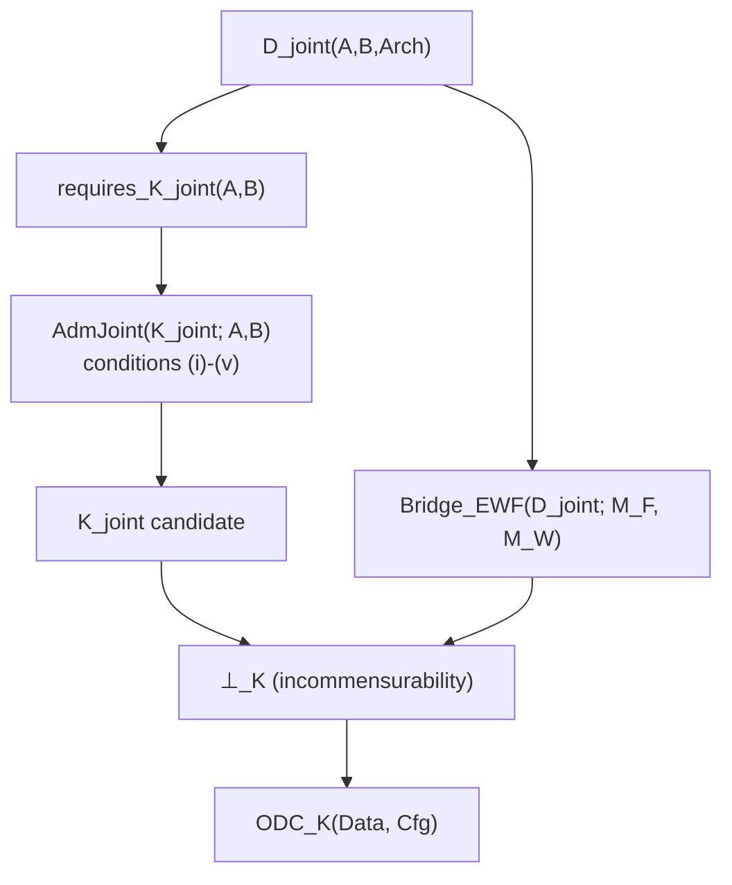
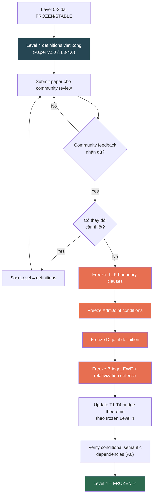

# RCA: Cách Mở Level 4 trong VVV-QMRF Dependency Stack

## 1. Dependency Stack — Bản đồ tổng thể

Dependency stack của VVV-QMRF có **6 tầng** (Level 0–5), xây từ dưới lên:

```
Level 0: BE SOT (system_be_full.md)                       → FROZEN
  └─ Level 1: Core architectural commitment (K ≠ H)        → FROZEN
       └─ Level 2: E1-E7 core postulates                    → STABLE
            └─ Level 3: Minimal K-state tuple (5-field)     → STABLE
                 └─ Level 4: ⊥_K formal chain, AdmJoint,    → IN REVIEW  ← MỤC TIÊU
                             D_joint, K_joint, Bridge_EWF
                      └─ Level 5: K-SPACE AXIOMATIZATION    → DONE (K1-K8 + T1-T4)
```

> [!IMPORTANT]
> **Level 4 hiện có trạng thái `IN REVIEW`** — nghĩa là tất cả definitions ở tầng này đã được viết (trong Working Paper v2.0 §4.3–4.6), nhưng chưa được **freeze** (đóng băng). "Mở Level 4" = đưa nó từ `IN REVIEW` → `FROZEN`.

---

## 2. Level 4 chứa gì?

Level 4 gồm **7 formal definitions** — tất cả đều nằm trong [VVV-QMRF_Working_Paper_v2.0.md](file:///c:/Stable_Diffusion/Buddhist_Epistemology_Quantum_Measurement/papers/Testable_Prediction_Section/extended_wigners_friend_k_side_incommensurability/VVV-QMRF_Working_Paper_v2.0.md):

| # | Symbol | Nội dung | Section | Claim class |
|---|--------|----------|---------|-------------|
| 1 | `D_joint` | Joint-validity demand predicate | §4.3 | D |
| 2 | `requires_K_joint` | Predicate: có cần joint K-space không | §4.3 | D |
| 3 | `AdmJoint` | Admissible joint K-space (5 conditions i–v) | §4.3 | D |
| 4 | `K_joint` | Candidate joint registration space | §4.3 | D |
| 5 | `⊥_K` | K-side incommensurability relation | §4.4 | D |
| 6 | `Bridge_EWF` | Bridge lemma D_joint → E7 contradiction | §4.5 | D/C |
| 7 | `ODC_K` | Operational data criterion | §4.6 | C |

### Dependency chain bên trong Level 4:



---

## 3. "Mở Level 4" — Chính xác là gì?

**"Mở Level 4" = FREEZE Level 4** — xác nhận rằng tất cả 7 definitions ở Level 4 đã ổn định, nhất quán nội bộ, và không mâu thuẫn với các tầng bên dưới (Level 0–3).

### 3.1 Tại sao chưa freeze được?

Có **3 blocker** được ghi nhận:

| # | Blocker | Mô tả | Tham chiếu |
|---|---------|--------|-----------|
| **B1** | Community review chưa xong | Paper v2.0 đã submit cho community feedback, chưa nhận phản hồi đủ để freeze | Paper status line |
| **B2** | ⊥_K boundary clauses chưa frozen | Full formalization của ⊥ (boundary clauses: "not null event", "not invalid when both sides independently valid") — Level 4 §4.4 — còn có thể thay đổi | [K_Space_Axiomatization_v1_5.md](file:///c:/Stable_Diffusion/Buddhist_Epistemology_Quantum_Measurement/papers/Testable_Prediction_Section/extended_wigners_friend_k_side_incommensurability/K_Space_Axiomatization_v1_5.md) Gap G3 |
| **B3** | Relativization defense | Framework-level semantic commitment: D_joint yêu cầu joint validity của original claims, không phải meta-descriptions — đây là một lập trường cần community chấp nhận, không phải mathematical gap | Gap G1 |

### 3.2 Tiền điều kiện để mở Level 4 (Freeze Checklist)

Từ [K_Space_Axiomatization_v1_5.md §9](file:///c:/Stable_Diffusion/Buddhist_Epistemology_Quantum_Measurement/papers/Testable_Prediction_Section/extended_wigners_friend_k_side_incommensurability/K_Space_Axiomatization_v1_5.md):

| # | Checklist item | Trạng thái hiện tại |
|---|---------------|-------------------|
| 1 | K1-K8 (Layer 1) nhất quán nội bộ | ✅ DONE — concrete model verified |
| 2 | K1-K8 không mâu thuẫn với Level 4 definitions | ✅ DONE — derivation chain verified |
| 3 | ⊥_K boundary clauses (§4.4) được frozen | ❌ PENDING — chờ community review |
| 4 | AdmJoint conditions (i)-(v) được frozen | ❌ PENDING — chờ community review |
| 5 | D_joint definition (§4.3) được frozen | ❌ PENDING — chờ community review |
| 6 | Bridge_EWF semantic proof hoàn chỉnh | ⚠️ PARTIAL — operational sufficient conditions done; full "no reinterpretation" proof deferred |
| 7 | Relativization defense được chấp nhận | ❌ PENDING — framework-level stance, cần community agreement |
| 8 | T1-T4 bridge theorems cập nhật theo frozen Level 4 | ❌ BLOCKED bởi items 3-7 |

---

## 4. Quy trình mở Level 4 (Step-by-step)



### Giải thích từng bước:

**Bước 1 — Prerequisites (đã hoàn thành):**
- Level 0 (BE SOT): FROZEN
- Level 1 (K ≠ H): FROZEN  
- Level 2 (E1-E7): STABLE
- Level 3 (K-state tuple): STABLE

**Bước 2 — Level 4 definitions viết xong (đã hoàn thành):**
- Tất cả 7 definitions đã có trong Paper v2.0

**Bước 3 — Community review (đang chờ):**
- Paper v2.0 đã submit cho community feedback
- Cần nhận phản hồi về: ⊥_K boundary clauses, AdmJoint, D_joint, relativization defense

**Bước 4 — Freeze từng component:**
1. Freeze ⊥_K boundary clauses (§4.4) — "not null event", "not physical erasure", "not invalid when both sides independently valid"
2. Freeze AdmJoint conditions (i)-(v) (§4.3)
3. Freeze D_joint + requires_K_joint (§4.3)  
4. Freeze Bridge_EWF + relativization defense (§4.5)

**Bước 5 — Post-freeze actions:**
1. Update T1-T4 bridge theorems (Layer 2 of K-Space Axiomatization) theo frozen Level 4
2. Verify conditional semantic dependencies (action item A6 từ K_Space_Axiomatization_v1_5.md §10)
3. Đánh dấu Level 4 = FROZEN

---

## 5. Tác động khi Level 4 được mở (freeze)

| Hệ quả | Chi tiết |
|---------|----------|
| **T1-T4 bridge theorems** được freeze | Hiện đang "pending Level 4 freeze" — sẽ chuyển thành frozen |
| **K5 semantic dependency giải quyết** | K5 ⊥ boundary clauses sẽ có giá trị extensional cố định |
| **K6 Auth dependency giải quyết** | D_joint scope cố định → Auth(k2→k1, C_K) có giá trị xác định |
| **K7 closure timing cố định** | requires_K_joint extensional scope cố định → t_close xác định |
| **Gap G3 đóng** | "Level 4 ⊥ not frozen" → resolved |
| **T2 unconditional** | T2 hiện tại CONDITIONAL on Level 4 ⊥ → sẽ trở thành unconditional |
| **Claim class upgrade path** | Mở đường cho D → C hoặc C → B upgrade cho formal claims |

---

## 6. Tóm tắt — Câu trả lời cho "Cách mở Level 4"

> [!TIP]
> **Level 4 không phải "chưa viết" — nó đã viết xong.** Vấn đề là nó chưa được **freeze** (xác nhận ổn định).

**3 điều kiện cần để mở (freeze) Level 4:**

1. **⊥_K boundary clauses** (§4.4) — community đồng ý rằng boundary clauses hiện tại là đúng và đủ
2. **Relativization defense** (§4.5) — community chấp nhận framework-level stance rằng D_joint yêu cầu original claims, không phải meta-descriptions
3. **AdmJoint/D_joint definitions** (§4.3) — community đồng ý rằng 5 conditions (i)-(v) và operational conditions A-E là nhất quán

**Khi cả 3 được đáp ứng:**
- Freeze tất cả Level 4 definitions
- Update T1-T4 bridge theorems
- Verify conditional semantic dependencies
- Level 4 = FROZEN → mở đường cho Level 5 (K-Space Axiomatization) cũng freeze hoàn toàn

---

## 7. Source Files Reference

| File | Vai trò |
|------|---------|
| [VVV-QMRF_Working_Paper_v2.0.md](file:///c:/Stable_Diffusion/Buddhist_Epistemology_Quantum_Measurement/papers/Testable_Prediction_Section/extended_wigners_friend_k_side_incommensurability/VVV-QMRF_Working_Paper_v2.0.md) | **Level 4 definitions** — §4.3 (D_joint, requires_K_joint, AdmJoint, K_joint), §4.4 (⊥_K, boundary clauses), §4.5 (Bridge_EWF), §4.6 (ODC_K) |
| [K_Space_Axiomatization_v1_5.md](file:///c:/Stable_Diffusion/Buddhist_Epistemology_Quantum_Measurement/papers/Testable_Prediction_Section/extended_wigners_friend_k_side_incommensurability/K_Space_Axiomatization_v1_5.md) | **Level 5** — K1-K8 axioms + T1-T4 bridge theorems; freeze checklist (§9), gaps G1-G3, action items A1-A6 |
| [VVV-QMRF_K_Space_Axiomatization_Plan.md](file:///c:/Stable_Diffusion/Buddhist_Epistemology_Quantum_Measurement/papers/Testable_Prediction_Section/extended_wigners_friend_k_side_incommensurability/plan/VVV-QMRF_K_Space_Axiomatization_Plan.md) | **Dependency stack diagram** (§1.1), 2-layer architecture rationale (§1.2), risk heat map (§6) |
