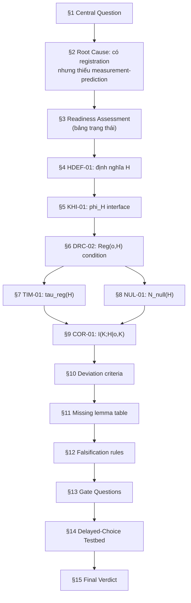

# RCA Đánh Giá Logic: K-H Registration Observability Plan

> **Tài liệu đánh giá:** [rca_k_h_registration_observability_plan.md](file:///c:/Stable_Diffusion/Buddhist_Epistemology_Quantum_Measurement/documents/research_documents/vvv-qmrf/plan/rca_k_h_registration_observability_plan.md)
>
> **Tham chiếu chéo:** [node_QM_VVV.md](file:///c:/Stable_Diffusion/Buddhist_Epistemology_Quantum_Measurement/documents/research_documents/vvv-qmrf/node_QM_VVV.md), [VVV_QMRF_vs_Standard_QM_system_diagram.md](file:///c:/Stable_Diffusion/Buddhist_Epistemology_Quantum_Measurement/documents/research_documents/vvv-qmrf/VVV_QMRF_vs_Standard_QM_system_diagram.md)

---

## 1. Tổng quan đánh giá

Đánh giá dọc theo **6 trục logic**:

| # | Trục đánh giá | Kết quả |
|---|---|---|
| A | Chuỗi logic tổng thể (§1→§15) | ✅ Nhất quán |
| B | Tính nhất quán định nghĩa nội bộ | ⚠️ Có 3 điểm cần chú ý |
| C | Phân tách hai cổng (two-gate decomposition) | ✅ Logic chặt chẽ |
| D | Khả năng vận hành hóa metric | ⚠️ Có 2 điểm yếu |
| E | Đủ điều kiện falsification | ✅ Có, nhưng có 1 lỗ hổng |
| F | Truy vết đến node table & framework | ⚠️ Có 3 liên kết thiếu |

**Verdict tổng:** Logic cấu trúc **chắc chắn**. Document có kỷ luật boundary tốt. Phát hiện **8 điểm cần xử lý** (3 nghiêm trọng, 5 nhẹ).

---

## 2. Trục A — Chuỗi logic tổng thể

### Luồng logic thực tế trong document



### Đánh giá

| Bước | Kiểm tra | Kết quả |
|---|---|---|
| §1→§2 | Question → root cause hợp lý? | ✅ Đúng: "có architecture nhưng thiếu prediction" là root cause chính xác |
| §2→§3 | Root cause → readiness check? | ✅ Đúng: bảng §3 đối sánh chính xác từng thành phần thiếu |
| §3→§4-§6 | Missing items → definitions? | ✅ Đúng: H, phi_H, Reg(o,H) lấp đúng 3 ô "Missing" trong bảng |
| §6→§7-§9 | Definitions → metrics? | ✅ Đúng: mỗi metric xây trên Reg(o,H) đã định nghĩa |
| §9→§10 | Metrics → deviation? | ✅ Đúng: delta_X_KH dùng đúng các metric đã định nghĩa |
| §10→§12 | Deviation → falsification? | ✅ Đúng: mỗi falsification rule tương ứng một metric |
| §12→§13 | Falsification → gate questions? | ✅ Đúng: gate questions hỏi "liệu falsification có nghĩa không" |
| §13→§14 | Gates → testbed? | ✅ Đúng: testbed là bước thực nghiệm đầu tiên để trả lời gates |

> [!TIP]
> Chuỗi logic §1→§15 tuân thủ trình tự RCA chuẩn: **Symptom → Root Cause → Fix Path → Definitions → Metrics → Deviation → Falsification → Experiment**. Không có bước nhảy logic.

---

## 3. Trục B — Tính nhất quán định nghĩa nội bộ

### Vấn đề B1: Hai phiên bản `H` chưa thống nhất rõ

| Vị trí | Định nghĩa H |
|---|---|
| [§4 HDEF-01](file:///c:/Stable_Diffusion/Buddhist_Epistemology_Quantum_Measurement/documents/research_documents/vvv-qmrf/plan/rca_k_h_registration_observability_plan.md#L87-L89) | `H = (C, R, Q, V)` — 4 thành phần |
| [§6.2 DRC-02](file:///c:/Stable_Diffusion/Buddhist_Epistemology_Quantum_Measurement/documents/research_documents/vvv-qmrf/plan/rca_k_h_registration_observability_plan.md#L173-L175) | `H = (H_physics, H_register)` — 2 thành phần |

**Logic gap:** HDEF-01 định nghĩa `H = (C, R, Q, V)` ở §4, nhưng §6.2 tách `H = (H_physics, H_register)`. Document **không nói rõ** `(C, R, Q, V)` thuộc `H_register` hay phân bổ giữa cả hai.

> [!WARNING]
> **Severity: TRUNG BÌNH.** Nếu `(C, R, Q, V)` chỉ thuộc `H_register`, thì HDEF-01 thực chất là định nghĩa `H_register`, không phải `H` toàn bộ. Cần explicit mapping:
> ```text
> H_register = (C, R, Q, V)   ← từ HDEF-01
> H_physics  = (rho_SA, M, Pi_o, H_A, epsilon_dec, theta_amp, N_threshold, tau_stab, epsilon_stab)  ← từ Gate 1
> H = (H_physics, H_register)
> ```

### Vấn đề B2: `D_o` vs `Phys(o|H_physics)`

| Vị trí | Ký hiệu cho "sự kiện vật lý xảy ra" |
|---|---|
| §7 TIM-01 (dòng 245-246) | `t_detect := t[D_o = 1]` |
| §7 TIM-01 full form (dòng 253) | `t[Phys(o\|H_physics)=1]` |

**Logic gap:** Compact form dùng `D_o=1` (detector click), full form dùng `Phys(...)=1`. Gate 1 (§13) nói rõ: `Phys≠D_o`. Nhưng §7 vẫn giữ compact form dùng `D_o=1` như là tham chiếu hợp lệ.

> [!NOTE]
> **Severity: NHẸ.** Compact form được label "earlier" và full form đã sửa. Nhưng document cần đánh dấu compact form là **deprecated** rõ ràng, không chỉ đặt song song.

### Vấn đề B3: `K_after = U_K(K_before, o)` vs `K_after = U_K(K_before, o | H)`

| Vị trí | Công thức |
|---|---|
| §2 Symptom (dòng 33) | `K_after = U_K(K_before, o)` — không có H |
| §5 KHI-01 (dòng 112) | `phi_H(o, K_before) = U_K(K_before, o \| H) = K_after` — có H |
| Node table N_QM_VVV_00023 | `K_after = U_K(K_before, o)` — không có H |

**Logic consistency:** §2 đúng khi nói phiên bản cũ không có H (đây là triệu chứng). §5 sửa bằng cách thêm H. Nhưng node table ([node_QM_VVV.md](file:///c:/Stable_Diffusion/Buddhist_Epistemology_Quantum_Measurement/documents/research_documents/vvv-qmrf/node_QM_VVV.md)) vẫn dùng phiên bản cũ `U_K(K_before, o)` cho `V̂_yava`.

> [!IMPORTANT]
> **Severity: NGHIÊM TRỌNG.** Nếu RCA plan giới thiệu `U_K(K_before, o | H)` nhưng node table chưa cập nhật, sẽ có xung đột tham chiếu khi xây formal document. Cần cập nhật node table hoặc ghi rõ plan đề xuất **mở rộng** signature của U_K.

---

## 4. Trục C — Two-Gate Decomposition Logic

### Bảng truth table kiểm tra (§6.2, dòng 208-213)

```text
Reg(o,H) = Phys(o | H_physics) AND Lock_K(o | K_before, H_register)
```

| Phys | Lock_K | Reg | Document meaning | Logic check |
|---:|---:|---:|---|---|
| 0 | 0 | 0 | Không ứng viên, không ghi nhận | ✅ Trivial |
| 0 | 1 | 0 | Registration without physics = invalid | ✅ Đúng — AND gate chặn |
| 1 | 0 | 0 | Ứng viên vật lý nhưng chưa Lock | ✅ Đây là nội dung mới của VVV-QMRF |
| 1 | 1 | 1 | Ứng viên vật lý + Lock = registered | ✅ Đúng |

> [!TIP]
> Logic AND-gate hoàn toàn nhất quán. Document chính xác khi nói: VVV-QMRF **thêm** Lock_K gate, **không thay thế** physical gate.

### Kiểm tra boundary:

| Claim | Trong document? | Đánh giá |
|---|---|---|
| VVV-QMRF không sửa p_QM(o) | ✅ Nói rõ 5 lần (§6.2, §7, §8, §9, §14.8) | Boundary discipline tốt |
| VVV-QMRF không claim retrocausation | ✅ Nói rõ (§14.8 dòng 894) | Boundary discipline tốt |
| VVV-QMRF không claim physical law | ✅ Nói rõ (§2, §10, §15) | Boundary discipline tốt |
| Lock_K không phải physical collapse | ✅ Nói rõ (§5 dòng 133) | Boundary discipline tốt |

> **Verdict C: Logic hai cổng chặt chẽ, boundary discipline xuất sắc.**

---

## 5. Trục D — Khả năng vận hành hóa (Operationalizability)

### Vấn đề D1: `tau_reg` phụ thuộc hoàn toàn vào `t_lock^val`

```text
tau_reg^val(H) = t_lock^val(H_register) - t_phys(H_physics)
```

**Phân tích:**
- `t_phys` = thời điểm Phys=1 → Gate 1 đã đề xuất Decoh+Ampl+Stable criteria, nhưng **chưa có số liệu ngưỡng cụ thể** (epsilon_dec, theta_amp, tau_stab đều là tham số chưa gán giá trị).
- `t_lock^val` = thời điểm V_yava=1 → chỉ nói "event passes validity rule", nhưng **chưa định nghĩa validity rule nào cụ thể** cho delayed-choice testbed.

> [!WARNING]
> **Severity: NGHIÊM TRỌNG.** `tau_reg` chỉ measurable khi cả `t_phys` và `t_lock^val` có **operational definition cụ thể** cho một setup cụ thể. Document thừa nhận điều này (§13 Gate 3), nhưng testbed §14 đã viết prediction `delta_tau_KH ≠ 0` **trước khi** trả lời Gate 3. Thứ tự logic nên là: Gate → operational definition → prediction, không phải Gate → prediction → (chưa giải Gate).

### Vấn đề D2: `N_null(H)` subtypes chưa exclusive

```text
N_null(H) = N_no-update(H) + N_no-lock(H) + N_invalidated(H)
```

**Kiểm tra:**
- `N_no-update`: D_o=1 nhưng không U_K → K_before không thay đổi.
- `N_no-lock`: U_K xảy ra nhưng V_yava=0 → K updated nhưng chưa lock.
- `N_invalidated`: Đã lock nhưng bị override sau đó.

**Logic gap:** `N_invalidated` ≠ `Lock_K=0` tại thời điểm đo. Nó là `Lock_K=1` rồi bị override thành `Lock_K=0` bởi E8 (retroactive override). Nhưng `N_null(H)` được định nghĩa tại §8 là `P(Reg(o,H)=0 | Phys=1)` — đây là **tại thời điểm đánh giá cuối**, không phải tại thời điểm Lock ban đầu. Cần clarify: `N_null` là snapshot cuối cùng hay bao gồm thay đổi retroactive?

> [!NOTE]
> **Severity: NHẸ.** Có thể fix bằng cách nói rõ: "N_null measures final registration status after all E8-style overrides."

---

## 6. Trục E — Falsification Adequacy

### TIM-F1, NUL-F1, COR-F1 — Đánh giá

| Rule | Falsifiable? | Control list đủ? | Gap |
|---|---|---|---|
| TIM-F1 (§12) | ✅ Có: `delta_tau = 0` → not supported | ✅ 6 controls listed | Thiếu control cho **learning effect** (observer biết kết quả lần trước, phản hồi nhanh hơn lần sau) |
| NUL-F1 (§12) | ✅ Có: `delta_N = 0` → not supported | ✅ 5 controls listed | OK |
| COR-F1 (§12) | ✅ Có: `I(...) = 0` → not supported | ⚠️ 2 controls listed | Thiếu control cho **sample size**: mutual information estimate bias scales with `1/N` |

### Vấn đề E1: Asymmetry of falsification burden

Document nói "if delta≠0, then candidate signal" (§14.7-14.8). Nhưng **không nói** liệu có tồn tại **bất kỳ mô hình nào khác ngoài VVV-QMRF** có thể giải thích delta≠0 bằng confounders thông thường.

> [!IMPORTANT]
> **Severity: NGHIÊM TRỌNG.** Để delta≠0 có nghĩa, cần một **null model** (classical registration-latency model chỉ dựa trên H_physics) và chứng minh delta≠0 **không thể giải thích** bởi null model. Document chưa định nghĩa null model này.
>
> **Đề xuất thêm:** FAL-02: "Define a null model N0 in which tau_reg depends only on H_physics and classical processing. delta_tau_KH is meaningful only if it exceeds the null model prediction with p < threshold."

---

## 7. Trục F — Cross-Reference Traceability

### Mapping RCA plan → Node table

| RCA plan concept | Expected node in [node_QM_VVV.md](file:///c:/Stable_Diffusion/Buddhist_Epistemology_Quantum_Measurement/documents/research_documents/vvv-qmrf/node_QM_VVV.md) | Status |
|---|---|---|
| `V_yava` (registration lock) | `N_QM_VVV_00023` — Registration Lock V̂_yava | ✅ Exists |
| `ε(M)` (pre-symbolic event) | `N_QM_VVV_00045` — Pre-Symbolic Event ε(M) | ✅ Exists |
| `Λ` (symbolization) | `N_QM_VVV_00046` — Symbolization Operator Λ | ✅ Exists |
| `Â_kāra` (internal encoding) | `N_QM_VVV_00022` — Internal Representation Encoding | ✅ Exists |
| S1 pipeline `ε(M)→Λ→Â→V_yava` | Implicit in diagram_3.mmd | ✅ Exists in [diagram](file:///c:/Stable_Diffusion/Buddhist_Epistemology_Quantum_Measurement/documents/research_documents/vvv-qmrf/_publication_check_mermaid/diagram_3.mmd) |
| `H` (Registration Horizon) | **No node** | ❌ Missing |
| `phi_H` (K-H Interface) | **No node** | ❌ Missing |
| `Reg(o,H)` (registration condition) | **No node** | ❌ Missing |
| `Phys(o\|H_physics)` | **No node** | ❌ Missing — but partially covered by existing QM nodes |
| `tau_reg`, `N_null`, `I(K;H)` | **No nodes** | ❌ Missing — expected: these are operational metrics not yet in framework |

> [!WARNING]
> 5 khái niệm mới trong RCA plan (`H`, `phi_H`, `Reg`, `Phys`, metrics) chưa có entry trong node table. §11 khuyến nghị "do not promote to E17+ postulates yet" — đúng. Nhưng cần ít nhất **placeholder nodes** loại "Candidate lemma / operational metric" trong node table để trace được.

### Mapping RCA plan → Existing E1-E16 postulates

Document nói (§3 dòng 63): "S1 pipeline `ε(M)→Λ→Â→V_yava` — Present — Ready". Kiểm tra:

- S1 pipeline được mô tả trong [VVV_QMRF_vs_Standard_QM_system_diagram.md](file:///c:/Stable_Diffusion/Buddhist_Epistemology_Quantum_Measurement/documents/research_documents/vvv-qmrf/VVV_QMRF_vs_Standard_QM_system_diagram.md) dòng 189-192 ✅
- E3 (Registration Lock Operation) = node `N_QM_VVV_00021-00024` ✅
- E8 (Retroactive Override) = node `N_QM_VVV_00029-00032` ✅ (dùng cho `N_invalidated`)

**Traceability verdict:** Nền tảng có, nhưng **các khái niệm mới chưa được ghi vào registry**.

---

## 8. Tổng hợp: 8 điểm cần xử lý

| # | Severity | Mã | Mô tả | Vị trí |
|---|---|---|---|---|
| 1 | 🔴 Nghiêm trọng | **B3** | `U_K(K_before, o)` vs `U_K(K_before, o\|H)` — xung đột với node table | §2, §5 vs node table |
| 2 | 🔴 Nghiêm trọng | **D1** | `tau_reg` prediction viết trước khi Gate 3 được giải — thứ tự logic ngược | §14.6 vs §13 Gate 3 |
| 3 | 🔴 Nghiêm trọng | **E1** | Thiếu null model cho delta≠0 — falsification chưa đủ mạnh | §12, §14 |
| 4 | 🟡 Trung bình | **B1** | `H=(C,R,Q,V)` vs `H=(H_physics, H_register)` chưa mapping rõ | §4 vs §6.2 |
| 5 | 🟡 Trung bình | **F1** | 5 khái niệm mới chưa có placeholder trong node table | §11 vs node table |
| 6 | 🟢 Nhẹ | **B2** | Compact form `D_o=1` chưa đánh dấu deprecated | §7 |
| 7 | 🟢 Nhẹ | **D2** | `N_invalidated` temporal scope chưa rõ | §8 |
| 8 | 🟢 Nhẹ | **E-ctrl** | TIM-F1 thiếu learning-effect control; COR-F1 thiếu sample-size control | §12 |

---

## 9. Đánh giá điểm mạnh

Dù có 8 điểm cần xử lý, document có những điểm mạnh logic **đáng chú ý**:

| Điểm mạnh | Chi tiết |
|---|---|
| **Boundary discipline** | 5+ lần nói rõ "không sửa Born rule", "không claim physical law" — nhất quán xuyên suốt |
| **Two-gate decomposition** | Phân tách Phys/Lock_K là bước logic quan trọng nhất, truth table chính xác |
| **Gate system** | §13 Gate 1-2-3 là cơ chế self-critique mạnh — document tự hỏi "liệu mình có nội dung không" |
| **C1-C10 cases** | 10 trường hợp Phys=1, Lock_K=0 cụ thể — cho thấy hai cổng không degenerate |
| **Four t_lock candidates** | Phân biệt hw/sw/val/obs lock time — thể hiện sự hiểu rõ operational measurement |
| **Phys criteria (Gate 1)** | Decoh + Ampl + Stable — ba tiêu chí vật lý cụ thể, không chỉ "detector click" |
| **"Not allowed" list** | §14.8 liệt kê rõ claims KHÔNG được phép — đây là kỷ luật khoa học tốt |

---

## 10. Verdict cuối cùng

```text
LOGIC STRUCTURE:      PASS (chuỗi §1→§15 nhất quán)
BOUNDARY DISCIPLINE:  PASS (xuất sắc)
INTERNAL CONSISTENCY: CONDITIONAL PASS (cần fix B1, B3)
OPERATIONALIZABILITY: CONDITIONAL PASS (cần giải Gate 3 trước prediction)
FALSIFICATION:        CONDITIONAL PASS (cần null model)
TRACEABILITY:         NEEDS WORK (5 concepts không có node entry)
```

**Recommended next actions theo priority:**

1. **[P0]** Fix B3: Quyết định rõ `U_K(K_before, o | H)` là **mở rộng** hay **thay thế** `U_K(K_before, o)`, và cập nhật node table tương ứng
2. **[P0]** Fix E1: Định nghĩa null model N0 cho delay-choice testbed
3. **[P0]** Fix D1: Sắp xếp lại §14 để Gate 3 operational definition đến **trước** prediction
4. **[P1]** Fix B1: Viết explicit mapping `H = (H_physics, H_register)` với `H_register = (C,R,Q,V)`
5. **[P1]** Fix F1: Tạo placeholder entries trong node table cho HDEF-01, KHI-01, DRC-02, TIM-01, NUL-01, COR-01
6. **[P2]** Fix B2, D2, E-ctrl: Minor clarifications
