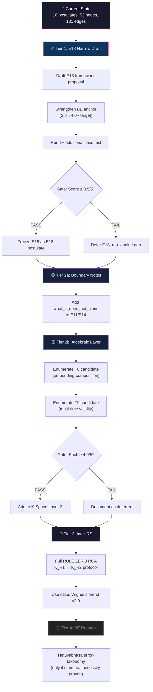

# 📊 Báo Cáo Tiến Độ — RCA Core Extensibility Analysis

**Tài liệu gốc:** [rca_core_extensibility_analysis.md](file:///c:/Stable_Diffusion/Buddhist_Epistemology_Quantum_Measurement/documents/research_documents/rca/rca_core_extensibility_analysis.md)
**Ngày báo cáo:** 2026-05-22
**Phương pháp:** RULE ZERO RCA — Define → Trace → Isolate → Fix → Verify

---

## 1. BẢNG TIẾN ĐỘ TỔNG QUAN

### 1.1 Framework State Snapshot

| Metric | Giá trị | Ghi chú |
|---|---:|---|
| Postulates (E1–E16) | **16** | Core frozen |
| Interface principle (legacy E17) | **1** | Đóng vai trò boundary marker |
| VVV nodes | **52** | Commit `73103df` |
| VVV edges | **131** | 4 pha: internal/cross-sys/source/cross-cat |
| Edge density | **2.52/node** | Trung bình–cao cho Class D |
| EX bridge edges | **141** active | 100% boundary audit PASS |
| K-Space axioms | **K1–K8** | Frozen (Level 4) |
| K-Space theorems | **T1–T7** | Layer 2, mở cho extension |
| RCA candidates | **2** | E17 rejected ‖ E18 retained |
| BE source coverage | **11/30** direct | Phần lớn còn lại không phù hợp |
| VVV node K-side bridge | **88.5%** direct | 100% kể cả KE-QI/KE-SC exceptions |

---

### 1.2 Tiến Độ 6 Chiều Mở Rộng — Heatmap

```
                                           Confidence
Dimension                        Status      Score     Progress Bar
─────────────────────────────────────────────────────────────────────
V1  BE Source mới              Gần đóng     4.6/5     ██████████████████░░  92%
V2  Structural gap nội tại    CĐK mở       4.1/5     ████████████████░░░░  82%
V3  Sub-node/edge detail      Mở           4.5/5     ██████████████████░░  90%
V4  EX import → core          Đóng         4.9/5     ███████████████████░  98%
V5  Algebraic-layer (T8/T9)   CĐK mở       4.1/5     ████████████████░░░░  82%
V6  Inter-RS coordination     Open frontier 4.1/5     ████████████████░░░░  82%
─────────────────────────────────────────────────────────────────────
                                    Avg:     4.38/5
```

> [!NOTE]
> **CĐK = Có Điều Kiện.** Confidence score đo mức chắc chắn về verdict (status), KHÔNG phải mức hoàn thành công việc. Score cao ở V4 nghĩa là "rất chắc chắn rằng chiều này đã đóng."

---

### 1.3 Tiến Độ RCA Candidates

| Candidate | Phase hiện tại | Score | Case Tests | Next Gate |
|---|---|---:|---:|---|
| **E17** Interaction-Free Registration | ❌ Rejected (R4 documentation gap) | 4.0/5 | — | R2 path deferred — cần RCA riêng nếu reopen |
| **E18** Delayed-Choice Reg. Boundary | ✅ Retained, 2 case PASS | 3.8/5 decision ‖ 4.3/5 readiness | 2/2 | Narrow draft → framework proposal |
| **T8** Embedding-composition theorem | 🔵 Identified, chưa RCA | — | 0 | 1-sentence statement + freeze check |
| **T9** Multi-time validity propagation | 🔵 Identified, chưa RCA | — | 0 | 1-sentence statement + freeze check |
| **Inter-RS protocol** (K_R1↔K_R2) | 🔵 Identified, chưa RCA | — | 0 | Full RULE ZERO RCA |

---

## 2. PHÂN TÍCH SÂU

### 2.1 Maturity Assessment — Mức Trưởng Thành Từng Chiều

````carousel
### V1: BE Source Exhaustion — 🔴 Gần Đóng (4.6/5)

**Phân tích:**
- 11/30 BE core nodes đã sử dụng trực tiếp (`source_analogue`)
- 7 nodes còn lại đã audit: 4 phủ gián tiếp, 2 không phù hợp (Śabda, Upamāna), 1 conditionally relevant (Hetuvābhāsa)
- EX đã bridge ~46 edges thêm qua BR_EX_BE registry

**Bottleneck:** Hầu hết BE concepts có structural match đã được khai thác. Hetuvābhāsa (error taxonomy) là candidate cuối cùng có potential — nhưng cần RCA chứng minh structural necessity mà E1–E16 chưa phủ.

**Maturity:** `████████████████████░ 92%` — gần bão hòa

---

| BE Node | Status | Detail |
|---|---|---|
| Pratyakṣa | Phủ gián tiếp | Implicit trong E4/E5 |
| Anumāna | Đang dùng gián tiếp | E18 valid sign structure |
| Śabda | Không phù hợp | Không có QM analogue |
| Upamāna | Không phù hợp | Không có registration function |
| Savikalpaka | Phủ gián tiếp | Implicit trong E5 encoding |
| **Hetuvābhāsa** | **Conditionally relevant** | Error-taxonomy extension |
| Vyāpti | Phủ gián tiếp | E10 + E18 context |
<!-- slide -->
### V2: Structural Gap Nội Tại — 🟡 Có Điều Kiện Mở (4.1/5)

**Phân tích:**
- E18 (delayed-choice boundary) là strongest candidate: score 4.3/5 postulate readiness, 2/2 case PASS (Wheeler + Quantum eraser)
- E17 R2 path (channel-self-registration) deferred, không rejected — có thể reopen
- 2 gaps chưa RCA: multi-RS coordination và registration-state communication

**Bottleneck:** E18 cần narrow draft trước freeze. BE anchor strength chỉ 3.8/5 (analogical) — đây là điểm yếu nhất.

**Maturity:** `████████████████░░░░ 82%` — active development zone

---

**E18 Formula:**
```
Lock(C_f, S, {W_i}) → W_valid
```
- `C_f` = final context configuration
- `S` = registration stratum
- `{W_i}` = set of registration windows
- Wheeler: 5/5 PASS | Quantum eraser: 5/5 PASS (with S refinement)
<!-- slide -->
### V3: Sub-Node/Edge Detail — 🟢 Mở (4.5/5)

**Phân tích:**
- 16 postulates đều có room cho internal detail enrichment
- Threshold thấp hơn new postulate (3.0/5 vs 3.5/5)
- Không cần new postulate justification

**5 enrichment candidates đã xác định:**

| Postulate | Gap | Complexity |
|---|---|---|
| E8 (REO) | Multiple competing overrides hierarchy | Medium |
| E10 (Tripartite validity) | Calibration protocol formalization | Medium |
| E11 (Contrapositive) | Multi-path beyond binary | Low–Medium |
| E12 (Limit-faculty) | Spectrum-based registration gradient | Medium |
| E15 (IRB) | Multi-party entanglement generalization | High |

**Maturity:** `██████████████████░░ 90%` — verdict clear, execution pending
<!-- slide -->
### V4: EX Import → Core — 🔴 Đóng (4.9/5)

**Phân tích:**
- CLAUDE.md rule: "EX compass, not cargo"
- Boundary control C3: No auto-E17+
- Isolation protocol I-5: No auto-merge
- 141 entries boundary audit: **100% PASS**
- Zero `N_QM_VVV_XXXXX` codes created by EX

**Exception duy nhất:** Import chỉ hợp lệ nếu RCA core-level tìm ra structural necessity implicit trong bài toán registration — lúc đó nó là kết quả RCA core, không phải merge EX.

**Maturity:** `███████████████████░ 98%` — resolved by design
<!-- slide -->
### V5: Algebraic-Layer Theorems (NEW) — 🟡 CĐK Mở (4.1/5)

**Phân tích (Appendix A.2.1):**
- K-Space v2.1 thêm T5/T6/T7 — RCA gốc viết cùng ngày nên bỏ sót chiều này (drift detected)
- K1–K8 frozen (Level 4); chỉ Layer 2 (theorems) update được
- 2 candidate theorems identified: T8 (embedding-composition) và T9 (multi-time validity)

**T8 candidate:** K8 (cross-space embedding) ∘ T5 (K_joint composition) — interaction theorem
**T9 candidate:** Multi-time validity propagation across embeddings

**Gate cho mỗi candidate:**
1. 1-sentence statement
2. Level 4 freeze status check
3. Case validation

**Maturity:** `████████████████░░░░ 82%` — candidates identified, not yet RCA'd
<!-- slide -->
### V6: Inter-RS Coordination (NEW) — 🟢 Open Frontier (4.1/5)

**Phân tích (Appendix A.2.3):**
- Wigner's friend, EPR distributed, multi-observer scenarios cần K_R1 ↔ K_R2 protocol
- **Không phải E15 IRB** (entangled subsystems cùng quantum state ≠ RS-RS communication)
- **Không phải T7** (propagation trong shared C_K ≠ arbitrary RS-RS)
- Chưa postulate nào define sharing/conflict/merge protocol

**5-Why root cause:** Inter-RS coordination là open frontier — RCA gốc tự liệt kê "Not yet RCA'd"

**Maturity:** `████████████████░░░░ 82%` — need full RULE ZERO RCA
````

---

### 2.2 Drift Analysis (Appendix A Findings)

| Drift Item | Nguyên nhân | Mức độ | Resolution |
|---|---|---|---|
| T5/T6/T7 không cross-ref | Commit cùng ngày RCA gốc | **Significant** | Dimension V5 được thêm (Appendix A.2.1) |
| E18 score ambiguity (3.8 vs 4.3) | 2 metric khác nhau đo 2 object khác nhau | **Cosmetic** | Upstream cross-link gap fixed |
| E6 multi-RS composition rule | Subsume bởi V6 Inter-RS | **Minor** | Round 2 FAIL (3.5/5), merged into Round 3 |

---

## 3. ĐÁNH GIÁ TỔNG HỢP

### 3.1 Strengths (Điểm mạnh)

| # | Strength | Evidence |
|---|---|---|
| 1 | **RCA methodology chặt chẽ** | RULE ZERO 5-step, 3-round × 4.0/5 gate, 5-Why, 5-criteria scoring |
| 2 | **Coverage rộng** | 88.5% VVV nodes K-side bridge trực tiếp, 100% kể cả exceptions |
| 3 | **Boundary discipline nghiêm** | EX 141 entries 100% PASS, compass-only rule respected |
| 4 | **Self-correction tốt** | Drift detected (T5/T6/T7) → Appendix A extends 4→6 dimensions |
| 5 | **Decision gates rõ ràng** | Mỗi candidate có threshold, scoring, case test requirements |

### 3.2 Weaknesses (Điểm yếu)

| # | Weakness | Impact | Mitigation |
|---|---|---|---|
| 1 | **E18 BE anchor chỉ 3.8/5** (analogical) | Weak philosophical grounding | Cần strengthen hoặc explicitly except (KE-QI style) |
| 2 | **V5/V6 chưa có RCA** | Open dimensions without formal analysis | Prioritize E18 first, then T8/T9, then Inter-RS |
| 3 | **BE source audit chưa xét deep secondary** | Possible hidden structural matches | Low risk — primary audit thorough |
| 4 | **Sub-node enrichment (V3) chưa có roadmap** | Many possible directions without prioritization | Cần ranking criteria per sub-node |

### 3.3 Risk Matrix

| Risk | Likelihood | Impact | Mitigation |
|---|---|---|---|
| **Overclaiming retrocausation** (E18) | Medium | High | Boundary guard: no new QM law, no Born rule modification |
| **Premature formalization** (E8 hierarchy) | Medium | Medium | RCA gate: prove current hierarchy insufficient first |
| **Scope creep** (V6 Inter-RS) | High | High | Strict registration-layer scope; use cases: Wigner's friend only initially |
| **Architecture bloat** (adding nodes) | Low | Medium | Each new node requires 5+ edges + 5-step RCA overhead |
| **EX re-merge pressure** | Low | High | CLAUDE.md rule + boundary audit as bulwark |

---

## 4. WHAT NEXT? — Lộ Trình Ưu Tiên

### Decision Tree



---

### 4.1 Tier 1 — Ngay Bây Giờ (Đã có RCA support)

> [!IMPORTANT]
> **E18 Delayed-Choice Registration Boundary** là action ưu tiên cao nhất.

| Step | Action | Input cần | Output kỳ vọng | Risk |
|---:|---|---|---|---|
| 1 | Draft E18 narrow framework proposal | [rca_e18](file:///c:/Stable_Diffusion/Buddhist_Epistemology_Quantum_Measurement/documents/research_documents/rca/rca_e18_delayed_choice_registration_boundary.md) | Postulate statement + formula + boundary notes | Overclaiming retrocausation |
| 2 | Strengthen BE anchor (3.8 → 4.0+) | BE SOT `system_be_full.md` | Explicit BE grounding hoặc KE-QI exception | Forced analogy |
| 3 | Run ≥1 additional case test | Mach-Zehnder interferometer hoặc GHZ delayed-choice | 5-condition PASS/FAIL | Confirmation bias |

### 4.2 Tier 2 — Sau Khi E18 Resolved

| Step | Action | Input cần | Output kỳ vọng |
|---:|---|---|---|
| 4 | Boundary notes cho E11/E14 | E17 RCA downstream | `what_it_does_not_claim` sections |
| 5 | T8 candidate enumeration | [K_Space_Axiomatization.md](file:///c:/Stable_Diffusion/Buddhist_Epistemology_Quantum_Measurement/documents/research_documents/meta_architecture/K_Space_Axiomatization.md) | 1-sentence statement + freeze check |
| 6 | T9 candidate enumeration | K-Space §3 Open Items | 1-sentence statement + case validation |

### 4.3 Tier 3 — Khi Tier 1+2 Xong

| Step | Action | Input cần | Output kỳ vọng |
|---:|---|---|---|
| 7 | Full RULE ZERO RCA cho Inter-RS coordination | Wigner's friend paper v2.0, EPR multi-RS | New dimension RCA report |
| 8 | E8 registration-weight hierarchy (if needed) | RCA showing current hierarchy insufficient | Sub-node enrichment |

### 4.4 Tier 4 — Chỉ Khi Structural Necessity Proven

| Step | Action | Condition |
|---:|---|---|
| 9 | Hetuvābhāsa error-taxonomy extension | RCA chứng minh E1–E16 chưa phủ error classification |
| 10 | E17 R2 reopen (channel-self-registration) | RCA cô lập được channel là K-side object riêng biệt |

---

### 4.5 ❌ NOT Recommended

| Action | Lý do |
|---|---|
| Import EX bridge structures vào core | CLAUDE.md "compass not cargo" + C3 + I-5 |
| Tạo postulate từ BE source alone | Không có structural necessity = forced analogy |
| Force E17 without channel-self-registration isolation | R4 documentation gap chưa resolved |
| Merge EX edges vào core graph | EX mission completed; remaining value = intelligence only |

---

## 5. SUMMARY METRICS

| Metric | Before Appendix A | After Appendix A | Δ |
|---|---:|---:|---:|
| Extension dimensions assessed | 4 | **6** | +2 |
| Avg. confidence | 4.13 | **4.38** | +0.25 |
| RCA candidates tracked | 2 | **5** | +3 |
| Drift items found & fixed | 0 | **3** | +3 |
| Dimensions OPEN/CĐK mở | 2 | **3** | +1 |
| Dimensions Gần đóng | 1 | **1** | 0 |
| Dimensions Đóng | 1 | **1** | 0 |
| Dimensions Open frontier | 0 | **1** | +1 |

---

> [!TIP]
> **Khuyến nghị:** Bắt đầu với **E18 narrow draft** — đây là candidate duy nhất đã có 2 case validations PASS và formula prototype. Mọi action khác đều phụ thuộc vào kết quả E18 hoặc cần RCA mới từ đầu.

---

## 6. UPDATE — G6 EX Recoverability Complete (2026-05-22)

> **Extend, not overwrite:** Sections 1-5 above remain authoritative for the state at Appendix A. This section records the G6 chain completion and final metrics delta.

### 6.1 E18 Promotion Gate Progress — Updated

| Gate | Status (report write time) | Status (now) |
|---|---|---|
| G1–G5 | DONE | DONE (unchanged) |
| **G6** | PASS-CANDIDATE / EX registry sync pending | **DONE — sync complete** |
| G7 | PENDING | **PENDING** — requires explicit user authorization |

**Gate progress: 6/7 DONE (86%).** E18 remains in `framework/drafts/` until G7.

### 6.2 G6 Chain Summary

| Step | File | Decision |
|---|---|---|
| G6 HOLD | `rca_e18_g6_ex_recoverability_check.md` | Old `BR_EX_BE_00066` object mismatches refined E18 valid-sign structure |
| Bridge audit | `rca_e18_ex_vnext_bridge_audit.md` | Path A FAIL 3.4 / Path B HOLD 3.8 / **Path C PASS 4.2/5** |
| EX registry sync | `br_ex_be_registry.md` | `BR_EX_BE_00070`–`BR_EX_BE_00072` active as valid-sign package |
| Extensibility verdict | `rca_core_extensibility_analysis.md` Appendix B | 6-dimension verdict unchanged; EX coverage 46→47/52 |

### 6.3 Updated Metrics Delta

| Metric | Section 1.1 value | Current value | Δ |
|---|---:|---:|---:|
| EX bridge edges active | 141 | **144** | +3 |
| K-side direct bridge coverage | 88.5% | **90.4% (47/52)** | +1.9pp |
| E18 case validations | 2 | **3** (Kim 1999) | +1 |
| E18 promotion gates DONE | 4/7 | **6/7** | +2 |

### 6.4 Updated RCA Candidates (Section 1.3)

| Candidate | Status | Score | Case Tests | Next Gate |
|---|---|---:|---:|---|
| **E17** | ❌ Rejected (R4) | 4.0/5 | — | R2 path deferred |
| **E18** | ✅ 6/7 gates DONE | 4.4/5 readiness | **3/3** | **G7 user authorization** |
| **T8** | 🔵 Identified, chưa RCA | — | 0 | 1-sentence + freeze check |
| **T9** | 🔵 Identified, chưa RCA | — | 0 | 1-sentence + freeze check |
| **Inter-RS** | 🔵 Identified, chưa RCA | — | 0 | Full RULE ZERO RCA |

### 6.5 Updated Roadmap

**Tier 1 (E18 narrow draft) = DONE.** Narrow draft exists at `framework/drafts/`, G1-G6 closed. **Remaining:** G7 — explicit user authorization to insert E18 into `framework/index.md`. Tier 2 onward unchanged.
