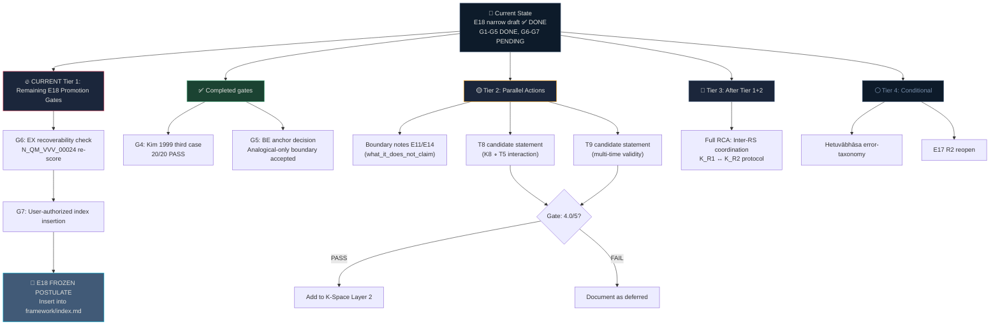

# 📊 Báo Cáo Tiến Độ v2 — Sau E18 Narrow Draft Hoàn Thành

**Tài liệu gốc:** [rca_core_extensibility_analysis.md](file:///c:/Stable_Diffusion/Buddhist_Epistemology_Quantum_Measurement/documents/research_documents/rca/rca_core_extensibility_analysis.md)
**E18 Narrow Draft:** [vvv_qmrf_framework_e18...narrow_draft.md](file:///c:/Stable_Diffusion/Buddhist_Epistemology_Quantum_Measurement/documents/research_documents/framework/drafts/vvv_qmrf_framework_e18_delayed_choice_registration_boundary_narrow_draft.md)
**Ngày báo cáo:** 2026-05-22
**Milestone đạt được:** ✅ **E18 Narrow Draft — Tier 1 action hoàn thành**

---

## 1. TRƯỚC / SAU — So Sánh Trạng Thái

### 1.1 Snapshot Comparison

| Metric | Trước E18 Draft | Sau E18 Draft | Δ |
|---|---|---|---|
| E18 status | RCA-supported candidate | **Narrow draft in `framework/drafts/`** | ⬆ Promoted |
| E18 postulate readiness | 4.3/5 (post-2-case) | **4.3/5** (confirmed, lifecycle table) | ✓ Stabilized |
| E18 formula | `Lock(C_f, S, {W_i}) → W_valid` (in RCA) | **Formalized in Section 3** with `I`, `R`, `B` predicates | ⬆ Formalized |
| E18 case validations | 2 (Wheeler + Quantum eraser) | **3** (+ Kim 1999; G4 DONE) | ✅ Complete for G4 |
| E18 BE anchor status | 3.8/5 (analogical) | **Analogical-only accepted** (G5 DONE; no equivalence claim) | ✅ Gate closed |
| E18 boundary safety | 4.3/5 | **4.3/5** (explicit Section 7 non-claims) | ✓ Documented |
| Confidence ambiguity (3.8 vs 4.3) | Flagged as drift | **RESOLVED** — Reconciliation Box (Section 0.1) | ✅ Fixed |
| Framework index touched | No | **No** (by design — draft only) | ✓ Correct |
| Promotion gates | Not defined | **G1–G7 defined** (3 DONE, 4 PENDING) | ⬆ Gated |
| Commits since RCA | 0 | **+2** (`6004de7` draft + `f0b91fa` traceability) | ⬆ Tracked |

---

### 1.2 Tier 1 Action: COMPLETED

```
BEFORE                              AFTER
─────────                           ─────
Tier 1: Draft E18 narrow proposal   ✅ DONE — committed 6004de7
        ↳ RCA-supported candidate   ✅ → framework/drafts/ (holding state)
        ↳ Confidence ambiguity       ✅ → Reconciliation Box resolved (f0b91fa)
        ↳ Formula formalized         ✅ → Lock(C_f, S, {W_i}) → W_valid
        ↳ 7-gate promotion path      ✅ → G1-G5 DONE, G6-G7 PENDING
```

---

## 2. BẢNG TIẾN ĐỘ CẬP NHẬT — 6 Chiều Mở Rộng

### 2.1 Updated Heatmap

```
                                           Confidence
Dimension                        Status      Score     Progress Bar
─────────────────────────────────────────────────────────────────────
V1  BE Source mới              Gần đóng     4.6/5     ██████████████████░░  92%
V2  Structural gap nội tại    CĐK mở       4.1/5     ████████████████░░░░  82%
    └─ E18 narrow draft        ✅ DONE       4.3/5     ████████████████████  100% (draft)
V3  Sub-node/edge detail      Mở           4.5/5     ██████████████████░░  90%
V4  EX import → core          Đóng         4.9/5     ███████████████████░  98%
V5  Algebraic-layer (T8/T9)   CĐK mở       4.1/5     ████████████████░░░░  82%
V6  Inter-RS coordination     Open frontier 4.1/5     ████████████████░░░░  82%
─────────────────────────────────────────────────────────────────────
```

> [!TIP]
> **Key change:** V2 (Structural gap) nay có sub-item E18 ở trạng thái **DONE (draft level)**. Chiều V2 vẫn CĐK mở vì còn E17-R2, multi-RS coordination, và registration-state communication chưa xử lý.

---

### 2.2 E18 Promotion Gate Tracker — Chi Tiết

| Gate | Condition | Status | Score/Evidence |
|---|---|:---:|---|
| G1 | 2 case validations PASS | ✅ **DONE** | Wheeler 5/5 + Quantum eraser 5/5 (with `S` refinement) |
| G2 | Formal locking rule with explicit `S` | ✅ **DONE** | `Lock(C_f, S, {W_i}) → W_valid` — [narrow_draft:90](file:///c:/Stable_Diffusion/Buddhist_Epistemology_Quantum_Measurement/documents/research_documents/framework/drafts/vvv_qmrf_framework_e18_delayed_choice_registration_boundary_narrow_draft.md#L90) |
| G3 | Boundary safety ≥ 4.0/5 | ✅ **DONE** | 4.3/5 — [narrow_draft:214](file:///c:/Stable_Diffusion/Buddhist_Epistemology_Quantum_Measurement/documents/research_documents/framework/drafts/vvv_qmrf_framework_e18_delayed_choice_registration_boundary_narrow_draft.md#L214) |
| G4 | Third independent case validation | ✅ **DONE** | [rca/cases/e18_case_kim_1999.md](file:///c:/Stable_Diffusion/Buddhist_Epistemology_Quantum_Measurement/documents/research_documents/rca/cases/e18_case_kim_1999.md) — Kim et al. 1999 4-branch lock, 20/20 condition cells PASS (2026-05-22) |
| G5 | BE anchor decision | ✅ **DONE** | Parent RCA Section 13 accepts analogical-only BE anchor as permanent boundary; no physical-equivalence claim |
| G6 | EX recoverability check | ⏳ **PENDING** | `N_QM_VVV_00024` at 3.7/5 — awaiting EX vNext |
| G7 | User-authorized index insertion | ⏳ **PENDING** | Explicit user authorization required |

```
Gate Progress: ██████████████████░░░ 5/7 (71%)
```

> [!IMPORTANT]
> **E18 narrow draft DONE ≠ E18 frozen postulate.** Có 2 gates chưa pass. File nằm ở `framework/drafts/`, framework `index.md` chưa bị chạm.

---

### 2.3 All Candidates Status

| # | Candidate | Phase | Score | Case Tests | Key Blocker |
|---:|---|---|---:|---:|---|
| 1 | **E18** Delayed-Choice Reg. Boundary | ✅ Narrow draft DONE | 4.4/5 readiness | 3/3 | G6 (EX recoverability), G7 (index authorization) |
| 2 | **E17 R2** Channel-self-registration | 🔴 Deferred | — | 0 | Chưa isolate K-side object |
| 3 | **T8** Embedding-composition theorem | 🔵 Identified | — | 0 | Chưa 1-sentence statement |
| 4 | **T9** Multi-time validity propagation | 🔵 Identified | — | 0 | Chưa 1-sentence statement |
| 5 | **Inter-RS** protocol (K_R1↔K_R2) | 🔵 Identified | — | 0 | Chưa có RCA |
| 6 | **Hetuvābhāsa** error-taxonomy | 🔵 Conditional | — | 0 | Chưa prove structural necessity |

---

## 3. PHÂN TÍCH SÂU

### 3.1 E18 Narrow Draft — Điều Gì Đã Làm Tốt

| # | Achievement | Detail |
|---|---|---|
| 1 | **Confidence ambiguity resolved** | Lifecycle table (3.5→3.9→4.1→4.3) + scoped headline — root cause fixed, not patched |
| 2 | **Formula formalized** | 3 predicates: `I` (valid inferential sign), `R` (registration relevance), `B` (K-side bounded) |
| 3 | **7-gate promotion path** | Clear G1–G7 with DONE/PENDING tracking — prevents premature freeze |
| 4 | **Architectural position mapped** | E18 vs E8/E13/E17 distinction table (Section 4) — object/trigger/direction/output |
| 5 | **Source traceability complete** | 4 BE anchors with identity boundaries, 3 QM case refs, EX compass note |
| 6 | **Section 7 non-claims explicit** | 6 explicit IS-NOT statements — retrocausation, Born rule, signaling, frozen, EX, identity |
| 7 | **Bilingual EN/VN** | Hybrid coverage per CLAUDE.md Q3 verdict |
| 8 | **Schema compliance** | `schema_guide.md` contract followed — one-sentence object, prose, formal, boundary |

### 3.2 Điểm Yếu Còn Tồn Tại

| # | Weakness | Impact | Action Required |
|---|---|---|---|
| 1 | **BE anchor boundary** — resolved by analogical-only acceptance | Philosophical grounding is explicitly scoped, not upgraded into equivalence | G5 DONE; keep boundary visible in future promotion review |
| 2 | **Third case validation** — resolved by Kim 1999 | G4 no longer blocks freeze path | G4 DONE; preserve 20/20 case trace |
| 3 | **EX 3.7/5** — `N_QM_VVV_00024` dưới 4.0 | EX không force nhưng cũng chưa validate | G6: Compass-only, defer to EX vNext |
| 4 | **T8/T9 interaction unknown** | E18 `Lock` operator có thể cần algebraic extension | Defer until T8/T9 enumerated |
| 5 | **V3 sub-node enrichment chưa prioritize** | 5 candidates nhưng no ranking | Cần scoring criteria |

### 3.3 Updated Risk Matrix

| Risk | Likelihood | Impact | Change vs v1 | Mitigation |
|---|---|---|---|---|
| **Overclaiming retrocausation** | Low ↓ | High | ↓ Giảm — Section 7 non-claims explicit | 6 IS-NOT statements + G condition `B` |
| **Premature freeze** (E18) | Low ↓ | High | ↓ Giảm — 7-gate system | G6–G7 blocking |
| **BE anchor forced-equivalence drift** | Low ↓ | Medium | ↓ Resolved by G5 Section 13 | Keep analogical-only boundary in all future E18 promotion text |
| **Scope creep** (V6 Inter-RS) | High | High | = Unchanged | Strict registration-layer scope |
| **T8/T9 × E18 interaction** | Medium | Medium | NEW | Defer — separate K-Space Layer 2 track |
| **Architecture bloat** | Low | Medium | = Unchanged | Per-node overhead: RCA + QM + BE + EX + boundary |

---

## 4. ĐÁNH GIÁ TỔNG HỢP

### 4.1 Maturity Scorecard

| Component | Maturity Level | Rationale |
|---|---|---|
| **E18 RCA** | 🟢 **Current through G5** | Sections 1-13, 5-Why, three case validations, formula refined, analogical-only BE boundary locked |
| **E18 Narrow Draft** | 🟢 **Complete / holding** | G1-G5 DONE, G6-G7 PENDING, still held in `framework/drafts/` |
| **E18 Frozen Postulate** | 🔴 **Not started** | G6-G7 PENDING — by design |
| **Core Extensibility RCA** | 🟢 **Complete** | 471 lines, 6-dimension matrix, Appendix A audit |
| **K-Space Algebraic (T5-T7)** | 🟢 **Complete** | Committed `e031621` |
| **K-Space T8/T9** | 🟡 **Identified only** | 1-sentence statements not yet written |
| **Inter-RS Coordination** | 🟡 **Identified only** | RCA not started |
| **E17 R2 Channel-self-reg** | ⚪ **Deferred** | Not blocked, not active |

### 4.2 Overall Framework Health

```
Framework Core (E1–E16 + legacy E17)
├── Lifecycle pipeline: E16→E4→E5→E3→E2→E7→E8    ✅ Complete
├── Boundary matrix: E9/E11/E14 + E12/E15/E16     ✅ Complete
├── K-Space axioms K1–K8                            ✅ Frozen (Level 4)
├── K-Space theorems T1–T7                          ✅ Active
├── VVV graph: 52 nodes, 131 edges, 2.52/node       ✅ Healthy density
├── BE source coverage: 11/30 direct                 ✅ Near-saturated
├── EX boundary audit: 141 entries, 100% PASS        ✅ Intact
│
├── E18 Narrow Draft                                 ✅ DONE (holding)
│   ├── G1-G5: DONE
│   └── G6-G7: PENDING
│
├── T8/T9 Algebraic candidates                       🟡 Identified
├── Inter-RS coordination                            🟡 Open frontier
└── Hetuvābhāsa error-taxonomy                       ⚪ Conditional
```

---

## 5. WHAT NEXT? — Lộ Trình Cập Nhật

### 5.1 Roadmap Shift: Tier 1 Old → Tier 1 New

```diff
  OLD TIER 1 (from v1 report):
- Draft E18 narrow framework proposal         <- COMPLETED
- Strengthen BE anchor (3.8 -> 4.0+ target)   <- Reframed by RCA: analogical-only accepted

  CURRENT TIER 1 (immediate next actions):
+ G6 EX recoverability check
+ G7 user-authorized index insertion
+ Boundary notes E11/E14
```

### 5.2 Updated Decision Tree



---

### 5.3 Tier 1 — E18 Promotion (Priority #1)

> [!IMPORTANT]
> **2 gates remaining.** E18 đã có narrow draft hoàn chỉnh, ba case validation, và G5 analogical-only boundary decision. Bước tiếp theo là G6→G7.

| Step | Action | Input | Output | Risk | Effort |
|---:|---|---|---|---|---|
| 1 | **G6: EX recoverability** | EX vNext re-classification | `N_QM_VVV_00024` score update or documented below-threshold status | May remain below 4.0 | Low |
| 2 | **G7: User authorization** | User review of G1-G6 results | Explicit approval → `index.md` insertion | Premature insertion if G6 not resolved | Low |

### 5.4 Tier 2 — Parallel Actions (Can Start Now)

| Step | Action | Dependency | Effort |
|---:|---|---|---|
| 5 | **Boundary notes E11/E14** — DONE in `rca_core_extensibility_analysis.md` Appendix D (4.4/5 PASS) | E17 RCA downstream | Done |
| 6 | **T8 candidate 1-sentence statement** — K8∘T5 embedding composition | [K_Space_Axiomatization.md](file:///c:/Stable_Diffusion/Buddhist_Epistemology_Quantum_Measurement/documents/research_documents/meta_architecture/K_Space_Axiomatization.md) | Low–Medium |
| 7 | **T9 candidate 1-sentence statement** — multi-time validity propagation | K-Space §3 Open Items | Low–Medium |

### 5.5 Tier 3 — After Tier 1+2

| Step | Action | Trigger |
|---:|---|---|
| 8 | **Full RCA: Inter-RS coordination** (K_R1↔K_R2) | User request + Wigner's friend v2.0 |
| 9 | **V3 sub-node prioritization** — rank E8/E10/E11/E12/E15 enrichment candidates | User preference |

### 5.6 Tier 4 — Conditional (Only If Triggered)

| Step | Action | Condition |
|---:|---|---|
| 10 | **Hetuvābhāsa error-taxonomy** | RCA proves E1–E16 lack error classification |
| 11 | **E17 R2 reopen** | RCA isolates channel as K-side object |

### 5.7 ❌ NOT Recommended (Unchanged)

| Action | Lý do |
|---|---|
| Import EX into core | CLAUDE.md "compass not cargo" |
| Force E18 into `index.md` now | G4–G7 PENDING |
| Create postulate from BE alone | No structural necessity proven |
| Force E17 R2 | Channel-self-registration object not isolated |

---

## 6. SUMMARY METRICS — V1 → V2

| Metric | Report v1 | Report v2 (now) | Δ |
|---|---:|---:|---:|
| E18 status | RCA candidate | **Narrow draft DONE** | ⬆ |
| E18 promotion gates defined | 0 | **7** (3 DONE) | ⬆ |
| Confidence ambiguity | Flagged | **Resolved** | ✅ |
| Tier 1 old actions remaining | 3 | **0** (completed) | ✅ |
| Tier 1 new actions | — | **4** (G4–G7) | NEW |
| Total candidates tracked | 5 | **6** (+Hetuvābhāsa) | +1 |
| Commits since project start | `73103df` base | **`f0b91fa`** (+6 commits) | +6 |
| Framework files in `drafts/` | 0 | **1** (E18) | +1 |
| Framework `index.md` modified | No | **No** (correct) | ✓ |

---

> [!TIP]
> **Khuyến nghị ưu tiên cao nhất:** Chọn 1 trong 3 case candidates (Kim 1999 / Ma 2013 / Manning 2015) cho **G4 — third case validation**. Đây là gate có effort thấp nhất mà unlock được phần lớn promotion path. Song song đó, quyết định G5 (BE anchor: deepen or accept) có thể làm cùng lúc.
>
> **Tier 2 status:** boundary notes E11/E14 are DONE in `rca_core_extensibility_analysis.md` Appendix D; T8/T9 statements remain parallel work independent of E18 promotion.

---

## 7. UPDATE LOG / Nhật ký Cập nhật

> [!IMPORTANT]
> **2026-05-22 — G4 ADVANCED TO DONE.** Section 1.2, 2.2, 4.2, 5.2, 5.3, 6 above were written when gate progress was 3/7. After Kim et al. 1999 case validation (case file: [rca/cases/e18_case_kim_1999.md](file:///c:/Stable_Diffusion/Buddhist_Epistemology_Quantum_Measurement/documents/research_documents/rca/cases/e18_case_kim_1999.md), 20/20 condition cells PASS), gate progress is now **4/7 (57%)**. All historical references in this file to "3 DONE, 4 PENDING" or "G1-G3 DONE, G4-G7 PENDING" describe the prior state; **current state is G1-G4 DONE, G5-G7 PENDING**.

### 7.1 Updated state summary

| Item | Previous (v2 original) | Current (after Kim 1999 case) |
|---|---|---|
| Gate progress | 3/7 (43%) | **4/7 (57%)** |
| Done gates | G1, G2, G3 | **G1, G2, G3, G4** |
| Pending gates | G4, G5, G6, G7 | **G5, G6, G7** |
| Total case validations | 2 (Wheeler + Scully-Drühl) | **3 (+ Kim 1999)** |
| Postulate readiness | 4.3/5 | **4.4/5** (per parent RCA Section 12.5) |
| Framework `index.md` modified | No (correct) | **No (correct, unchanged)** |
| E18 holding state | `framework/drafts/` | **`framework/drafts/` (unchanged)** |

### 7.2 Next priority actions / Hành động ưu tiên kế tiếp

**Tier 1 (new priorities after G4 DONE):**

1. **G5 — BE anchor decision** (currently 3.8/5, gate ≥ 4.0/5)
   - Option A: Deepen Anumāna–Vyāpti–Svabhāvapratibandha chain to push above 4.0
   - Option B: Accept analogical-only permanently and document the acceptance as a permanent boundary
   - Recommended: Option B (per pre-write RCA reasoning — case test does not strengthen BE anchor; deepening risks forced analogy)

2. **G6 — EX recoverability check** (currently `N_QM_VVV_00024` at 3.7/5)
   - Awaiting EX vNext re-classification
   - Compass-only, no commitment to import

3. **G7 — User-authorized index insertion** (currently PENDING)
   - Explicit user authorization required
   - Only after G5 + G6 resolved

**Tier 2 (parallel, unblocked):**

4. DONE — Boundary notes for E11/E14 (`what_it_does_not_claim` sections), recorded in `rca_core_extensibility_analysis.md` Appendix D.
5. T8 candidate 1-sentence statement (K8 ∘ T5 embedding composition)
6. T9 candidate 1-sentence statement (multi-time validity propagation)

### 7.3 Decision-impact summary / Tóm tắt tác động quyết định

**Strongest weakness reduced:** "Only 2 case tests" weakness from v2 Section 3.2 is now resolved — three independent case validations exist (Wheeler binary, Scully-Drühl ternary, Kim 1999 4-branch with symmetric pairs).

**Previously strongest weakness:** BE anchor 3.8/5 below 4.0 threshold is now resolved by G5 analogical-only boundary acceptance in parent RCA Section 13. The remaining blocking gate is G6.

**Framework health:** E18 remains a narrow-draft candidate in `framework/drafts/`. Framework `index.md` is intentionally untouched, consistent with G7 still PENDING.

VN — Tóm tắt tác động: Điểm yếu chỉ 2 case test đã giải quyết bằng Kim 1999. Điểm yếu BE anchor 3.8/5 cũng đã giải quyết bằng quyết định G5 analogical-only trong RCA Section 13. Gate còn chặn hiện tại là G6. E18 vẫn ở `framework/drafts/`, `index.md` không bị chạm.

---

### 7.4 G5 update — analogical-only BE anchor accepted

> [!IMPORTANT]
> **2026-05-22 — G5 ADVANCED TO DONE.** Parent RCA Section 13 closes G5 by accepting the BE anchor as analogical-only permanent boundary. The decision does not strengthen the BE-QM relation into physical equivalence; it resolves the gate by removing boundary ambiguity.

| Item | Previous (after G4) | Current (after G5 decision) |
|---|---|---|
| Gate progress | 4/7 (57%) | **5/7 (71%)** |
| Done gates | G1, G2, G3, G4 | **G1, G2, G3, G4, G5** |
| Pending gates | G5, G6, G7 | **G6, G7** |
| BE anchor status | 3.8/5, decision pending | **Analogical-only accepted as permanent boundary** |
| Framework `index.md` modified | No (correct) | **No (correct, unchanged)** |
| E18 holding state | `framework/drafts/` | **`framework/drafts/` (unchanged)** |

**Next blocking gate:** G6 — EX recoverability check. EX remains compass-only; no EX structure is imported into the core.

VN: G5 da dong bang cach chap nhan neo BE la analogical-only. Day la cach an toan hon viec co ep BE thanh tuong duong vat ly. Gate con chan hien tai la G6; E18 van chua duoc dua vao `framework/index.md`.
