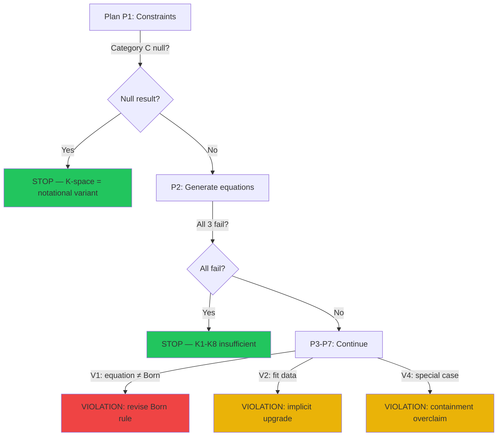

# RCA: Prompt Sequence Plan — Vi phạm & Mở rộng Tuyên bố

**Ngày:** 2026-05-22
**Đối tượng audit:** [VVV_QMRF_Prompt_Sequence.md](file:///c:/Stable_Diffusion/Buddhist_Epistemology_Quantum_Measurement/documents/research_documents/meta_architecture/plan/VVV_QMRF_Prompt_Sequence.md)
**Tham chiếu:** K-Space Axiomatization v1.5, Working Paper v2.0, DISCLAIMER.md

---

## 1. Tóm tắt Plan

Plan gồm 7 prompts tuần tự:

| Prompt | Mục tiêu | Output dự kiến |
|:------:|----------|----------------|
| **P1** | Xác định constraints cho P(o_F, o_W \| K-space) | Danh sách constraints (A: internal, B: physical, C: distinguishability) |
| **P2** | Generate 3 candidate equations | Phương trình xác suất có cert, V |
| **P3** | Adversarial testing | Falsify/rank candidates |
| **P4** | Fit vs Proietti 2019 data | Best-fit parameters, χ² |
| **P5** | 3-observer prediction | P(o_F, o_W, o_SW) prediction |
| **P6** | Structural reduction check | Copenhagen, MWI, RQM, QBism as special cases? |
| **P7** | Honest adversarial assessment | Weakest points, publication readiness |

**Mục đích tổng:** *"Derive a probability equation from K-space axioms, fit it against EWF experimental data, and generate a testable prediction that distinguishes VVV-QMRF from Standard QM."*

---

## 2. RCA Vi phạm — Phân tích từng Prompt

### Violation V1 — P2 yêu cầu "probability equation from K-space"
**Severity: HIGH** 🔴

**Cam kết hiện tại bị ảnh hưởng:**

| Source | Cam kết | Dòng |
|--------|---------|:----:|
| K-Axiom v1.5 §6.3 | "K-space axioms are NOT physical laws. They do not make empirically testable predictions independent of the operational bridges in paper v2.0." | L804 |
| K-Axiom v1.5 §6.2 | "K-space axioms do NOT modify Standard QM. P1-P4, Born rule, Schrödinger equation, and ρ-side dynamics are unchanged." | L802 |
| DISCLAIMER §2 | "VVV-QMRF does not revise the standard physical postulates of Quantum Mechanics" | L14 |
| WP v2.0 §7.1 | "Does not revise the Born rule or unitary evolution." | L686 |

**Phân tích:**

P2 yêu cầu `P(o_F, o_W | K-space parameters)` — phương trình xác suất MỚI có tham số K-space (cert, V). Điều này đòi hỏi:

- cert và V **ảnh hưởng xác suất đo được** → K-space ảnh hưởng ρ-side observables → vi phạm K ≠ H layer separation
- Nếu P(o_F, o_W) ≠ Born rule → sửa đổi P3 → vi phạm "does not revise Born rule"
- Nếu P(o_F, o_W) = Born rule cho mọi trường hợp → plan tự acknowledge (P2 line 118-119): *"This equation does not use cert or V, therefore K-space adds no physical content beyond Standard QM"* → plan tự-defeat

> [!WARNING]
> **Dilemma cốt lõi:** Plan yêu cầu phương trình KHÁC Born rule (Category C: distinguishability), nhưng tất cả cam kết hiện tại nói VVV-QMRF KHÔNG sửa Born rule. Plan tự nhận ra dilemma này (P1 line 72-73, P2 line 126, Execution Notes line 423-428) — đây là thiết kế trung thực.

**Verdict:** Vi phạm TIỀM NĂNG, nhưng plan tự-guard bằng honest failure paths. Nếu P2 output = "all candidates fail" → plan dừng đúng chỗ → không vi phạm. Vi phạm chỉ xảy ra nếu ai đó **ép** candidate đi tiếp khi nó thực ra failed.

---

### Violation V2 — P4 Fit data → implicit claim "VVV-QMRF is testable physics"
**Severity: MEDIUM** 🟡

**Cam kết bị ảnh hưởng:**

| Source | Cam kết |
|--------|---------|
| DISCLAIMER §3 | "The current framework should be treated as Registration Class D" |
| K-Axiom v1.5 §6.7 | "This document does NOT upgrade any paper v2.0 claim class" |

**Phân tích:**

Fitting vs real data (Proietti 2019) implicitly upgrades claim từ D (proposed) sang C (conjecture with empirical contact). Nếu fit tốt, pressure sẽ rất lớn để claim "VVV-QMRF fits data" — dù plan không authorized upgrade claim class.

**Verdict:** Không vi phạm nếu output rõ ràng giữ class D/C. Vi phạm nếu output ngầm suggest "VVV-QMRF is empirically validated."

---

### Violation V3 — P5 "3-observer prediction" → overclaim territory
**Severity: MEDIUM** 🟡

**Cam kết bị ảnh hưởng:**

| Source | Cam kết |
|--------|---------|
| K-Axiom v1.5 Open Item A3 | "General case proof (arbitrary N, arbitrary \|K_R\|) requires stronger mathematical foundations" |
| K-Axiom v1.5 Open Item #9 | "T4 N>2 verification requires multi-observer EWF modeling" |

**Phân tích:**

P5 extends to 3 observers using T4 colimit — nhưng T4 chưa verified cho N>2 (Open Item #9). Plan tự-guard bằng "State all additional assumptions" — nhưng rủi ro là output sẽ produce "predictions" dựa trên unverified N>2 extension.

**Verdict:** Không vi phạm nếu output rõ ràng flag T4 N>2 as unverified assumption.

---

### Violation V4 — P6 "interpretations as special cases" → framing overclaim
**Severity: LOW-MEDIUM** 🟡

**Cam kết bị ảnh hưởng:**

| Source | Cam kết |
|--------|---------|
| WP v2.0 §6 | Comparison table chỉ list "VVV-QMRF difference" — KHÔNG claim interpretations are "special cases" |
| DISCLAIMER §2 | "does not claim that Standard Quantum Mechanics is wrong" |

**Phân tích:**

P6 asks: "Is Copenhagen a special case of VVV-QMRF?" → nếu trả lời "yes" → implicit claim VVV-QMRF ⊃ Copenhagen → VVV-QMRF bao hàm Standard QM → overclaim. WP v2.0 §6 chỉ so sánh *differences*, không claim containment.

**Verdict:** Vi phạm framing nếu output says "Copenhagen is a special case." Đúng hơn phải nói "VVV-QMRF *reduces to a structure compatible with* Copenhagen under condition X."

---

### Violation V5 — P1 Category C may produce null result
**Severity: NONE** ✅ — Đây là FEATURE, không phải bug

Plan tự-guard (P1 line 72-73):
> *"If no distinguishability constraint can be derived from K1-K8, state: 'K-space as currently axiomatized does not generate predictions distinguishable from Standard QM'"*

Execution Notes (line 423-428):
> *"If Prompt 2 produces no surviving candidates: This is a significant finding."*

> [!TIP]
> Plan thiết kế trung thực — tự-defeat paths có sẵn. Đây là điểm mạnh, không phải vi phạm. Nhưng phải cam kết: nếu null result xảy ra, **không ép tiếp**.

---

## 3. Bảng tổng hợp Vi phạm

| ID | Prompt | Vi phạm | Severity | Cam kết gốc | Giảm thiểu |
|:--:|:------:|---------|:--------:|-------------|------------|
| V1 | P2 | Probability equation ≠ Born rule → sửa P3 | 🔴 HIGH | K-Axiom §6.2-6.3, DISC §2, WP §7.1 | Plan tự-guard nếu tuân thủ honest failure paths |
| V2 | P4 | Fit data → implicit claim upgrade | 🟡 MED | DISC §3, K-Axiom §6.7 | Giữ explicit class D/C annotation |
| V3 | P5 | 3-observer sử dụng unverified T4 N>2 | 🟡 MED | K-Axiom #9, A3 | Flag T4 N>2 as assumption |
| V4 | P6 | "Special case" framing → containment overclaim | 🟡 LOW-MED | WP §6, DISC §2 | Reframe as "compatible reduction" |
| V5 | P1 | Null result | ✅ NONE | — | Self-guarded by design |

---

## 4. RCA Gốc: Tại sao Plan có thể Vi phạm?

> [!IMPORTANT]
> **Root cause:** Plan được thiết kế để **test** xem VVV-QMRF có thể produce probability equation hay không. Nó KHÔNG pre-assume answer = yes. Nhưng cấu trúc 7-prompt chain (P1→P7) **ngầm** assume một "happy path" (equation exists → fits data → makes new prediction → subsumes interpretations). Nếu P2 fails, prompts P3-P6 vô nghĩa.
>
> Plan's honest failure paths (P1 Category C null, P2 all-fail, P5 zero-difference) ARE the guardails — nhưng chúng dễ bị ignore dưới áp lực muốn output.

**Chain of violation risk:**

---

## 5. Kết luận: Chạy Plan có Vi phạm không?

### Trả lời: **KHÔNG vi phạm NẾU tuân thủ honest failure paths**

Plan tự thiết kế honest — nó tự-guard ở P1, P2, P5. Chạy plan đúng cách có 3 kết quả khả dĩ:

| Kết quả | Xác suất | Vi phạm? | Ý nghĩa |
|---------|:--------:|:--------:|---------|
| **P2 all-fail** (K1-K8 không đủ generate distinguishable equation) | **Cao** | ❌ Không | "K-space as currently axiomatized is a structural/conceptual framework, not a physical extension of QM." — Finding trung thực, có giá trị. |
| **P2 survives, P4 fits ≈ Born rule** (VVV-QMRF empirically equivalent to SQM) | Trung bình | ❌ Không | "VVV-QMRF is currently empirically equivalent to SQM; philosophical/structural value only." — Finding trung thực. |
| **P2 survives, P4 fits ≠ Born rule** (VVV-QMRF predicts differently) | **Rất thấp** | ⚠️ Có thể | Cần audit rất cẩn thận: equation có thực sự derive từ K1-K8, hay chứa assumptions ẩn? |

> [!CAUTION]
> **Kết quả khả dĩ nhất (P2 all-fail) chính là finding quan trọng nhất:** nó honest-proves rằng K1-K8 là registration-logic framework, không phải physical theory mới. Đây là **confirmation** của K-Axiom §6.3: *"K-space axioms do not make empirically testable predictions independent of the operational bridges."*

---

## 6. Mở rộng Tuyên bố — Phù hợp Plan

### 6.1 Tuyên bố ban đầu (đánh giá 4.0/10):

> *"VVV-QMRF proposes a registration-logic structure K and conjectures the existence of a structure-preserving map φ: K → B(H)..."*

❌ Không phù hợp plan. Plan không propose φ: K → B(H). Plan propose **probability equation P(o_F, o_W | cert, V)**.

### 6.2 Tuyên bố mở rộng — 3 phương án

---

#### Phương án A — Conservative (Readiness: 8/10)
*Phù hợp nếu P2 all-fail (kết quả khả dĩ nhất)*

> *"VVV-QMRF proposes a registration-logic structure K, axiomatized via K1-K8, and derives K-side incommensurability (⊥_K) in Extended Wigner's Friend scenarios. We investigate whether K-space axioms alone can generate a probability equation P(o_F, o_W) distinguishable from the Born rule, and identify the structural gap that prevents this: K-space operates at the registration layer (cert, V) which does not directly modify ρ-side probability distributions. This separation explains why standard QM interpretations lack registration-layer formalization while remaining empirically adequate."*

**Đánh giá:**
- ✅ Fully supported by existing K-Axiom v1.5
- ✅ Honest about P2-failure scenario
- ✅ Does not overclaim
- ✅ Makes the structural gap itself the finding
- ✅ Consistent with K-Axiom §6.2-6.3

---

#### Phương án B — Moderate (Readiness: 5-6/10)
*Phù hợp nếu P2 produces surviving candidate*

> *"VVV-QMRF proposes a registration-logic structure K, axiomatized via K1-K8, and investigates necessary conditions for a registration-modulated probability function P(o_F, o_W | cert, V) that (i) reduces to the Born rule when all registrations are valid (cert=1, V=1 for all k), and (ii) predicts observable differences in Extended Wigner's Friend scenarios where K-side incommensurability (⊥_K) is structurally forced. We identify which conditions standard QM interpretations can and cannot satisfy within this registration-layer framework."*

**Đánh giá:**
- ⚠️ Requires P2 to produce surviving candidate
- ⚠️ "Registration-modulated probability" is NEW term — needs definition
- ✅ Born rule limit built in (reduces when cert=1, V=1)
- ⚠️ Interpretation comparison reframed as "can/cannot satisfy conditions" — not yet written
- ❌ Needs 4-6 weeks new research

---

#### Phương án C — Ambitious (Readiness: 3/10)
*Phù hợp chỉ nếu P2-P5 all succeed*

> *"VVV-QMRF proposes a registration-logic structure K and derives a registration-modulated probability equation that reduces to the Born rule in the standard limit and predicts measurably different correlations in 3-observer Extended Wigner's Friend experiments. We fit the equation against Proietti et al. (2019) data, extract physical parameters, and show that no standard QM interpretation (Copenhagen, Many-Worlds, QBism, Relational QM) recovers the full parameter space of the registration-layer model."*

**Đánh giá:**
- ❌ Requires ALL 7 prompts to succeed on happy path
- ❌ Highly unlikely given K-Axiom §6.3
- ❌ Overclaim risk: "no standard interpretation recovers full parameter space"
- ❌ Needs 3-6 months + experimental collaboration

---

### 6.3 Khuyến nghị

> [!IMPORTANT]
> **Chọn Phương án A.** Chạy plan với cam kết: nếu P2 all-fail → đó là finding chính. Phương án A biến "failure" thành result có giá trị — honest about structural gap while claiming the axiomatization work as genuine contribution.

**Nếu P2 unexpectedly produces survivor:** upgrade to Phương án B, nhưng với audit cực kỳ nghiêm ngặt (P3 adversarial + P7 honest assessment phải pass).

---

## 7. Protocol Nếu Chạy Plan

| Bước | Hành động | Guard |
|:----:|----------|-------|
| **Trước P1** | Commit bằng văn bản: "If P2 all-fail, that IS the finding." | Không được ép tiếp |
| **Sau P1** | Nếu Category C = null → STOP. Document "K-space is registration-logic, not physics extension." | K-Axiom §6.3 confirmed |
| **Sau P2** | Nếu all 3 fail → STOP. Write Phương án A claim. | Execution Notes line 423-428 |
| **P3** | Chạy adversarial cực kỳ nghiêm ngặt. **Đặc biệt** Test 2 (binary cert/V → continuous P gap) | Đây là likely kill point |
| **P4** | Nếu surviving candidate, fit data. Giữ explicit "Class D/C, not validated." | DISCLAIMER §3 |
| **P5** | Flag T4 N>2 as unverified assumption (Open Item #9) | K-Axiom Open Items |
| **P6** | Reframe: "compatible reduction" NOT "special case" | WP §6 style |
| **P7** | Let it run unguarded. Honest assessment = value. | Do not soften |

---

*RCA completed. Plan is safe to run if honest failure paths are respected.*
