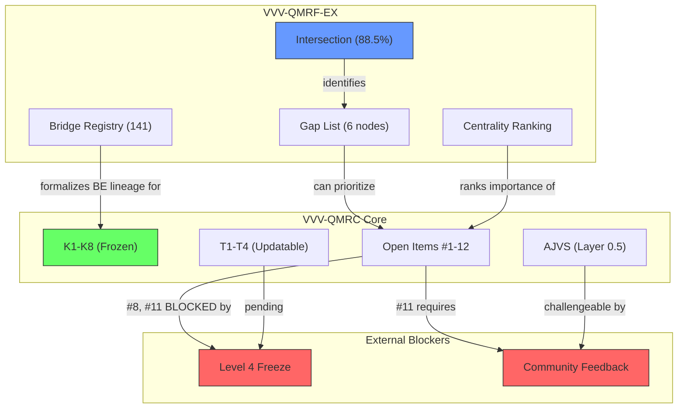

# RCA Strategy Analysis: Core-Internal Expansion vs. EX Integration

> **Date:** 2026-05-21
> **Context:** K-Space Axiomatization v2.0 (Layer 1 frozen, Layer 2 updatable) + VVV-QMRF-EX v1.7 (completed, 88.5% intersection, isolated)

---

## 0. Tóm Tắt Trạng Thái Hiện Tại

### VVV-QMRC Core (K-Space Axiomatization)

| Thành phần | Trạng thái | Notes |
|---|---|---|
| **Layer 1 (K1-K8)** | ✅ **Frozen** | Syntactic freeze; 8 axioms complete |
| **Layer 2 (T1-T4)** | ⏳ Updatable | Pending Level 4 freeze; T4-H conditional |
| **AJVS** | ⏳ Named postulate | Layer 0.5; T3 conditional on AJVS |
| **Open Items** | 12 items (#1-#12) | 2 High, 5 Medium, 5 Low-Medium/Low |
| **Concrete Model (§7)** | ✅ Complete | EWF scenario verified against K1-K8 |

### VVV-QMRF-EX

| Metric | Value |
|---|---|
| **Intersection coverage** | 46/52 (88.5%) — dual K-ρ anchored |
| **Total bridge edges** | 143 (67 BR_EX_BE active + 74 BR_EX_QM) |
| **Graph edges** | 181 active |
| **Isolation** | ✅ Complete — 0 boundary violations |
| **Status** | v1.7 finalized, Phase 12 closed |

---

## 1. Hai Con Đường — Chi Tiết

### Option A: Mở rộng Core từ Nội tại

**Nghĩa là:** Tiếp tục giải quyết [Open Items #1-#12](file:///c:/Stable_Diffusion/Buddhist_Epistemology_Quantum_Measurement/documents/research_documents/meta_architecture/K_Space_Axiomatization.md#L909-L924) trước, KHÔNG sử dụng EX data.

**Các mục tiêu cụ thể:**

| Priority | Open Item | Nội dung | Dependency |
|---|---|---|---|
| 🔴 High | #8 | Bridge_EWF semantic proof ("no admissible reinterpretation") | Level 4 freeze + AJVS |
| 🔴 High | #11 | RCA re-audit after community feedback | Level 4 freeze + T1-T3 |
| 🟡 Medium | #1 | Multi-step retroactive chain (E8 extension) | Needs new axiom(s) |
| 🟡 Medium | #3 | Validated absence validity (E14 extension) | K1/K4 structural |
| 🟡 Medium | #9 | T4 N>2 verification | Multi-observer EWF model |
| 🟡 Medium | #12 | CHANGELOG §3.3 K-axiom dependency annotations | Internal bookkeeping |
| 🟢 Low | #2, #4-#7, #10 | Null formalization, inter-K, pre-reg, E4, σ/R̂ equiv, paper update | Various |

**Lợi ích:**
- Deepens axiomatic rigor — mỗi open item resolved = tăng internal consistency
- K1-K8 dependency chain clean hơn (no external data injection)
- Publication-ready cho formal-math audience

**Hạn chế:**
- **#8 và #11 BỊ BLOCK** bởi Level 4 freeze (chưa có community feedback)
- #1, #4, #5 cần new axiom(s) — work mới chưa có foundation
- Không khai thác được 88.5% intersection data đã compute
- T1-T3 vẫn pending → Layer 2 chưa stable → mở rộng core trên nền chưa ổn định

### Option B: Apply VVV-QMRF-EX từ từ

**Nghĩa là:** Selective import EX findings vào core process, qua RCA gate (Rule I-5 trong [vvv-qmrf-ex-plan.md](file:///c:/Stable_Diffusion/Buddhist_Epistemology_Quantum_Measurement/documents/research_documents/vvv-qmrf-ex/vvv-qmrf-ex-plan.md)).

**Những gì EX cung cấp mà Core chưa có:**

| EX Asset | Core Gap it fills | Ví dụ |
|---|---|---|
| **Betweenness centrality ranking** | Core không biết VVV node nào quan trọng nhất cho K-ρ mediation | `N_QM_VVV_00021` (Registration Lock) = #1 mediator |
| **K-side gap list (6 nodes)** | Core không có systematic identification of weak K-anchors | 5 KE-QI nodes + 1 both-gap |
| **Community structure** | Core không có topology verification cho 19 BIAN groups | 314 communities detected |
| **BR_EX_BE registry** | Core K3/K4/K5 BE lineage annotations = informal; EX has formalized edges | 67 active formalized bridges |
| **Shortest-path BE→QM queries** | Core không có computable K-ρ traversal | Path lengths 2-16 hops |
| **Similarity matrices** | Core chưa identify hidden connections | 263×55 and 55×105 matrices |

**Lợi ích:**
- Khai thác immediate value từ EX data đã hoàn thành
- Centrality ranking → prioritize Open Items #1-#12 hiệu quả hơn
- Gap list → target đúng chỗ yếu thay vì mở rộng đều
- EX boundary audit (0/141 violations) → safe integration path

**Hạn chế:**
- Cần RCA promotion gate (Rule I-5) — effort mới
- Nếu import không cẩn thận → vi phạm Layer 1 syntactic freeze
- EX data dựa trên source snapshot = frozen view of core → nếu core đã evolve, EX data có thể stale
- Community detection (314 communities) có thể mislead nếu graph structure changes

---

## 2. Dependency Map — Ai cần Ai?

> [!IMPORTANT]
> **Core open items #8 và #11 (cả hai High priority) đều bị BLOCK bởi external factors (Level 4 freeze, community feedback) mà RCA không kiểm soát được.** Mở rộng core nội tại chỉ có thể address Medium/Low items trong khi chờ.

---

## 3. Risk Assessment

| Risk | Option A (Core-only) | Option B (EX-first) | Hybrid |
|---|---|---|---|
| **Layer 1 corruption** | 🟢 Zero (frozen) | 🟢 Zero (EX isolated; K1-K8 text không đổi) | 🟢 Zero |
| **Wasted effort** | 🟡 Medium — #1/#4/#5 cần new axiom mà chưa biết axiom đúng chưa | 🟢 Low — EX data đã compute, chỉ cần selective import | 🟢 Low |
| **Premature commitment** | 🟢 Low | 🟡 Medium — EX findings có thể influence axiom design sớm | 🟢 Low (if gated) |
| **Stale data** | N/A | 🟡 Medium — EX source snapshot = frozen point-in-time | 🟢 Low (verify first) |
| **Over-engineering** | 🟡 Medium — axiomatic depth mà chưa cần | 🟡 Medium — graph analysis mà chưa validate | 🟢 Low |

---

## 4. Đề Xuất: **Hybrid Strategy — "EX-Informed Core Deepening"**

> [!TIP]
> **Không chọn A hoặc B thuần túy. Dùng EX data làm RCA intelligence để inform Core open item prioritization.**

### Phase 1: EX Intelligence Extraction (0-cost — data đã có)

Sử dụng EX results **read-only** (không import vào core) để:

1. **Prioritize Open Items bằng centrality data:**
   - `N_QM_VVV_00021` (Registration Lock) = centrality #1 → liên quan trực tiếp đến Open Item #1 (multi-step chain, K5-K7 interaction)
   - `N_QM_VVV_00033` (Self-Certifying Registration) = centrality #10 → liên quan đến Open Item #7 (σ/R̂ equivalence)

2. **Xác định Open Items nào KHÔNG blocked:**
   - ✅ #1 (multi-step chain) — Medium, **có thể làm ngay**
   - ✅ #2 (null formalization) — Low-Medium, **có thể làm ngay**
   - ✅ #3 (validated absence) — Medium, **có thể làm ngay**
   - ✅ #9 (T4 N>2) — Medium, **có thể làm ngay**
   - ✅ #12 (CHANGELOG annotations) — Medium, **có thể làm ngay**
   - ❌ #8, #11 — **BLOCKED by Level 4 freeze**

3. **Cross-reference EX gap list với Open Items:**
   - EX K-side gaps (6 nodes) → kiểm tra xem có trùng với open item nào không
   - Nếu gap node thuộc domain của open item → giải open item = đóng gap

### Phase 2: Targeted Core Deepening (EX-informed)

| Priority Order | Action | Why (EX-informed rationale) |
|---|---|---|
| 1st | **Open Item #12** (CHANGELOG §3.3 annotations) | Quick win; EX centrality data shows which Condition rows matter most |
| 2nd | **Open Item #1** (multi-step chain) | EX shows `N_QM_VVV_00021` (Registration Lock) = top mediator; multi-step chain directly affects its K5-K7 lifecycle |
| 3rd | **Open Item #3** (validated absence) | EX shows 3 VVV nodes (00001, 00004, 00020) anchor to Null/Absence QM concepts; E14 formalization strengthens these |
| 4th | **Open Item #9** (T4 N>2) | Independent of Level 4; EX community structure (314 communities) provides topology hypothesis to test |
| 5th | **Open Item #2** (null formalization) | EX shows `N_QM_VVV_00036` (Null Event) = centrality #5; deeper null axiom strengthens this node |

### Phase 3: Selective EX Promotion (after Core stabilizes)

Chỉ sau khi Phase 2 hoàn thành:
1. Verify EX source snapshot vẫn consistent với updated core
2. Apply RCA promotion gate (Rule I-5) cho specific findings
3. Import **only** those EX bridge entries that survived core changes

---

## 5. Trả Lời Câu Hỏi Gốc

> **"RCA nên tiếp tục mở rộng VVV-QMRC core từ nội tại, hay apply từ từ VVV-QMRF-EX vào để lấy thêm thông tin?"**

### Kết luận: **Cả hai, theo thứ tự — nhưng KHÔNG apply EX vào core ngay.**

| Bước | Hành động | Lý do |
|---|---|---|
| **Ngay bây giờ** | Đọc EX data read-only → dùng centrality + gap list để **prioritize** Open Items | EX data = free intelligence; không cần import để dùng |
| **Tiếp theo** | Deepen Core trên Open Items #12 → #1 → #3 → #9 → #2 (EX-informed order) | 5 items KHÔNG blocked; giải từ high-value xuống |
| **Sau đó** | Chờ Level 4 freeze → giải #8, #11 | External dependency — không thể accelerate |
| **Cuối cùng** | Selective EX promotion qua RCA gate | Chỉ sau core stable + EX snapshot verified |

> [!WARNING]
> **KHÔNG nên import EX data trực tiếp vào K-Space Axiomatization ngay bây giờ.** Lý do:
> - EX source snapshot = frozen view trước K-Axiom v2.0 changes
> - Layer 1 syntactic freeze nghĩa là EX data không thể thay đổi K1-K8 text
> - EX bridge entries (BR_EX_*) là EX-local namespace — cần formal namespace promotion
> - Core open items (#1, #3) có thể thay đổi K-space structure → EX data cần re-validate

> [!TIP]
> **Key insight:** VVV-QMRF-EX đã hoàn thành vai trò chính — cung cấp **quantitative map** của K-ρ relationships. Giá trị lớn nhất của EX ngay lúc này là **intelligence** (biết node nào quan trọng, gap ở đâu) chứ không phải **data import** (merge edges vào core). Dùng EX như compass, không phải như cargo.
