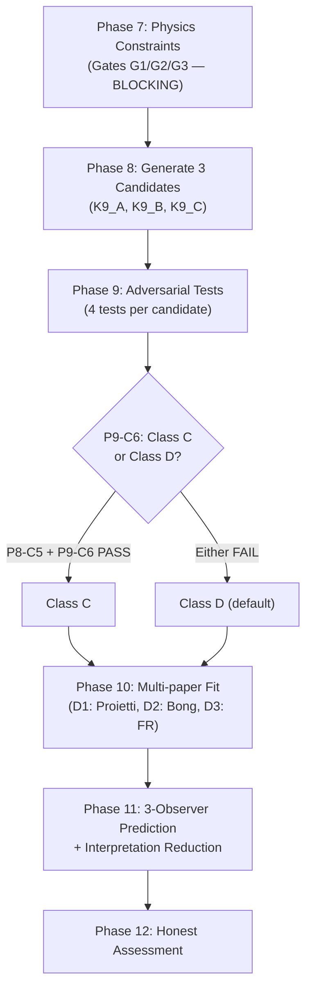

# RCA: T4 là gì, K9 là gì — Cách xác định

**Source:** [K_Space_Axiomatization.md](file:///c:/Stable_Diffusion/Buddhist_Epistemology_Quantum_Measurement/documents/research_documents/meta_architecture/K_Space_Axiomatization.md) (v2.1) + [K_Space_Axiomatization_plan_v3.md](file:///c:/Stable_Diffusion/Buddhist_Epistemology_Quantum_Measurement/documents/research_documents/meta_architecture/K_Space_Axiomatization_plan_v3.md)

---

## 1. T4 — N-Observer Generalization Theorem

### 1.1 T4 là gì?

T4 là **Bridge Theorem (Định lý Cầu nối)** thuộc **Layer 2** của K-Space Axiomatization. T4 mở rộng T1 (K_joint Construction cho 2 observer) lên **N ≥ 2 observer**.

> **Statement chính thức** ([K_Space_Axiomatization.md#L819-L822](file:///c:/Stable_Diffusion/Buddhist_Epistemology_Quantum_Measurement/documents/research_documents/meta_architecture/K_Space_Axiomatization.md#L819-L822)):
> Cho N ≥ 2 registering system R₁, ..., R_N với K-side spaces K₁, ..., K_N: joint K-space K_joint(R₁,...,R_N) tồn tại dưới dạng **colimit** của embedding diagram khi và chỉ khi:
> 1. Mỗi cặp (i,j) với `requires_K_joint(K_i, K_j) = 1` thỏa mãn pairwise AdmJoint
> 2. Embedding diagram thỏa mãn **global overlap compatibility** — tất cả embedding paths commute trong candidate K_joint

### 1.2 Vị trí trong kiến trúc

```
Layer 1 — CORE AXIOMS (K1-K8): FROZEN
Layer 2 — BRIDGE THEOREMS:
  T1: K_joint Construction (N=2)           ← T4 mở rộng từ đây
  T2: ⊥_K Derivation
  T3: Bridge_EWF Formalization
  ★ T4: N-Observer Generalization           ← NEW, Class D
  T5: K_joint Composition/Associativity     ← phụ thuộc T4
  T6: Decoherence-Induced Registration
  T7: IRB Registration-Scope Propagation    ← phụ thuộc T4 qua T5
```

### 1.3 Cách xác định T4

| Tiêu chí | Cách xác định |
|---|---|
| **Khi nào T4 áp dụng?** | Khi có N ≥ 2 registering systems (observers) cần joint K-space |
| **Input từ Layer 1** | K1 (carrier sets), K2 (intra-K_R chains), K4+K5+K7 (V lifecycle), K8 (V-preservation) |
| **Input từ Level 4** | `requires_K_joint`, `D_joint`, `AdmJoint` — generalized to N observers |
| **Colimit construction** | `K_joint = colimit of diagram D` với objects = K₁,...,K_N và morphisms = K1-K8-preserving embeddings |
| **Global commutativity (F7d)** | Pairwise AdmJoint là **necessary but NOT sufficient** — cần thêm global path-independence: khi 2 embedding paths mang cùng source K-state vào K_joint, images phải agree trên M, o, cert, t, V |

### 1.4 Thuộc tính quan trọng

- **⊥_K KHÔNG transitive:** `K_A ⊥_K K_B ∧ K_B ⊥_K K_C` ⇏ `K_A ⊥_K K_C`
- **Pairwise checks:** Tối đa N(N-1)/2 cặp với `requires_K_joint = 1`
- **T4-H (Colimit Existence Hypothesis):** T4 conclusions **conditional** on T4-H — giả thuyết rằng category C_{K-space} có colimits cho mọi finite embedding diagram. Đây là HYPOTHESIS, không derivable từ K1-K8 alone.

### 1.5 Claim class và status

| Property | Value |
|---|---|
| **Claim class** | D (proposed) — NEW, không có trong paper v2.0 |
| **Freeze status** | New theorem, requires independent verification for N>2 |
| **Conditional on** | T4-H (Colimit Existence Hypothesis) |
| **If T4-H fails** | N-observer colimit may not exist; T1 (N=2, constructive) remains valid |
| **If T4-H holds** | T4 valid for all N ≥ 2 |

---

## 2. K9 — Candidate Bridge Axiom (Probability Bridge)

### 2.1 K9 là gì?

K9 **CHƯA tồn tại** trong [K_Space_Axiomatization.md](file:///c:/Stable_Diffusion/Buddhist_Epistemology_Quantum_Measurement/documents/research_documents/meta_architecture/K_Space_Axiomatization.md) v2.1. K9 là **candidate bridge axiom** được đề xuất trong [K_Space_Axiomatization_plan_v3.md](file:///c:/Stable_Diffusion/Buddhist_Epistemology_Quantum_Measurement/documents/research_documents/meta_architecture/K_Space_Axiomatization_plan_v3.md) §1.4 để giải quyết **structural gap** cốt lõi:

> **Gap:** K1-K8 chỉ có `cert ∈ {0,1}` và `V ∈ {0,1}` (binary). Không có cơ chế sinh ra **xác suất liên tục** (continuous probability). Không có ánh xạ "registration-state → probability value". Vì vậy K1-K8 **không phân biệt được** với Standard QM.

K9 sẽ là **Layer 3 (Probability Bridge)** — tầng mới giữa Layer 2 (Bridge Theorems) và data fit. K9 **KHÔNG nằm trong Layer 1** (K1-K8 vẫn FROZEN).

### 2.2 Ba candidate K9

#### K9_A — V-Weighted Born Rule

```
P(o | K) = V(k) · |⟨o|ψ⟩|² / Z(K)
```

| Property | Value |
|---|---|
| **Cơ chế** | V(k) làm "validity gate": V=1 → Born rule; V=0 → outcome suppressed |
| **Free parameters** | 1 (optional scaling α; default α=1) |
| **Born limit** | cert=1 ∧ V=1 ∀k → P = \|⟨o\|ψ⟩\|² ✓ |
| **Distinguishability** | Chỉ δP ≠ 0 nếu V fluctuates across runs (V=0 xảy ra cho một số runs) |
| **Status** | ✅ READY for Phase 7 |
| **Weakness** | Nếu V=1 luôn → K9_A = Born rule chính xác, không phân biệt được |

#### K9_B — Registration-Conditioned Probability

```
P(o | K) = Tr(E_o ρ) · f(cert, V, ⊥_K, C_K)
```

| Property | Value |
|---|---|
| **Cơ chế** | Born rule modulated bởi hàm f phụ thuộc cert, V, cross-registration context |
| **Free parameters** | 0–1 (f_context sensitivity; cert α removed vì cert=1 luôn theo K1) |
| **Born limit** | f(1, 1, no-firing, trivial) = 1 → P = Tr(E_o ρ) ✓ |
| **Distinguishability** | δP ≠ 0 khi f ≠ 1, phụ thuộc context (K5 firing, ⊥_K) |
| **Status** | ⚠️ CONDITIONAL READY — requires f-specification |

#### K9_C — Colimit Probability via T4

```
P(o_F, o_W | K_joint(F,W)) = lim_{colimit} Σᵢ wᵢ(context) · P(o | Kᵢ)
```

| Property | Value |
|---|---|
| **Cơ chế** | T4 colimit xây dựng joint probability từ individual observer registrations |
| **Free parameters** | 2–3 (weighting scheme wᵢ) |
| **Born limit** | Single observer (N=1), w=1 → P = marginal ✓ |
| **Distinguishability** | δP ≠ 0 khi colimit weighting diverges from classical product (EWF scenarios) |
| **Status** | ⚠️ NOT READY — requires T4 formalization + weighting scheme |
| **Dependencies** | T4 (phải formalized trước) |

### 2.3 Cách xác định K9

#### Quy trình xác định (Phase 7→12)



#### Tiêu chí chọn K9

| Gate | Tiêu chí | Mức độ |
|------|----------|--------|
| **P7-G1** | Operationalize `Phys(o\|H_physics)=1` beyond "detector click" | BLOCKING |
| **P7-G2** | Admit scenarios `Phys=1 ∧ Lock_K=0` (nontrivial registration gap) | BLOCKING |
| **P7-G3** | Operationally defined `t_lock` | BLOCKING |
| **P7-C3** | Distinguishability vs Standard QM | BLOCKING |
| **P8-C5** | Zero unjustified assumptions beyond K1-K8 ∪ {Born rule recovery} | HIGH |
| **P9-C6** | Pass all 4 adversarial tests + Gates 1/2/3 | HIGH |
| **Parameter budget** | ≤ 2 free parameters (Proietti D1: 4 data points → DOF ≥ 1) | HARD |

#### Pre-Phase-7 Forecast

| K9 | Signal | Phase 7 C3 Forecast |
|----|--------|---------------------|
| K9_A | δP ≠ 0 if V-fluctuation | **MARGINAL** — depends on V-variability |
| K9_B | δP ≠ 0 if context varies | **PROMISING** — if f is derived rigorously |
| K9_C | δP ≠ 0 in EWF multi-observer | **AMBITIOUS** — requires T4 + weighting |

### 2.4 K5 Firing trong Proietti Setup (RCA A2)

> [!IMPORTANT]
> K5 **CAN fire** trong Proietti EWF 6-photon setup vì `requires_K_joint = 1` (2 observers F, W share physical system → C_K exists). W's entangled-basis measurement → `k_W ⊥ k_F` possible → `V_prov(k_F) → 0`.

Tuy nhiên: Proietti reports **aggregate** ⟨A_xB_y⟩ over 1794 coincidences. V-fluctuation là per-event → aggregation có thể washout signal.

---

## 3. So sánh T4 vs K9

| Dimension | T4 | K9 |
|-----------|----|----|
| **Layer** | Layer 2 (Bridge Theorem) | Layer 3 (Probability Bridge) — PROPOSED |
| **Status hiện tại** | Đã có trong v2.1 | Chưa có — plan v3 only |
| **Claim class** | D (proposed) | D (default), eligible C |
| **Loại** | Structural theorem (K_joint for N observers) | Quantitative axiom (registration → probability) |
| **Frozen?** | No (updatable when Level 4 changes) | No (candidate — not adopted yet) |
| **Giải quyết gap gì?** | N=2 → N ≥ 2 observer generalization | Binary V/cert → continuous probability |
| **Dependency direction** | K9_C depends on T4 | T4 không phụ thuộc K9 |

---

## 4. Dependency Chain tổng hợp

```
Level 0-1: BE SOT, K≠H
  └── Level 2: E1-E7 (Framework Postulates)
       └── Level 3: K-state tuple
            └── Layer 1: K1-K8 (FROZEN)
                 ├── Layer 2: T1 (K_joint N=2)
                 │    └── ★ T4 (N-observer colimit) [conditional on T4-H]
                 │         ├── T5 (Composition/Associativity)
                 │         └── T7 (IRB Scope Propagation)
                 ├── Layer 2: T2 (⊥_K Derivation)
                 ├── Layer 2: T3 (Bridge_EWF) [conditional on AJVS]
                 ├── Layer 2: T6 (Decoherence)
                 └── ★ Layer 3: K9_candidate (PROPOSED — plan_v3 only)
                      ├── K9_A (V-Weighted Born Rule)
                      ├── K9_B (Registration-Conditioned)
                      └── K9_C (Colimit Probability) ← depends on T4
```

> [!NOTE]
> - T4 đã **tồn tại** trong v2.1 nhưng là Class D và conditional on T4-H
> - K9 **chưa tồn tại** — chỉ là candidates trong plan v3, chờ Phase 7-12 evaluation
> - K1-K8 (Layer 1) **hoàn toàn không bị ảnh hưởng** bởi T4 hay K9
