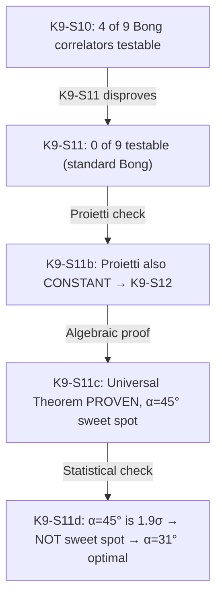

# Walkthrough: K9-S11 Chain — Testability to Experimental Proposal Foundation

**Session:** 2026-05-23
**Scope:** VVV-QMRF, EX compass
**Method:** 3-round RCA × 5-Why × scoring threshold 4/5

---

## Chain of Self-Corrections

This session discovered and corrected 4 errors through successive RCA rounds:

| Step | Claim | Self-Correction |
|---|---|---|
| K9-S10 | 4/9 Bong correlators testable | **WRONG** — f_perp is constant for Bong geometry |
| K9-S11c | α=45° sweet spot (K9_E=0.707) | **WRONG** — 1.9σ not significant; 0.707 not measurable |
| K9-S11d | α=31° optimal (FOM=6.0) | **CORRECT** — both LF (6.0σ) and K9_E (20.8σ) |

---

## Key Results

### 1. Universal Equatorial Cancellation Theorem (PROVEN)

$$f_\perp(+1,H) - f_\perp(-1,H) = -\cos(\theta)$$

Vanishes **IFF** θ = π/2 (equatorial). Azimuthal φ irrelevant.

**Implication:** ALL existing EWF experiments (Proietti 2019, Bong 2020) use equatorial superobserver measurements → K9_E = QM → UNTESTABLE.

### 2. Optimal Modified Bong Parameters

| Parameter | Standard Bong | Modified (K9-S12) |
|---|---|---|
| Superobserver θ | 90° (equatorial) | **31° (tilted)** |
| Gen LF 1 | -1.61 (not violated) | **+0.062 (6.0σ)** |
| δ⟨A₁B₂⟩ | 0 (hidden) | **-0.036 (20.8σ)** |
| N required | — | 91,000 (= Bong) |

### 3. Buddhist Epistemology Anchor

θ = degree of substrate sharing (adhara) between badhaka and pramana:
- θ = 90°: maximally incompatible → invisible contradiction
- θ = 31°: partially incompatible → visible contradiction → testable

---

## Commits (chronological)

| Hash | Message |
|---|---|
| `ca09ba2` | K9-S11: Bong Geometry Cancellation — self-correction of K9-S10 |
| `17c5025` | K9-S11b: Proietti Geometry Check — CONSTANT, go to K9-S12 |
| `d42e937` | K9-S11c: Universal Theorem PROVEN + LF Compatibility COMPATIBLE |
| `07b928d` | K9-S11d: Statistical Significance — α=45° NOT sweet spot |
| *(pending)* | RCA report + file updates + consolidation |

---

## Files Created

| File | Purpose |
|---|---|
| [K9S11_bong_predictions.md](file:///c:/Stable_Diffusion/Buddhist_Epistemology_Quantum_Measurement/documents/research_documents/meta_architecture/plan/k9_analysis/K9S11_bong_predictions.md) | Bong geometry cancellation analysis |
| [K9S11_bong_predictions.py](file:///c:/Stable_Diffusion/Buddhist_Epistemology_Quantum_Measurement/documents/research_documents/meta_architecture/fits/K9S11_bong_predictions.py) | Numerical engine (Bong overlaps) |
| [proietti_geometry_check.py](file:///c:/Stable_Diffusion/Buddhist_Epistemology_Quantum_Measurement/documents/research_documents/meta_architecture/fits/proietti_geometry_check.py) | Proietti BSM/CHSH overlap check |
| [K9S11c_universal_theorem_lf_check.md](file:///c:/Stable_Diffusion/Buddhist_Epistemology_Quantum_Measurement/documents/research_documents/meta_architecture/plan/k9_analysis/K9S11c_universal_theorem_lf_check.md) | Universal Theorem proof + LF compatibility |
| [universal_theorem_lf_check.py](file:///c:/Stable_Diffusion/Buddhist_Epistemology_Quantum_Measurement/documents/research_documents/meta_architecture/fits/universal_theorem_lf_check.py) | Sympy proof + LF computation |
| [alpha_threshold_scan.py](file:///c:/Stable_Diffusion/Buddhist_Epistemology_Quantum_Measurement/documents/research_documents/meta_architecture/fits/alpha_threshold_scan.py) | Refined α threshold search |
| [K9S11d_statistical_significance.md](file:///c:/Stable_Diffusion/Buddhist_Epistemology_Quantum_Measurement/documents/research_documents/meta_architecture/plan/k9_analysis/K9S11d_statistical_significance.md) | Statistical significance analysis |
| [statistical_significance.py](file:///c:/Stable_Diffusion/Buddhist_Epistemology_Quantum_Measurement/documents/research_documents/meta_architecture/fits/statistical_significance.py) | FOM optimization + measurables |

## Files Modified

| File | Change |
|---|---|
| [K9S10_testability_analysis.md](file:///c:/Stable_Diffusion/Buddhist_Epistemology_Quantum_Measurement/documents/research_documents/meta_architecture/plan/k9_analysis/K9S10_testability_analysis.md) | Erratum added (0/9 testable, not 4/9) |
| [VVV_QMRF_K9_Analysis_Plan.md](file:///c:/Stable_Diffusion/Buddhist_Epistemology_Quantum_Measurement/documents/research_documents/meta_architecture/plan/VVV_QMRF_K9_Analysis_Plan.md) | K9-S11/b/c/d added, K9-S12 updated with α=31° |
| [CHANGELOG.md](file:///c:/Stable_Diffusion/Buddhist_Epistemology_Quantum_Measurement/documents/research_documents/meta_architecture/CHANGELOG.md) | Sections 20–23 added |

---

## Next Step

**K9-S12:** Modified Bong Protocol Proposal at α=31°.
