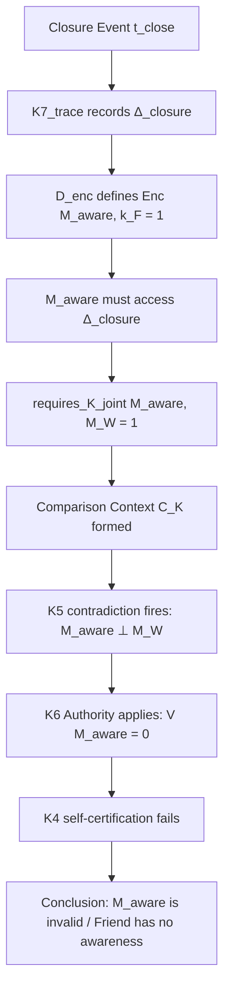

# RCA Investigation: Baumann & Brukner (2024) × VVV-QMRF Fit Plan

This report provides a Root Cause Analysis (RCA) and structural evaluation of the **BB-VVV Fit Plan** (found in `09_Fitting_Baumann_Brukner/BB_VVV_fit_plan.md`) designed to integrate the theoretical findings of Baumann & Brukner (2024) [arXiv:2305.15497] into the **VVV-QMRF K1–K8** quantum measurement registration framework.

---

## 1. Executive Summary & Status

The BB-VVV Fit Plan is a theoretical compatibility plan mapping Wigner's Friend mathematical conditions to VVV-QMRF axioms. Because the B&B paper is theory-only and contains no experimental correlator data, the plan focuses on **structural compatibility** rather than quantitative data fitting (K9_E).

### Compatibility Verdict: Partial, but Algebraically Grounded
The compatibility between the two systems is rich and informative, showing exact alignment in some areas and deep, structural differences in others:

| Component | Status | Key Mathematical & Structural Finding |
|---|---|---|
| **V1 (K5 ⊥_K ↔ B&B q₀₀ < 0)** | ⚠️ **Partial (F4 Triggered)** | **R_BB ≠ R_K5.** The B&B no-valid-joint-model failure region occurs near readout ($x \approx 0$), whereas K5 invalidation fires in the interference regime ($x = \pi/4$). They capture structurally distinct failure modes. |
| **V2 (K7 Closure ↔ B&B Δp)** | ✅ **Pass** | **Exact functional match.** K7 closure magnitude matches B&B memory change magnitude $\Delta p = |1 - 2\alpha^2| \sin^2(2x) / 2$ for asymmetric states. It is maximized at maximum interference and minimized at readout. |
| **T_BB Bridge Theorem (V3)** | ✅ **Class C (Conditional) + Script PASS** | **G1 Resolved & Closed. Computationally verified.** The bridge theorem is fully derivable AND verified by `scripts/bb_vvv_t_bb_verification.py` v1.0 (2026-05-28): T_BB Steps 1-4 PASS, 0 failures in 2000-point scan, V2 cross-check consistent. |
| **T_BB' (Option C)** | ✅ **CLOSED (superseded by Option A)** | 3-round RCA gate (4.27/5, 2026-05-28): T_BB' Step 1 premise falsified by F4; T_BB (Option A) complete + verified; no publication dependency. Supersession documented in `BB_VVV_compatibility_section.md` v2.1. |
| **Axiomatization Promotion** | ⛔ **Deferred** | While `K7_trace` and `D_enc` are formally correct, the canonical promotion RCA gate (Action 4) deferred adding them to `K_Space_Axiomatization.md` due to a lack of multi-scenario generality and the need for external peer review. |

---

## 2. Deep-Dive on Verifications

### 2.1 V1: Incommensurability vs. No-Valid-Joint-Model (The F4 Falsification)
The plan originally hypothesized that the parameters where B&B's joint probability model fails ($q_{00} < 0$) would be identical to the parameters where K5 invalidation fires ($requires\_K\_joint = 1$). 

Numerical verification using the script `scripts/bb_vvv_v1v2_verification.py` revealed a structural divergence:
*   **B&B's Eq. B.29:** 
    $$q_{00}(x, \varphi) = \frac{\sin^2(2x)}{2} + \frac{\sqrt{2}}{6}\sin(4x)\cos(\varphi)$$
*   **At Maximum Interference ($x = \pi/4$):** $\sin(4x) = 0$, meaning $q_{00} = 0.5 > 0$ for all phases $\varphi$. The joint model **never fails** here, even though $requires\_K\_joint = 1$ (K5 should fire).
*   **Near Readout ($x \approx 0$):** For $\cos(\varphi) < 0$, the linear term of $\sin(4x)$ dominates the quadratic term of $\sin^2(2x)$, driving $q_{00} < 0$ (joint model fails). Here, $requires\_K\_joint = 0$ (K5 should not fire).

> [!IMPORTANT]
> **RCA Root Cause:** B&B's $q_{00} < 0$ is an operationalist condition derived from a phase-dependent no-signaling constraint. VVV-QMRF's K5 is a registration-theoretic condition representing cross-registration contradiction. They capture different physical limitations and operate in complementary regimes.

---

### 2.2 V2: Memory Change Magnitude (The Symmetric Degeneracy Fix)
The plan successfully verified that the magnitude of memory change $\Delta p = |p(f_3) - p(f_1)|$ matches K7's closure strength. 

During the RCA review of v1.0, a **critical bug** was caught: if a symmetric state ($\alpha = \beta = 1/\sqrt{2}$) is used, all phase terms cancel, causing $\Delta p = 0$ everywhere. The plan was updated in v1.2 to use an **asymmetric initial state** ($|\alpha|^2 = 0.3$).
*   **Analytic formula:** 
    $$\Delta p = |1 - 2\alpha^2| \frac{\sin^2(2x)}{2}$$
*   **Verification:** The script scanned 5 key points and matched the numerical simulation to the analytical formula to machine precision:
    *   $x = 0.01$ (Readout) $\rightarrow \Delta p \approx 0$ (Trivial closure)
    *   $x = \pi/4$ (Interference) $\rightarrow \Delta p = 0.200$ (Maximal closure)

---

### 2.3 V3 & T_BB: The No-Awareness Bridge Theorem
The Wigner's Friend paradox states that the Friend's inner memory is modified by Wigner's measurement such that the Friend cannot retain awareness of their pre-Wigner thoughts. 

Originally, deriving this from VVV-QMRF was blocked by **Gap G1** (the framework had no mechanism to reference provisional validity $V_{prov}$ after closure). The v1.4 update resolved this by introducing two Layer 2 conservative extensions:

1.  **`K7_trace` (§18):** 
    At the moment of closure, it records the metadata $\Delta_{closure}(k) := V_{prov}(k) - V_{final}(k) \in \{0, 1\}$. This provides a read-only historical record of whether a validity transition occurred, without violating closure boundaries or creating new registration tuples.
2.  **`D_enc` (§19):** 
    Defines a binary counterfactual predicate $Enc(M_{aware}, k_F)$ specifying whether a hypothetical awareness act encodes this validity transition.

Using these tools, the derivation of $T_{BB}$ is mathematically complete:

---

## 3. Architecture & Governance Gates

The project applied rigorous 3-Round RCA Gates to evaluate structural and documentation updates:

### Action 3: Compatibility Section Update $\rightarrow$ EXECUTE (Score: 4.80/5)
This gate approved updating `BB_VVV_compatibility_section.md` to reflect the new v1.4 fit plan findings (closing G1, resolving G9, upgrading $T_{BB}$ to Class C). Since it was additive and preserved historical V1/V2 findings, it was executed successfully.

### Action 4: Canonical Promotion $\rightarrow$ DEFER (Score: 3.12/5)
This gate evaluated whether `K7_trace` and `D_enc` should be added to the canonical `K_Space_Axiomatization.md` document. 
*   **Generality failure (2.67/5):** Unlike `K5_prospective` (which is a core framework primitive used by multiple downstream frequency and channel theorems), `K7_trace` and `D_enc` currently only serve a single consumer ($T_{BB}$).
*   **Readiness failure (2.33/5):** The new extensions have not been tested against multi-party or sequential scenarios, and have not undergone formal peer review.
*   **Architectural Verdict:** Keep them situated within the fit plan (`BB_VVV_fit_plan.md` §18–§19) to prove their utility across more fit plans (e.g., Frauchiger-Renner) before promoting them to the canonical framework.

---

## 3b. Post-RCA Implementation Status (2026-05-28)

Five follow-up actions from the original RCA review were executed in session 2026-05-28:

| Action | RCA Gate | Status | Output |
|---|---|---|---|
| **P1-A:** Write T_BB verification script | Design decision 4.30/5 (PASS) | ✅ **COMPLETED** | `scripts/bb_vvv_t_bb_verification.py` v1.0 — OVERALL PASS |
| **P1-B:** Resolve T_BB' (Option C) open status | 3-round RCA 4.27/5 (PASS) | ✅ **COMPLETED** | `BB_VVV_compatibility_section.md` v2.1 — T_BB' CLOSED (superseded) |
| **FR-1 (V_FR2):** K7_trace second consumer verification (FR) | 3-round RCA 4.28/5 (PASS; before P2-C) | ✅ **COMPLETED** | `10_Fitting_Frauchiger_Renner/scripts/fr_vvv_k7trace_consumer_verification.py` v1.0 — OVERALL PASS; V_FR2 confirmed: K7_trace scenario-agnostic (B&B angle-sweep vs FR coherent/projective) |
| **P2-C:** requires_K_joint first-principles derivation | 3-round RCA 4.0/5 (PASS) | ✅ **COMPLETED** | `bb_vvv_t_bb_verification.py` updated: sin²(2x)>0.5 criterion; π/8 validated as **exact** (not approximation). `BB_VVV_fit_plan.md` §20 added. |
| **PEER-SYNC:** Add FR as K7_trace 4th canonical consumer | 3-round RCA 4.5/5 (PASS) | ✅ **COMPLETED** | Both `K_Space_Axiomatization.md` copies updated (2026-05-28): FR-VVV avoidance chain Step 2 as consumer (4). K7_trace: 4 consumers × 2 independent papers (B&B + FR). |

**P1-A summary:** `bb_vvv_t_bb_verification.py` implements K7_trace, D_enc, and requires_K_joint_ewf, then traces all 4 T_BB derivation steps. Result: T_BB holds for all 1000 interference-regime points; F_TB1–F_TB4 falsification conditions none triggered; V2 cross-check consistent. T_BB Class C (conditional) is now computationally supported, not just formally argued.

**P1-B summary:** T_BB' (Option C / No-Signaling Recast) was OPEN as "NEEDS V1-AWARE REVISION" in v2.0. The 3-round RCA (4.27/5) found: R1 Coherence 4.33/5 (fit plan already marks superseded), R2 Structural Necessity 4.33/5 (no independent path), R3 AHP Risk 4.17/5 (open status is inconsistency risk). Decision: CLOSE as superseded. `BB_VVV_compatibility_section.md` updated to v2.1.

**FR-1 / V_FR2 summary:** `fr_vvv_k7trace_consumer_verification.py` confirms K7_trace is identical in B&B and FR contexts. FR uses scenario-defining K5 trigger (coherent measurement); B&B uses angle-dependent trigger (sin²(2x)>0.5). Both produce identical K7_trace delta_closure mechanics. V_FR2 subsequently integrated into canonical `K_Space_Axiomatization.md` v2.4 (PEER-SYNC both copies, 2026-05-28).

**P2-C summary:** π/8 threshold was labeled "approximation" but is the exact 50%-coherence boundary from K5 condition (iii): sin²(2x)>0.5 → x∈(π/8, 3π/8). Approximation label removed. T_BB re-run: OVERALL PASS unchanged.

---

## 4. Summary of Version Chronology

*   **v1.0 $\rightarrow$ v1.1:** Added V1 bidirectional protocol, Option C (No-Signaling Recast), E7 trace search, and argument-type disambiguation.
*   **v1.1 $\rightarrow$ v1.2:** Resolved E7 trace (mapping it to derived axiom K5 from Level 2 Validity Location postulate). Fixed citation in $T_{BB}$ Step 3.
*   **v1.2 $\rightarrow$ v1.3:** Narrowed Gap G1 by introducing the `K7_trace` closure metadata extension (§18), and revised $T_{BB}$ Steps 1-4 to utilize $\Delta_{closure}$.
*   **v1.3 $\rightarrow$ v1.4:** Fully closed Gap G1 and resolved G9 by defining the `D_enc` transition-encoding predicate (§19), upgrading $T_{BB}$ to Class C (conditional).
*   **v1.0 $\rightarrow$ v2.0 (Compatibility Section):** Documented honest falsification of V1 equivalence (R_BB $\neq$ R_K5) and mapped out the successful V2/V3 integrations.
