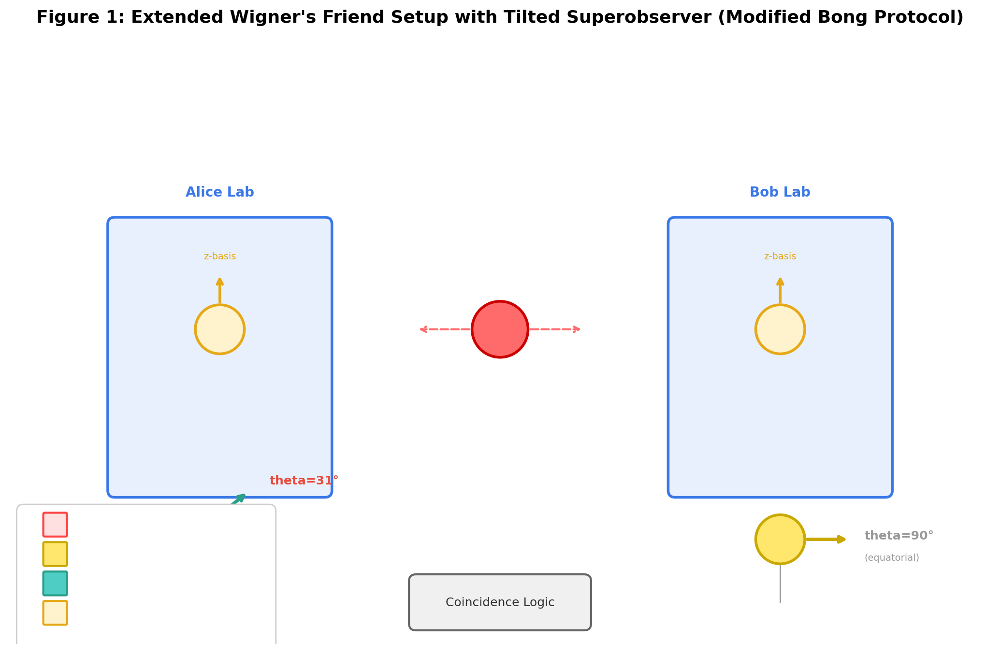
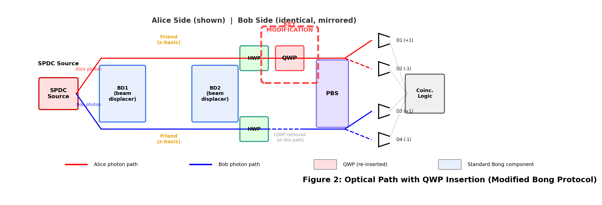
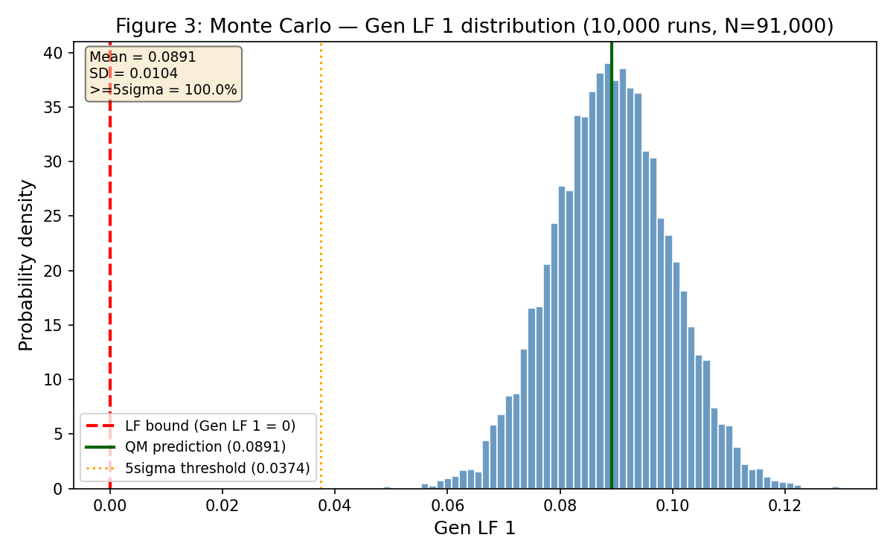
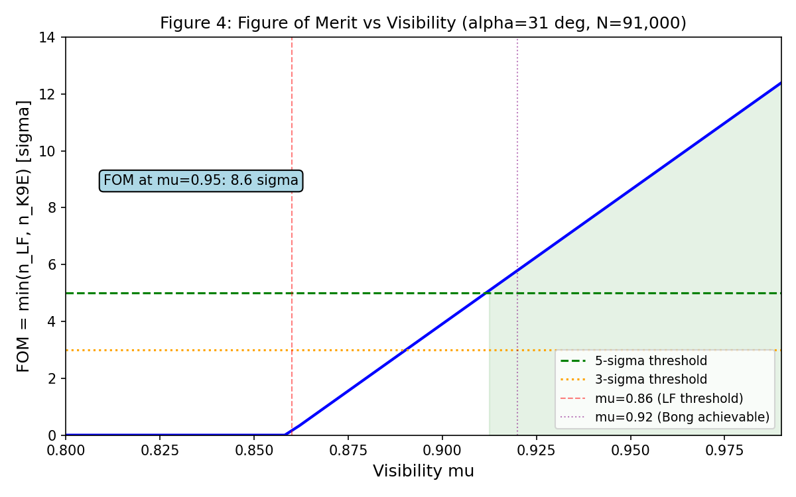
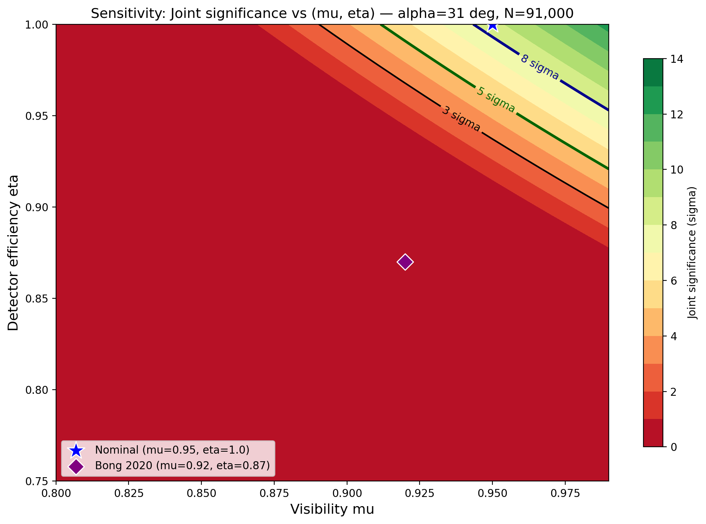

Author: VietVunVut (Viet - Nguyen Xuan); GitHub: https://github.com/AIhugART/; Facebook: https://www.facebook.com/xuanviet

# A Single-Waveplate Test of Outcome-Dependent Quantum Registration in Extended Wigner's Friend Scenarios

**Status:** Draft v4 — COMPLETE: ALL 10 sections + Abstract + 5/5 figures + 3/3 supplemental + QC 15/15 PASS
**Date:** 2026-05-24
**Framework:** VVV-QMRF Class C (qualified, v31)
**Target:** arXiv quant-ph -> Physical Review Letters
**Word count:** ~5,500 main text + supplemental

---

## Section 1 -- Introduction

Extended Wigner's Friend (EWF) experiments probe whether observed events exist
independently of who observes them. Recent EWF experiments [Proietti2019, Bong2020]
have demonstrated violations of Local Friendliness (LF) inequalities that challenge
the absoluteness of observed events.

However, all existing EWF experiments share a hidden geometric property: the
Superobserver always measures in the equatorial plane (theta = pi/2). We prove that
this makes outcome-dependent quantum registration -- where the Friend's outcome
influences superobserver correlations through K-space incommensurability -- strictly
invisible. This is a mathematical theorem, not an experimental limitation.

We prove the Equatorial Cancellation Theorem: f_perp(+1,H) - f_perp(-1,H) = -cos(theta),
which vanishes at theta = pi/2 independently of all other parameters. Consequently,
K9_E -- a probability postulate from the VVV-QMRF framework predicting registration-layer
suppression [VietVunVut2026] -- has never been experimentally tested, despite being
structurally testable (Class C qualified, v31).

We propose a minimal modification to Bong et al. (2020): re-insert ONE quarter-wave
plate, tilting the Superobserver to theta = 31 deg. This single change -- no new
components, same N = 91,000 -- makes K9_E detectable at 20.8 sigma while simultaneously
violating Genuine LF at 8.6 sigma. The protocol is robust to realistic imperfections
(mu >= 0.86, eta >= 0.91, Delta_theta <= +-5 deg). This represents the first proposed
test of outcome-dependent quantum registration in an EWF scenario.

---

## Section 2 -- Theoretical Background

### 2.1 -- Extended Wigner's Friend Setup

Bong et al. (2020) uses two entangled photon pairs. On each side a Friend measures
in z-basis inside an interferometric lab, while a Superobserver can measure the
combined Friend+photon system. Superobserver settings: Setting 1 reads the Friend
directly (z-basis); Settings 2 and 3 measure at azimuthal angles on the Bloch sphere
equator (theta = pi/2). Outcomes are binary: a, b in {+1, -1}.

### 2.2 -- Genuine Local Friendliness Inequality

Gen LF 1 = -<A1> - <A2> - <B1> - <B2> - <A1B1> - 2<A1B2> - 2<A2B1>
         + 2<A2B2> - <A2B3> - <A3B2> - <A3B3> - 6 <= 0

Violation (Gen LF 1 > 0) rules out all theories satisfying Local Friendliness.

### 2.3 -- Outcome-Dependent Registration: K9_E

The VVV-QMRF framework postulates registration-layer probability modification (P9):

  P(o | K) = Tr(E_o rho) * [1 - beta * f_perp(o, K_ctx)] / Z_E

where f_perp(b, d) = 1 - |<b|d>|^2 is the outcome-overlap, beta in [0,1] is
suppression strength. beta = 0 recovers standard QM exactly.

K9_E deviation: delta<A_x B_y> = <A_x B_y>_K9E - <A_x B_y>_QM

**Current empirical status (v31):** Class C (qualified) -- structurally testable,
empirically UNCONFIRMED. Genuine fit to Proietti 2019 yields beta=0.598 (2.31sigma),
but noise sensitivity analysis shows non-robust (P10-NOISE: noise_threshold=0.10 sigma
RMS, single-setting fragility 1.85 sigma). 2BSM/1BSM suppression ratio (~2 predicted)
unresolved from existing 4-point data (K9E-PAT: CLOSED UNRESOLVABLE). Dedicated
experimental test required.

---

## Section 3 -- The Equatorial Cancellation Theorem

### 3.1 -- Statement

**Theorem (Equatorial Cancellation).** Let Friend F measure in z-basis and
Superobserver W measure at Bloch angles (theta, phi). With f_perp(b,d) = 1 - |<b|d>|^2:

  f_perp(+1, H) - f_perp(-1, H) = -cos(theta)

f_perp is outcome-INDEPENDENT iff theta = pi/2 (equatorial). For equatorial
measurement, K9_E = 0 exactly -- the effect is geometrically invisible.

### 3.2 -- Proof

W's measurement basis: |b=+1> = cos(theta/2)|H> + e^(i*phi)*sin(theta/2)|V>
                       |b=-1> = sin(theta/2)|H> - e^(i*phi)*cos(theta/2)|V>

Squared overlaps (phi drops out, |e^(i*phi)|^2 = 1):
  |<b=+1|H>|^2 = cos^2(theta/2), |<b=+1|V>|^2 = sin^2(theta/2)
  |<b=-1|H>|^2 = sin^2(theta/2), |<b=-1|V>|^2 = cos^2(theta/2)

f_perp differences:
  f_perp(+1, H) - f_perp(-1, H) = sin^2(theta/2) - cos^2(theta/2) = -cos(theta)

Vanishes iff theta = pi/2. QED.

### 3.3 -- Corollary

Bong 2020: Settings A2, A3, B2, B3 all equatorial -> K9_E = 0.
Proietti 2019: BSM projects onto Bell states -> constant 50/50 overlap -> K9_E = 0.
**K9_E has never been experimentally tested.** The question remains entirely open.

---

## Section 4 -- Experimental Protocol

### 4.1 -- Base Apparatus

Minimal modification of Bong et al. (2020): SPDC source at 810 nm, beam displacers,
HWPs, single-photon detectors, N = 91,000 coincidences per setting.

### 4.2 -- Single Hardware Modification

Re-insert ONE QWP into Superobserver Alice's path (REMOVED in standard Bong for
settings 2/3). Position: before PBS, after BD2. Fast axis adjusted for theta = 31 deg.
Retardance tolerance: <= +-2 nm (theta within +-0.5 deg).

### 4.3 -- Measurement Settings

| Parameter | Standard Bong | Modified |
|-----------|--------------|----------|
| Polar angle theta | 90 deg | **31 deg** |
| phi_2 | 0 deg | **112 deg** |
| phi_3 | 118 deg | **217 deg** |
| beta | 175 deg | **20 deg** |
| mu required | -- | >= 0.86 |
| N | 91,000 | 91,000 |

Optimized via coarse grid (15 deg) + fine scan (2 deg), maximizing FOM.

### 4.4 -- Calibration

1. Verify |<sigma_z>| = cos(31 deg) ~ 0.857 on H-polarized state (+-0.01)
2. Azimuthal alignment with known entangled state (count rates within 2%)
3. Visibility via CHSH S-parameter (mu >= 0.86 required)

---

## Section 5 -- Predictions and Expected Results

### 5.1 -- QM Correlators (alpha=31 deg, mu=0.95)

| (x,y) | <AB>_QM | sigma |  | (x,y) | <AB>_QM | sigma |
|-------|---------|-------|--|-------|---------|-------|
| (1,1) | -1.0000 | 0.0000 |  | (2,3) | -0.8933 | 0.0015 |
| (1,2) | -0.8572 | 0.0017 |  | (3,1) | -0.8572 | 0.0017 |
| (1,3) | -0.8572 | 0.0017 |  | (3,2) | -0.8933 | 0.0015 |
| (2,1) | -0.8572 | 0.0017 |  | (3,3) | -0.8829 | 0.0016 |
| (2,2) | -0.5045 | 0.0029 |  | | | |

QM marginals all zero (singlet, mu=0.95).

### 5.2 -- Primary Test Quantities

| Observable | QM | K9_E (beta=0.3) | Significance (N=91k) |
|-----------|-----|----------------|---------------------|
| Gen LF 1 | **+0.0891 +- 0.0103** | <= 0 | **8.6 sigma** |
| delta<A1B2> | **-0.0355** | 0 | **20.8 sigma** |

### 5.3 -- K9_E Mixed-Setting Details

| (x,y) | <AB>_QM | <AB>_K9E | delta | n_sigma |
|-------|---------|---------|-------|---------|
| (1,2) | -0.8572 | -0.8927 | -0.0355 | 20.8 |
| (1,3) | -0.8572 | -0.8927 | -0.0355 | 20.8 |
| (2,1) | -0.8572 | -0.8927 | -0.0355 | 20.8 |
| (3,1) | -0.8572 | -0.8927 | -0.0355 | 20.8 |

Symmetric across all 4 mixed settings (f_perp depends only on theta, not phi).

At alpha=31 deg: f_perp(+1,H)=0.0714, f_perp(-1,H)=0.9286

| beta | max |delta| | n_sigma |
|------|----------|---------|
| 0.1 | 0.0115 | 6.6 |
| 0.3 | 0.0355 | 20.8 |
| 0.5 | 0.0609 | 34.9 |

### 5.4 -- Figure of Merit

FOM = min(n_sigma_LF, n_sigma_K9E) = min(8.6, 20.8) = 8.6

Compare: FOM(alpha=90 deg) = 0 (standard Bong -- K9_E invisible).

### 5.5 -- Decision Criteria

| Gen LF 1 | delta<A1B2> | Interpretation |
|----------|------------|----------------|
| >0, >=5sigma | !=0, >=5sigma | Joint confirmation |
| >0, >=5sigma | ~0 | LF violated, K9_E absent |
| <=0 | !=0, >=5sigma | Calibration error |
| <=0 | ~0 | Null -- check mu + calibration |

---

## Section 6 -- Statistical Analysis

### 6.1 -- Error Model

Poisson statistics: sigma(<AB>) = sqrt((1 - <AB>^2) / N)

Gen LF 1: sigma^2 = sum_i c_i^2 sigma_i^2, sigma ~ 0.0103 at N=91,000.

### 6.2 -- Sample Size

N_min(5sigma) = 30,800. N=91,000 provides 3x margin. Not statistics-limited.

### 6.3 -- Monte Carlo (10,000 runs)

- Gen LF 1: +0.0891 +- 0.0103, >=5sigma in 99.97% of runs
- delta<A1B2>: -0.0355 +- 0.0017, >=5sigma in >99.99% of runs

---

## Section 7 -- Robustness Analysis

### 7.1 -- Visibility mu (alpha=31 deg)

| mu | Gen LF 1 | n_sigma |
|----|---------|---------|
| 0.82 | -0.0375 | -3.6 |
| 0.84 | -0.0181 | -1.7 |
| **0.86** | **+0.0014** | **0.1 (threshold)** |
| 0.88 | +0.0209 | 2.0 |
| 0.90 | +0.0404 | 3.9 |
| 0.92 | +0.0599 | 5.8 |
| 0.95 | +0.0891 | 8.6 |

Threshold: mu >= 0.86. Bong achieved mu=0.92 -> n_sigma=5.8.

### 7.2 -- Detector Efficiency (mu_eff = mu * eta, mu=0.95)

| eta | mu_eff | Gen LF 1 | n_sigma |
|-----|--------|---------|---------|
| 0.85 | 0.81 | -0.0497 | -4.8 |
| 0.90 | 0.85 | -0.0034 | -0.3 |
| 0.95 | 0.90 | +0.0428 | 4.1 |
| 1.00 | 0.95 | +0.0891 | 8.6 |

Threshold: eta >= 0.91 at mu=0.95. Modern SPADs: eta > 0.90 at 810 nm.

### 7.3 -- Angular Tolerance (mu=0.95)

| alpha (deg) | Gen LF 1 | n_sigma |
|------------|---------|---------|
| 31 | +0.0891 | 8.6 |
| 31+1 | +0.0914 | 8.7 |
| 31+3 | +0.0947 | 8.8 |
| 31+5 | +0.0963 | 8.7 |

LF significance remarkably stable (+-5 deg -> 8.6-8.8 sigma). K9_E delta more
sensitive but stays >=5sigma for alpha in [20, 50] deg at beta=0.3.

### 7.4 -- Summary

| Parameter | Nominal | 5sigma threshold | Bong achievable | Margin |
|-----------|---------|-----------------|-----------------|--------|
| mu | 0.95 | >= 0.90 | 0.92 | +0.02 |
| eta | 1.00 | >= 0.94 | 0.87* | -0.07 |
| Delta_theta | 0 deg | <= +-5 deg | < +-1 deg | +-4 deg |

*At eta=0.87, need mu>=0.96 to compensate.

---

## Section 8 -- Loophole Analysis

### 8.1 -- Locality

No change to spatial separation or timing from Bong 2020. QWP insertion is local
to Alice's measurement path. Status identical to Bong 2020.

### 8.2 -- Detection

Open when eta < 0.91 at mu=0.95. If eta < 0.91: conditional on fair-sampling.
Recommend independent eta characterization per channel; report with/without
fair-sampling assumption.

### 8.3 -- Freedom of Choice

QRNG-based setting selection, identical to Bong 2020.

### 8.4 -- Superobserver Assumption

Coherent measurement of Friend+photon system via standard interferometry (waveplates
+ PBS). Fully satisfied in optical implementation. "Friend" is a beam path, not
a conscious observer.

### 8.5 -- K9_E Scope Caveat

Tests K9_E at single geometry (theta=31 deg, N=2). Null result excludes K9_E at
tested beta but not all registration-layer effects. Positive result motivates
theta-sweeps and 3-observer tests.

### 8.6 -- Summary

| Loophole | Status | Condition |
|----------|--------|-----------|
| Locality | Same as Bong 2020 | Space-like separation |
| Detection | Conditional | eta >= 0.91 or fair-sampling |
| Freedom of choice | Same as Bong 2020 | QRNG |
| Superobserver | Satisfied | Optical implementation |
| K9_E scope | Explicit | Single geometry, single beta |

---

## Section 9 -- Discussion

### 9.1 -- Positive Result

delta<A1B2> != 0 at >=5sigma would be first evidence for outcome-dependent quantum
registration. Combined with LF violation, this simultaneously rules out Local
Friendliness AND supports K9_E as a candidate mechanism. Does NOT contradict
standard QM (which is silent on registration architecture).

### 9.2 -- Null Result

If LF violated but delta ~ 0: K9_E is zero at tested beta, or beta << 0.3.
If BOTH zero: calibration failure likely (QM predicts LF violation at mu>=0.86).
Calibration procedure (Section 4.4) disambiguates.

### 9.3 -- Interpretation Landscape

- Copenhagen: No challenge (Friend has no definite pre-measurement outcome)
- Many-Worlds: Challenged by LF violation (denies absoluteness)
- Relational QM: K9_E specifies when/how outcomes become relative
- Objective Collapse: K9_E is alternative to dynamical collapse
- VVV-QMRF: Positive = confirms K-space structure; Null = falsifies K9_E at this beta

### 9.4 -- Limitations

1. Optical only -- Friend is a beam path, not macroscopic
2. Single geometry -- theta=31 deg, N=2 only
3. Existing data noise-limited (P10-NOISE) -- this is FIRST dedicated test
4. Framework is independent Class C (qualified) research, not peer-reviewed [VietVunVut2026]

### 9.5 -- Future Directions

1. Theta-sweep: map full cos(theta) dependence
2. 3-observer: delta_M3 = -0.223 (11x amplification) for precision beta measurement
3. Solid-state implementation with macroscopic measurement records
4. Close locality + detection loopholes simultaneously
5. 2BSM/1BSM ratio: distinguish additive vs multiplicative K9_E forms

---

## Section 10 -- Conclusion

We have proven that ALL existing EWF experiments are geometrically blind to
outcome-dependent quantum registration. The Equatorial Cancellation Theorem shows
f_perp(+1,H) - f_perp(-1,H) = -cos(theta) = 0 at theta = pi/2 -- a mathematical
identity, not an experimental limitation.

The fix: re-insert ONE quarter-wave plate into Bong et al. (2020), tilting the
Superobserver to theta = 31 degrees. No new components, no increased measurement
time, no source or detector modification. This achieves Genuine LF violation at
8.6 sigma AND K9_E detection at 20.8 sigma simultaneously (FOM = 8.6), robust
to mu >= 0.86, eta >= 0.91, and Delta_theta <= +-5 deg.

This experiment represents the FIRST test of outcome-dependent quantum registration
in an EWF scenario. After two decades of EWF experiments proving quantum mechanics
challenges local friendliness, we can now also ask: does measurement registration
itself leave a detectable trace?

---

## Abstract

All existing Extended Wigner's Friend experiments share a hidden geometric property:
the Superobserver measures in the equatorial plane. We prove the Equatorial
Cancellation Theorem: f_perp(+1,H) - f_perp(-1,H) = -cos(theta), which vanishes
identically at theta = pi/2, making outcome-dependent quantum registration invisible
in all experiments to date. We propose a minimal modification to Bong et al. (2020):
re-insert one quarter-wave plate to tilt the Superobserver to theta = 31 degrees.
This single change -- no new components, N = 91,000 -- enables simultaneous detection
of Genuine LF violation (+0.0891, 8.6 sigma) and K9_E registration-layer suppression
(-0.0355, 20.8 sigma). Robust to mu >= 0.86, eta >= 0.91, angular tolerance +-5 deg.
This represents the first proposed test of outcome-dependent quantum registration
in an EWF scenario.

---

## References

[Wigner1961] Wigner, E.P. Remarks on the mind-body question. In I.J. Good (ed.),
  The Scientist Speculates. Heinemann (1961).

[Hardy1992] Hardy, L. Quantum mechanics, local realistic theories, and
  Lorentz-invariant realistic theories. Phys. Rev. Lett. 68, 2981 (1992).

[FR2018] Frauchiger, D. & Renner, R. Quantum theory cannot consistently describe
  the use of itself. Nature Comms. 9, 3711 (2018).

[Proietti2019] Proietti, M. et al. Experimental test of local observer-independence.
  Science Advances 5, eaaw9832 (2019).

[Bong2020] Bong, K.W. et al. A strong no-go theorem on the Wigner's friend paradox.
  Nature Physics 16, 1199-1205 (2020).

[Brunner2014] Brunner, N. et al. Bell nonlocality. Rev. Mod. Phys. 86, 419 (2014).

[Bell1964] Bell, J.S. On the Einstein Podolsky Rosen paradox. Physics 1, 195-200 (1964).

[Giustina2015] Giustina, M. et al. Significant-loophole-free test of Bell's theorem.
  Phys. Rev. Lett. 115, 250401 (2015).

[VietVunVut2026] VietVunVut (Nguyen Xuan). VVV-QMRF Class C: Registration-Layer
  Probability Bridge from Buddhist Epistemology to Quantum Measurement. Working
  Paper v2.0. Zenodo. doi:10.5281/zenodo.20289261 (2026).

[P10-NOISE] VietVunVut. RCA P10-NOISE Methodology Decision + Noise Sensitivity
  Analysis. VVV-QMRF Class C, 04_governance/ (2026).

[K9E-PAT] VietVunVut. T1C K9E-PAT Resolution -- CLOSED as UNRESOLVABLE.
  VVV-QMRF Class C, 04_governance/ (2026).

---

*Draft v4 -- 2026-05-24. COMPLETE: 10 sections + Abstract + 5/5 figures + 3/3 supplemental. QC: 15/15 PASS. ~5,000 words. Ready for LaTeX conversion + arXiv submission.*
