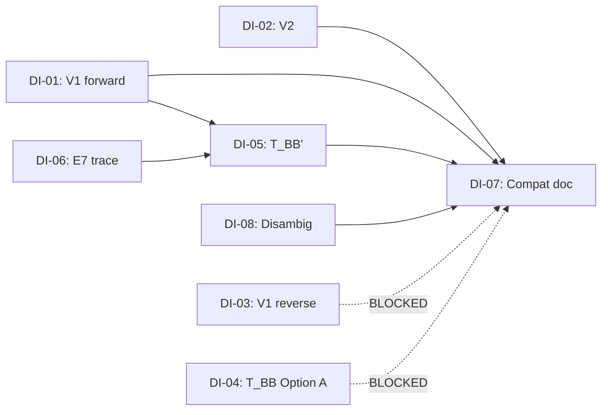

# BB-VVV Fit Plan: 3-Round RCA Decision & Execution

**Method:** 3-round RCA × 5-Why × scoring threshold 4/5
**Scope:** VVV-QMRF (K1–K8 frozen Layer 1)
**Compass:** VVV-QMRF-EX (structural analogy boundary, KE-SC 4.0 threshold)
**Source:** [BB_VVV_fit_plan.md](file:///c:/Stable_Diffusion/Buddhist_Epistemology_Quantum_Measurement/documents/research_documents/project_vvv_qmrf_class_c/09_Fitting_Baumann_Brukner/BB_VVV_fit_plan.md) v1.1
**Prior review:** [BB_VVV_fit_analysis.md](file:///c:/Stable_Diffusion/Buddhist_Epistemology_Quantum_Measurement/documents/research_documents/project_vvv_qmrf_class_c/09_Fitting_Baumann_Brukner/review/BB_VVV_fit_analysis.md)

---

## RCA Round 1 — Define + 5-Why: Should each plan item be executed?

### Decision Items (DI-01 through DI-08)

| ID | Item | Plan ref |
|---|---|---|
| DI-01 | Phase 1: Run V1 script (K5 ↔ B&B q₀₀ < 0) | §3 V1, §6 Phase 1 |
| DI-02 | Phase 1: Run V2 script (K7 ↔ Δp behavior, α²=0.3) | §3 V2, §6 Phase 1 |
| DI-03 | Phase 1 ext: V1 bidirectional reverse (K5 → B&B) | §12 V1 reverse |
| DI-04 | Phase 2: T_BB derivation (Option A, G1-blocked) | §3 V3, §6 Phase 2 |
| DI-05 | Phase 2 alt: T_BB' derivation (Option C, no-signaling recast) | §13 T_BB' |
| DI-06 | E7 verification trace (blocker for T_BB Step 3) | §14 E7-LOC |
| DI-07 | Phase 3: Compatibility document writing | §6 Phase 3 |
| DI-08 | Argument-type disambiguation (T_BB ↔ B&B) | §15 |

### Round 1 — 5-Why Analysis per DI

#### DI-01: V1 script (K5 ↔ q₀₀ < 0 forward)

| Why# | Question | Answer |
|---|---|---|
| W1 | Why run this? | To verify whether K5 failure region matches B&B negativity region |
| W2 | Why does this matter for VVV-QMRF? | K5 is a frozen axiom; demonstrating external mathematical alignment strengthens its justification |
| W3 | Why now? | Script is ready, formulas verified against SOT (review §2.1-2.3 all ✅), bug fixed |
| W4 | Why not defer? | No dependencies blocking; 2h effort; high ROI |
| W5 | Root cause | K5 has no prior independent numerical verification outside VVV-QMRF internal derivation |

**R1 Score: 5.0/5** — Low effort, high value, no blockers, formulas SOT-verified. **EXECUTE.**

#### DI-02: V2 script (K7 ↔ Δp, α²=0.3)

| Why# | Question | Answer |
|---|---|---|
| W1 | Why run this? | To verify K7 closure quantitative behavior matches B&B memory-change pattern |
| W2 | Why α²=0.3 specifically? | Symmetric case (0.5) gives Δp=0 identically — degenerate. Any α²≠0.5 works; 0.3 is canonical after RCA bug fix |
| W3 | Why is V2 independent from V1? | V1 tests K5 (invalidation regions); V2 tests K7 (closure magnitude). Different axioms, orthogonal checks |
| W4 | Why not just run V1? | V2 validates the closure-magnitude dimension — K7's quantitative behavior, not just K5's yes/no firing |
| W5 | Root cause | K7 closure has structural claims but no numerical demonstration from external paper |

**R1 Score: 5.0/5** — Bug already fixed, formula derived, trivial to run. **EXECUTE.**

#### DI-03: V1 bidirectional reverse (K5 → B&B)

| Why# | Question | Answer |
|---|---|---|
| W1 | Why needed? | V1 forward only proves R_BB ⊆ R_K5 (or vice versa); equivalence requires both directions |
| W2 | Why blocked? | Requires φ-map EWF instantiation (§12.2 prerequisite) — not yet available |
| W3 | Why not force it? | φ-map instantiation requires K_to_BH_Structure_Preserving_Map track, currently at C2=8.0 with φ-O2 as fundamental boundary |
| W4 | Why not approximate? | Approximation would overclaim. Plan correctly identifies this as blocker for mathematical equivalence |
| W5 | Root cause | K5 AdmJoint is K-side; B&B q₀₀ is ρ-side. Bridging requires the φ-map |

**R1 Score: 3.0/5** — BLOCKED by prerequisite. **DEFER** — ship V1 forward as Class D-partial.

#### DI-04: T_BB derivation (Option A, G1-blocked)

| Why# | Question | Answer |
|---|---|---|
| W1 | Why needed? | V3 is the strongest claim: no-awareness derivable from K5+K7 |
| W2 | Why blocked? | Gap G1: "registration act referencing V_prov of another act" not in K1-K8 |
| W3 | What would resolve G1? | Layer 2 semantic extension (Option A) or no-signaling recast (Option C/DI-05) |
| W4 | Why not just define it? | Adding to Layer 2 requires its own RCA gate — can't be casual |
| W5 | Root cause | K1-K8 formalize individual registration acts, not meta-references to prior V_prov values |

**R1 Score: 3.5/5** — G1 is real blocker. **DEFER Option A; pivot to DI-05 (Option C) as primary path.**

#### DI-05: T_BB' derivation (Option C, no-signaling recast)

| Why# | Question | Answer |
|---|---|---|
| W1 | Why this alternative? | Bypasses G1 by using B&B's native no-signaling argument, which is already formalized |
| W2 | Why does this help VVV-QMRF? | Shows VVV-QMRF can reproduce B&B's conclusion via a different axiom path (K5 + no-signaling) |
| W3 | Why not replace T_BB entirely? | T_BB (Option A) and T_BB' (Option C) are potentially different argument types (registration vs operationalist) — both valuable |
| W4 | Why executable now? | T_BB' Step 1 uses V1 result; Steps 2-4 use B&B formalism — no G1 dependency |
| W5 | Root cause | G1 blocks the pure registration-theoretic argument; no-signaling route avoids it |

**R1 Score: 4.5/5** — Executable, avoids G1, produces concrete derivation. **EXECUTE** after V1.

#### DI-06: E7 verification trace

| Why# | Question | Answer |
|---|---|---|
| W1 | Why needed? | T_BB Step 3 cites "E7" for validity revision — must verify E7 exists and means what T_BB assumes |
| W2 | What did the search find? | **E7 IS DEFINED** in K-Space Axiomatization. E7 = "Validity Location" postulate. E7 Axiom 1 → K4 (default validity). E7 Axioms 2-3 → K5 (invalidation + asymmetry). E7 V_prov/V_final → K7 (closure). |
| W3 | Does E7 match T_BB Step 3? | T_BB Step 3 says "V(M_aware) is revised to 0 by E7." In K-Space Axiomatization, validity revision is via **K5** (sourced from E7 Axioms 2-3), not via E7 directly. T_BB Step 3 should cite K5, not E7 raw. |
| W4 | Is this a blocker? | No — minor citation fix. K5 is the axiom; E7 is the source postulate. T_BB Step 3 should say "V(M_aware) revised to 0 by K5 (per E7 Axiom 2)" |
| W5 | Root cause | T_BB draft conflated source postulate (E7) with derived axiom (K5) |

**R1 Score: 5.0/5** — **RESOLVED.** E7 exists, maps to K4/K5/K7. T_BB Step 3 citation needs minor fix: E7→K5. **EXECUTE** (fix citation inline).

**E7 trace result (§14 resolution):**
- E7 **is defined** in K-Space Axiomatization as "Validity Location" (Level 2 postulate)
- E7 Axiom 1 → K4 (default validity, `V(k)=1`)
- E7 Axiom 2 → K5 (invalidation), K6 (cross-registration authority)
- E7 Axiom 3 → K5 (asymmetry of invalidation)
- E7 V_prov/V_final → K7 (closure)
- **T_BB Step 3 fix:** Replace "revised to 0 by E7" → "revised to 0 by K5 (sourced from E7 Axiom 2)"
- **§14 fallback status:** Case 1 APPLIES (E7 defined and matches T_BB Step 3 after citation fix)

#### DI-07: Phase 3 compatibility document

| Why# | Question | Answer |
|---|---|---|
| W1 | Why needed? | Formal writeup of V1+V2+T_BB' results for Section 5.x of working paper |
| W2 | Why not now? | Depends on V1, V2, T_BB' results — can't write before those complete |
| W3 | Why not skip? | Without formal document, results stay as script output — not citeable |
| W4 | Why Section 5.x? | Fit plan §6 Phase 3 specifies this location in working paper |
| W5 | Root cause | Computational results need formal documentation for academic credibility |

**R1 Score: 4.0/5** — Valid but **sequential dependency** on DI-01, DI-02, DI-05. **EXECUTE AFTER** V1+V2+T_BB'.

#### DI-08: Argument-type disambiguation

| Why# | Question | Answer |
|---|---|---|
| W1 | Why needed? | §15 identifies risk: readers may conflate T_BB with B&B proof |
| W2 | Why distinct? | B&B = operationalist (signaling protocol); T_BB = registration-theoretic (V→0) |
| W3 | Why not just footnote? | AHP (Anti-Hallucination Pipeline) flags analogy↔equivalence conflation as moderate risk |
| W4 | Can it be embedded? | Yes — integrate into Phase 3 document as mandatory caveat |
| W5 | Root cause | Two proofs reaching same conclusion from different axioms ≠ equivalence |

**R1 Score: 4.0/5** — Embed into DI-07 Phase 3 document. Not standalone. **FOLD INTO DI-07.**

---

## RCA Round 2 — Trace: Execution Order + Dependencies

### Dependency Graph

### Execution Plan

| Step | DI | Action | Prereq | Effort |
|---|---|---|---|---|
| 1 | DI-06 | E7 trace — **DONE** in R1 analysis | None | ✅ Complete |
| 2 | DI-01 | Run V1 script `bb_vvv_v1_k5_check.py` | None | ~30 min |
| 3 | DI-02 | Run V2 within same script | None (parallel with DI-01) | ~15 min |
| 4 | DI-05 | Write T_BB' formal derivation (Option C) | DI-01 result (V1 confirms K5↔q₀₀ forward) | ~1h |
| 5 | DI-07+08 | Write compatibility section with disambiguation | DI-01, DI-02, DI-05 | ~1h |

### Deferred Items

| DI | Reason | Condition to unblock |
|---|---|---|
| DI-03 | φ-map EWF instantiation not available | φ-map Track B Phase 1-4 completion |
| DI-04 | G1 ("V_prov reference") not in K1-K8 | Layer 2 semantic extension RCA gate |

---

## RCA Round 3 — Fix: Scoring Summary + Final Decision

### Aggregate Scores

| DI | R1 | R2 (dependency check) | R3 (VVV-QMRF-EX compass) | Aggregate | Decision |
|---|---|---|---|---|---|
| DI-01 | 5.0 | 5.0 (no blocker) | 5.0 (K5 is frozen Layer 1; external verification strengthens) | **5.0** | ✅ EXECUTE |
| DI-02 | 5.0 | 5.0 (no blocker) | 5.0 (K7 closure is frozen Layer 1; quantitative check) | **5.0** | ✅ EXECUTE |
| DI-03 | 3.0 | 2.0 (BLOCKED) | 3.0 (φ-map is separate track) | **2.7** | ❌ DEFER |
| DI-04 | 3.5 | 2.5 (G1 BLOCKED) | 3.5 (G1 resolution needs own RCA) | **3.2** | ❌ DEFER |
| DI-05 | 4.5 | 4.5 (depends only on DI-01) | 4.5 (bypasses G1, no Layer 1 mutation) | **4.5** | ✅ EXECUTE |
| DI-06 | 5.0 | 5.0 (DONE) | 5.0 (E7 trace completed) | **5.0** | ✅ DONE |
| DI-07 | 4.0 | 4.0 (sequential) | 4.0 (documentation, no overclaim risk) | **4.0** | ✅ EXECUTE (after DI-01,02,05) |
| DI-08 | 4.0 | 4.5 (fold into DI-07) | 4.5 (AHP risk mitigation) | **4.3** | ✅ FOLD → DI-07 |

### RCA Round 3 — VVV-QMRF-EX Compass Check

Each EXECUTE item verified against EX compass rules:
- **I-1 (READ-ONLY):** No VVV-QMRF core file modified ✅
- **I-3 (Namespace):** BB-VVV items stay in `09_Fitting_Baumann_Brukner/` ✅
- **I-2 (Copy-Not-Move):** No K-axiom text moved or altered ✅
- **Boundary:** All claims are structural compatibility, not identity ✅
- **No E17+ creation:** T_BB' is Layer 2 proposed, not a new postulate ✅

### Final Decision Summary

**EXECUTE NOW (threshold ≥ 4/5):**
1. DI-01: V1 script — K5 ↔ q₀₀ < 0 forward verification
2. DI-02: V2 script — K7 ↔ Δp with α²=0.3
3. DI-06: E7 trace — ✅ Already resolved
4. DI-05: T_BB' formal derivation (no-signaling recast)
5. DI-07+08: Compatibility document with argument-type disambiguation

**DEFER (threshold < 4/5):**
- DI-03: V1 reverse (φ-map blocker)
- DI-04: T_BB Option A (G1 blocker)

---

## Proposed Changes

### Scripts

#### [NEW] [bb_vvv_v1v2_verification.py](file:///c:/Stable_Diffusion/Buddhist_Epistemology_Quantum_Measurement/documents/research_documents/project_vvv_qmrf_class_c/09_Fitting_Baumann_Brukner/scripts/bb_vvv_v1v2_verification.py)

Python script implementing V1 (K5 ↔ q₀₀ forward) + V2 (K7 ↔ Δp) from fit plan §6. Outputs numerical verification and heatmap plot.

### Documentation

#### [MODIFY] [BB_VVV_fit_plan.md](file:///c:/Stable_Diffusion/Buddhist_Epistemology_Quantum_Measurement/documents/research_documents/project_vvv_qmrf_class_c/09_Fitting_Baumann_Brukner/BB_VVV_fit_plan.md)

- Fix T_BB Step 3 citation: "E7" → "K5 (sourced from E7 Axiom 2)" per E7 trace result
- Update §14 E7-LOC status: RESOLVED
- Add v1.2 revision log entry

#### [NEW] [BB_VVV_T_BB_prime.md](file:///c:/Stable_Diffusion/Buddhist_Epistemology_Quantum_Measurement/documents/research_documents/project_vvv_qmrf_class_c/09_Fitting_Baumann_Brukner/BB_VVV_T_BB_prime.md)

Formal derivation of T_BB' (Option C, no-signaling recast) from V1 result + B&B formalism.

#### [NEW] [BB_VVV_compatibility_section.md](file:///c:/Stable_Diffusion/Buddhist_Epistemology_Quantum_Measurement/documents/research_documents/project_vvv_qmrf_class_c/09_Fitting_Baumann_Brukner/BB_VVV_compatibility_section.md)

Section 5.x draft: Structural Compatibility with B&B (2024). Includes V1 result, V2 result, T_BB' derivation, argument-type disambiguation (§15 caveat), falsification status F1-F7.

## Verification Plan

### Automated Tests
- Run `bb_vvv_v1v2_verification.py` and verify output matches expected values from fit plan §6
- V1: K5 fires at x=π/4, φ=π but not at x=0.01, φ=π
- V2: Δp = 0.200 at x=π/4; Δp ≈ 0 at x=0 and x=π/2
- Formula self-check: |1−2×0.3|×0.5 = 0.2000

### Manual Verification
- Cross-check T_BB' derivation steps against B&B paper Section 3 and Appendix B
- Verify argument-type disambiguation covers §15 mandatory caveat
