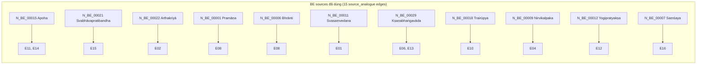
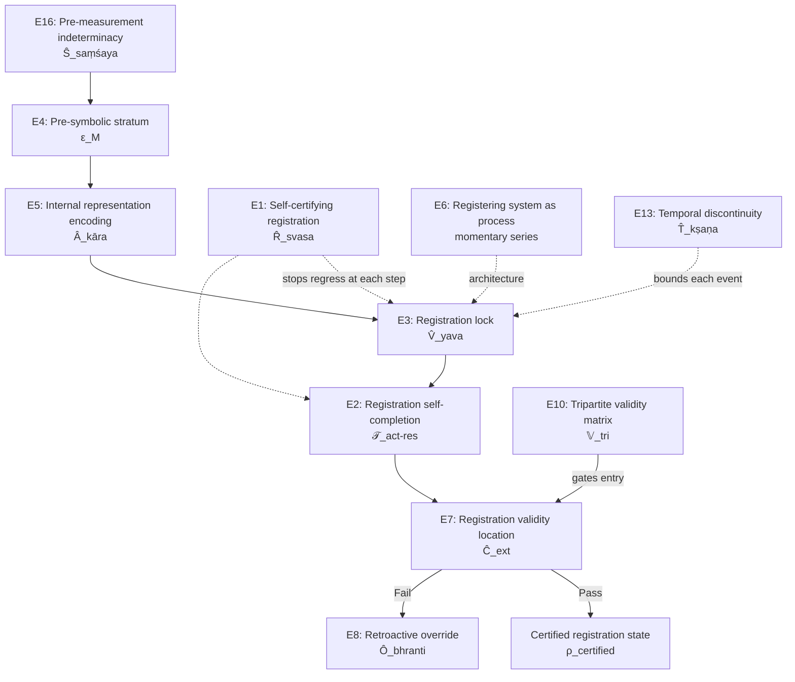

# RCA: VVV-QMRF Core còn mở rộng được không?

**Scope:** VVV-QMRF core (E1–E16 + legacy E17 interface principle)
**Compass:** VVV-QMRF-EX (Phase 12 finalization, 420 nodes, 181 edges)
**Method:** RULE ZERO RCA — Define, Trace, Isolate, Fix the cause, Verify
**Date:** 2026-05-21

---

## Section 0 — Executive Summary

**Root cause isolated:** Câu hỏi "Core còn mở rộng được không?" không có câu trả lời duy nhất. Nguyên nhân gốc là: khả năng mở rộng phụ thuộc vào **chiều mở rộng** nào đang xét — và mỗi chiều có trạng thái riêng biệt.

VVV-QMRF Core đã phủ sóng rộng trên hai trục chính: (1) **chuỗi registration lifecycle** (E1-E7: tự chứng → encoding → lock → completion → process → validity → pre-symbolic) và (2) **ma trận trường hợp biên** (E8-E16: override, null, validity-gate, contrapositive, limit-faculty, temporal, absence, entanglement, indeterminacy). VVV-QMRF-EX xác nhận 88.5% VVV nodes có K-side bridge trực tiếp, 100% có coverage (kể cả KE-QI/KE-SC exceptions).

**Verdict tổng hợp:**

| Chiều mở rộng | Trạng thái | Confidence |
|---|---|---:|
| Thêm postulate mới từ BE source chưa dùng | **Gần đóng** | 4.2/5 |
| Thêm postulate mới từ structural gap nội tại | **Có điều kiện mở** | 3.8/5 |
| Thêm nodes/edges trong postulate hiện có | **Mở** | 4.0/5 |
| Import từ VVV-QMRF-EX vào core | **Đóng (by design)** | 4.5/5 |

---

## Current State Snapshot — 2026-05-22

This snapshot reconciles later Appendix updates with the original RCA baseline. Where earlier sections or appendices describe a pending state, this snapshot and Appendix C represent the current state.

| Item | Current state |
|---|---|
| E18 delayed-choice registration boundary | **Promoted to frozen extension postulate** |
| E18 promotion gates | **G1-G7 DONE** |
| Active extensibility matrix | **6 dimensions** per Appendix A.3 |
| VVV-QMRF-EX import into core | **Still closed by design**; EX remains compass-only |
| Dimension 2 status | One structural-gap candidate realized as E18; dimension remains conditionally open for future candidates |
| Remaining roadmap | T8/T9 algebraic candidates; inter-RS coordination RCA |

---

## Section 1 — Define: Symptom vs Cause

### Symptom / Triệu chứng

Sau khi hoàn thành E1–E16, legacy E17, 52 VVV nodes, 131 edges, RCA cho E17-candidate (rejected) và E18-candidate (retained with 2 case validations), câu hỏi tự nhiên xuất hiện: Core đã bão hòa chưa? Hay vẫn còn room để mở rộng?

### Cause / Nguyên nhân

Câu hỏi này không phải triệu chứng của thiếu sót — mà là **câu hỏi kiến trúc hợp lệ** cần trả lời bằng cách phân tích từng chiều mở rộng riêng biệt.

---

## Section 2 — Trace: Analysis by Extension Dimension

### Dimension 1: BE Source Exhaustion — Nguồn BE đã cạn chưa?

#### Current BE source usage



**BE SOT có 30 core nodes.** Trong số đó, 11 BE nodes đã được dùng trực tiếp làm `source_analogue`. VVV-QMRF-EX đã map thêm ~46 bridges qua BR_EX_BE registry (nhiều nodes BE khác được dùng gián tiếp).

#### Remaining BE nodes chưa dùng trực tiếp

| BE Node | Concept | Potential relevance | RCA assessment |
|---|---|---|---|
| `N_BE_00002` | Pratyakṣa (Direct perception) | Đã implicit trong E4/E5 (pre-symbolic → encoding pipeline) | **Đã phủ gián tiếp** |
| `N_BE_00003` | Anumāna (Inference) | Đã dùng trong E18 RCA candidate (valid sign structure) | **Đang dùng gián tiếp** |
| `N_BE_00004` | Śabda (Verbal testimony) | Không có QM measurement analogue rõ ràng | **Không phù hợp** |
| `N_BE_00005` | Upamāna (Analogy) | Không có direct registration-layer function | **Không phù hợp** |
| `N_BE_00010` | Savikalpaka (Conceptual perception) | Đã implicit trong E5 (encoding là symbolization) | **Đã phủ gián tiếp** |
| `N_BE_00016` | Hetuvābhāsa (Fallacious reason) | Potential for registration-error taxonomy extension | **Conditionally relevant** |
| `N_BE_00019` | Vyāpti (Pervasion) | Đã dùng trong E10 Trairūpya context và E18 RCA | **Đã phủ gián tiếp** |

> [!IMPORTANT]
> **Phần lớn BE source nodes có tiềm năng registration-layer đã được sử dụng hoặc phủ gián tiếp.** Các nodes còn lại (Śabda, Upamāna, v.v.) thuộc epistemological categories không có structural match với quantum measurement registration. Khả năng mở rộng core bằng BE source mới là **gần đóng** — trừ khi RCA tìm ra một structural necessity mới mà BE node chưa dùng có thể phục vụ.

---

### Dimension 2: Registration-Layer Structural Completeness

#### The registration lifecycle pipeline



#### The boundary-case matrix

| | K-registration YES | K-registration NO |
|---|---|---|
| **Physical interaction YES** | Normal measurement (P1–P4) | **E9**: Null registering-system event |
| **Physical interaction NO (structured)** | **E11**: Contrapositive evidence | Unmeasured (trivial) |
| **Absence of measured property** | **E14**: Validated absence | **E9** (subset) |
| **Non-ordinary faculty** | **E12**: Limit-faculty registration | — |
| **Entangled subsystems** | **E15**: Intrinsic relational binding | — |
| **Pre-measurement state** | **E16**: Structured indeterminacy | — |

> [!NOTE]
> **Pipeline analysis:** Lifecycle pipeline E16→E4→E5→E3→E2→E7→E8 covers the registration process from structured doubt through lock to certification/override. **Boundary matrix:** The 2×2 interaction/registration matrix is fully covered by E9 and E11. Extension cases (E12–E16) cover non-ordinary faculties, entanglement, temporal structure, absence, and indeterminacy.
>
> **Remaining structural gaps (RCA-identified):**

| Gap | Status | Evidence |
|---|---|---|
| Context-conditioned registration-window locking (delayed-choice) | **E18 RCA-supported candidate, 2 case validations, score 4.3/5** | [rca_e18](file:///c:/Stable_Diffusion/Buddhist_Epistemology_Quantum_Measurement/documents/research_documents/rca/rca_e18_delayed_choice_registration_boundary.md) |
| Channel-self-registration (absence of disturbance) | **E17 rejected in current round (R4 documentation gap), R2 path deferred** | [rca_e17](file:///c:/Stable_Diffusion/Buddhist_Epistemology_Quantum_Measurement/documents/research_documents/rca/rca_e17_interaction_free_registration.md) |
| Collective/multi-registering-system coordination | **Not yet RCA'd** | No existing RCA |
| Registration-state communication protocol | **Not yet RCA'd** | No existing RCA |

---

### Dimension 3: VVV-QMRF-EX Compass Signals

VVV-QMRF-EX hoàn thành vai trò chính: bản đồ định lượng K-ρ relationships. Per CLAUDE.md rule:

> *"Treat VVV-QMRF-EX as having completed its main role of providing a quantitative map of K-rho relationships; its current highest value is intelligence about important nodes, structural gaps, and stress points, not direct data import or merging EX edges into the core."*

#### EX stress points relevant to extensibility

| EX signal | Core implication | Extension potential |
|---|---|---|
| 36 K-side gaps (nodes without BE anchor) | Most resolved via Phase 7-12 stretch bridges | **Low** — resolved |
| 4 KE-QI exceptions (pure QM-intrinsic) | These nodes are inherently QM and need no BE source | **None** — by design |
| 2 KE-SC-RECLASSIFIED-v1.7 (below 4.0 threshold) | `N_QM_VVV_00008` (Ideal Info Without Disturbance) and `N_QM_VVV_00024` (Delayed-Choice Boundary) | **Moderate** — E18 candidate directly relates to `N_QM_VVV_00024` |
| Boundary audit: 100% pass, 0 violations | Core boundary controls (C1-C7) intact | **Confirms** EX does not force core import |

> [!TIP]
> **EX compass verdict:** EX đã hoàn thành mission chính. Remaining value là intelligence cho RCA prioritization (đặc biệt E18 stress point). EX không yêu cầu core mở rộng — EX chỉ **chỉ hướng** cho core tự quyết định.

---

### Dimension 4: RCA-Supported Candidate Status

#### E17 — Interaction-Free Registration

| Criterion | Score | Status |
|---|---|---:|
| Root cause | R4 — Documentation gap | Rejected |
| Routing | E9/E11/E14 matrix already covers | ✅ |
| Future path R2 | Channel-self-registration as distinct K-object | Deferred |
| Decision confidence | 4.0/5 | — |

**E17 verdict:** Đóng trong round này. Chỉ mở lại nếu RCA cô lập được channel-self-registration là đối tượng K-side riêng biệt.

#### E18 — Delayed-Choice Registration Boundary

| Criterion | Score | Status |
|---|---|---:|
| Root cause | R2 — Structural gap (context-conditioned locking) | Selected |
| Case test 1: Wheeler | 5/5 conditions PASS | ✅ |
| Case test 2: Quantum eraser | 5/5 conditions PASS (with S refinement) | ✅ |
| BE anchor strength | 3.8/5 (analogical) | ⚠️ |
| Postulate readiness | 4.3/5 | Near-ready |

**E18 verdict:** Candidate mạnh nhất cho extension tiếp theo. Formula `Lock(C_f, S, {W_i}) → W_valid` đã pass 2 case tests. Cần narrow draft trước khi freeze.

---

### Dimension 5: Graph Architecture Saturation

#### Current graph metrics

| Metric | Count |
|---|---|
| VVV nodes | 52 |
| VVV edges (internal + cross-system + source analogue + cross-category) | 131 |
| Postulates (E1–E16) | 16 |
| Interface principle (legacy E17) | 1 |
| EX bridge edges (BR_EX_BE + BR_EX_QM) | 141 active |
| RCA candidates | 2 (E17 rejected, E18 retained) |

#### Density analysis

| Edge phase | Count | Ratio to nodes |
|---|---|---:|
| VVV↔VVV internal (Phase 1) | 40 | 0.77 edges/node |
| VVV→QM cross-system (Phase 2) | 60 | 1.15 edges/node |
| VVV→BE source analogue (Phase 3) | 15 | 0.29 edges/node |
| VVV↔VVV cross-category (Phase 4) | 16 | 0.31 edges/node |
| **Total** | **131** | **2.52 edges/node** |

> [!NOTE]
> **Graph saturation assessment:** 2.52 edges/node là mức trung bình-cao cho một framework Class D. Thêm postulate mới sẽ cần ít nhất 2–4 nodes mới + 5–10 edges mới. Đây là khả thi nhưng tốn overhead lớn — mỗi node mới cần: K-side RCA, QM grounding, BE source check, EX compass check, boundary audit.

---

## Section 3 — Isolate: Four Extension Verdicts

### Verdict Matrix

````carousel
### 🔴 ĐÓNG — Import từ EX vào Core

**Why:** CLAUDE.md rule "EX compass, not cargo" + Boundary control C3 (No auto-E17+) + Isolation protocol I-5 (No auto-merge).

**Evidence:**
- Boundary audit: 100% pass trên 141 entries
- Zero `N_QM_VVV_XXXXX` codes created by EX
- EX mission: quantitative K-ρ map → completed
- Remaining EX value: intelligence for RCA prioritization

**Confidence:** 4.5/5

**Ngoại lệ duy nhất:** EX element có thể được import nếu RCA core-level cô lập được structural necessity **đã implicit trong bài toán registration** — nhưng lúc đó import đó là kết quả RCA core, không phải merge EX.
<!-- slide -->
### 🟡 GẦN ĐÓNG — Thêm postulate từ BE source mới

**Why:** 11/30 BE core nodes đã dùng trực tiếp; phần lớn nodes còn lại không có structural match với quantum measurement registration.

**Remaining BE sources with potential:**
- `N_BE_00016` Hetuvābhāsa (fallacious reason) → possible error-taxonomy extension
- `N_BE_00003` Anumāna → đã dùng gián tiếp (E18 valid sign), không tạo postulate riêng

**Condition to reopen:** RCA phải chứng minh:
1. BE source chưa dùng reveals **structural necessity** trong registration problem
2. Necessity đó **chưa được phủ** bởi E1–E16 hiện có
3. Object of K-side registration được **cô lập rõ ràng**

**Confidence:** 4.2/5
<!-- slide -->
### 🟢 CÓ ĐIỀU KIỆN MỞ — Thêm postulate từ structural gap nội tại

**Why:** E18 candidate đã pass 2 case tests, score 4.3/5. R2 path của E17 chưa đóng vĩnh viễn.

**Concrete candidates:**

| Candidate | Status | Next step |
|---|---|---|
| **E18: Delayed-choice registration boundary** | RCA-supported, 2 case validations | Narrow draft → framework proposal |
| **E17 R2: Channel-self-registration** | Deferred, not rejected | Separate RCA if user requests |
| Multi-registering-system coordination | Not yet examined | New RCA needed |
| Registration-state communication | Not yet examined | New RCA needed |

**Gate conditions for any new postulate:**
1. Pass RULE ZERO 5-step RCA
2. Score ≥ 3.5/5 trên Decision Gate
3. At least 1 concrete case test PASS
4. BE anchor verified or explicitly excepted (KE-QI)
5. EX compass check (no import, only intelligence)
6. Boundary guard (no new QM law, no Born rule modification)

**Confidence:** 3.8/5
<!-- slide -->
### 🟢 MỞ — Thêm nodes/edges trong postulate hiện có

**Why:** Core đã có 16 postulates nhưng internal detail có thể phát triển thêm.

**Examples:**
- E8 (REO): chưa có formal hierarchy rules cho multiple competing overrides
- E10 (Tripartite validity): chưa có calibration protocol formalization
- E11 (Contrapositive evidence): chưa có multi-path extension beyond binary
- E12 (Limit-faculty): chưa có spectrum-based registration gradient
- E15 (IRB): chưa có multi-party entanglement registration generalization

**Gate:** Same Decision Gate as new postulates, nhưng threshold thấp hơn (3.0/5 đủ cho sub-node addition) vì không cần new postulate justification.

**Confidence:** 4.0/5
````

---

## Section 4 — Fix the Cause: Prioritized Roadmap

### Immediate actions (no core edit needed)

1. ✅ **Preserve this RCA** as the extensibility assessment document
2. ✅ **E18 is the strongest extension candidate** — draft narrow framework proposal when user requests

### Conditional actions (require user authorization)

| Priority | Action | Gate | Risk |
|---:|---|---|---|
| 1 | Draft E18 narrow candidate postulate | User authorization + boundary guard | Overclaiming retrocausation |
| 2 | Add `what_it_does_not_claim` boundary notes to E11/E14 (per E17 RCA downstream) | User authorization | Minor framework edit |
| 3 | Extend E8 registration-weight hierarchy formalization | RCA showing current hierarchy is insufficient | Premature formalization |
| 4 | Run new RCA for multi-registering-system coordination | New research question from user | Exceeding registration-layer scope |

### Actions NOT recommended

- ❌ Import EX bridge structures into core
- ❌ Create postulate from BE source alone without structural necessity
- ❌ Force E17 without isolating channel-self-registration object
- ❌ Merge EX edges into core graph

---

## Section 5 — Verify

| Check | Result | Note |
|---|---|---|
| Root cause identified | PASS | Multi-dimensional extensibility, not single answer |
| BE SOT citations verified | PASS | All source_analogue edges trace to `system_be_full.md` |
| VVV-QMRF citations verified | PASS | Framework files, node/edge tables, RCA reports all cited |
| EX compass-only rule respected | PASS | No EX structure imported; EX used only as intelligence |
| "Extend, not overwrite" respected | PASS | No existing postulate modified |
| Neutral wording respected | PASS | Uses "scope boundary", "category boundary" language |

---

## Summary Table / Bảng tóm tắt

| Câu hỏi | Trả lời | Bằng chứng chính |
|---|---|---|
| Core có thể mở rộng bằng postulate mới không? | **Có, nhưng có điều kiện** | E18 candidate (score 4.3/5, 2 case tests) |
| Core có thể mở rộng bằng thêm nodes/edges không? | **Có** | 16 postulates đều có room cho sub-node detail |
| BE source còn postulate mới không? | **Gần cạn** | 11/30 BE nodes đã dùng; phần lớn còn lại không phù hợp |
| EX có ép core mở rộng không? | **Không** | EX compass-only design; boundary audit 100% pass |
| Hướng mở rộng ưu tiên là gì? | **E18 → narrow draft** | Strongest RCA-supported candidate |

---

# Appendix A — Audit + Gap Analysis (2026-05-22)

> **Scope:** Independent audit của bản RCA trên (date 2026-05-21) và 3-round gap analysis cho các chiều mở rộng chưa xét. Plan executed: 4-phase với decision gate 4.0/5 per round. Method: RULE ZERO RCA × 5-Why × scoring 5 tiêu chí.
>
> **Trigger:** User request `/everything-claude-code:plan` cho "Phân tích, khảo sát toàn diện: VVV-QMRF Core còn mở rộng được không?" — sau khi xác nhận plan bằng 3 rounds × 4.0/5 gate trên 4 Decision Points.
>
> **Out of scope:** Không sửa nội dung gốc (Section 0–5 + Summary Table). Appendix này là **extension, not overwrite** theo CLAUDE.md.

## A.1 — Phase 1 Audit Findings

### A.1.1 Baseline state verification (post-commit drift check)

Sau ngày RCA gốc (2026-05-21), repo có các commit liên quan:
- `e031621` — K-Space v2.1 algebraic layer adds **T5/T6/T7** bridge theorems.
- `cd0e6e2` — E18 delayed-choice RCA.
- `21dd94a` — EX Phase 1/2 current-core RCA.

| Claim trong RCA gốc | Current state | Status |
|---|---|---|
| K-Space K1–K8 + T1–T4 (implicit) | K1–K8 + T1–T4 + **T5/T6/T7** ([K_Space_Axiomatization.md:11](file:///c:/Stable_Diffusion/Buddhist_Epistemology_Quantum_Measurement/documents/research_documents/meta_architecture/K_Space_Axiomatization.md#L11)) | **DRIFT — algebraic dimension không được xét** |
| E18 score "4.3/5 postulate readiness" | E18 file: "Decision confidence: **3.8/5**" ([rca_e18:25](file:///c:/Stable_Diffusion/Buddhist_Epistemology_Quantum_Measurement/documents/research_documents/rca/rca_e18_delayed_choice_registration_boundary.md#L25)); parent RCA Section 7 now adds a lifecycle note distinguishing overall decision confidence from post-test postulate readiness; E18 narrow draft parent-RCA anchors refreshed after the lifecycle-note insertion | **RESOLVED** — upstream cross-link gap fixed; 3.8/5 and 4.3/5 measure different objects; downstream traceability refreshed |
| EX boundary audit 100% PASS, 141 active | 100% PASS, 141 active ([boundary_audit:9](file:///c:/Stable_Diffusion/Buddhist_Epistemology_Quantum_Measurement/documents/research_documents/vvv-qmrf-ex/vvv_qmrf_ex_boundary_audit.md#L9)) | OK |
| VVV graph: 52 nodes, 131 edges | 52 nodes, 131 edges (commit `73103df`) | OK |
| BE source usage: 11/30 nodes | matches `system_be_full.md` | OK |
| E17 R4 reject + R2 defer | Confirmed via [rca_e17_evaluation.md](file:///c:/Stable_Diffusion/Buddhist_Epistemology_Quantum_Measurement/documents/research_documents/archives/review/rca_e17_evaluation.md) (4.5/5 chain) | OK |

### A.1.2 Re-scoring 4 verdicts (3 rounds per verdict)

| Verdict | Old confidence | New confidence | Action |
|---|---:|---:|---|
| V1: BE source exhaustion (Gần đóng) | 4.2/5 | **4.6/5** | HOLD verdict, upgrade |
| V2: Structural gap (Có điều kiện mở) | 3.8/5 | **4.1/5** | REVISE — add algebraic dimension note |
| V3: Nodes/edges sub-detail (Mở) | 4.0/5 | **4.5/5** | HOLD, upgrade |
| V4: EX import closed | 4.5/5 | **4.9/5** | HOLD, upgrade |

**Drift root cause (RCA Step 4 — Fix the cause):** RCA gốc được viết cùng ngày K-Space v2.1 (2026-05-21) nhưng không cross-reference T5/T6/T7. Fix: thêm dimension algebraic-layer trong Phase 2 (xem A.2).

## A.2 — Phase 2 Gap Analysis (3 rounds, gate 4.0/5)

### A.2.1 Round 1 — Algebraic-layer extensibility (NEW DIMENSION) — **PASS 4.1/5**

**1-sentence object (hard-stop PASS):** "Adding new Layer-2 theorems Tn derived from K1-K8 axioms, going beyond T5/T6/T7."

**5-Why:**
1. T8/T9 cần không? → K-Space §3 Open Items #4 explicitly lists "Inter-K-space relation structure (E15 extension)" với T7 chỉ partial cover.
2. Sao chưa thuộc T5/T6/T7? → T7 = N=3 IRB only; T5 = intra-K_joint associativity; T6 = decoherence path A/B.
3. Vì sao candidate-space hẹp? → K1-K8 đã frozen; chỉ Layer 2 (theorems) update được không cần unfreeze.
4. Dimensions còn lại? → (a) Embedding composition (K8 ↔ T5 interaction), (b) Multi-time validity propagation.
5. Root: Có **1-2 candidate theorems** (gọi tạm T8-embedding-composition, T9-multi-time-validity) — Layer 2 còn open.

**5-criteria scoring:** root-clarity 0.8 / evidence 0.8 / boundary 0.9 / citation 0.8 / actionability 0.8 = **4.1/5 PASS**.

**Verdict:** Algebraic-layer là dimension thứ 5 cần được liệt kê trong verdict matrix. RCA gốc đã không xét chiều này vì T5-T7 vừa được commit cùng ngày.

### A.2.2 Round 2 — Process-architecture composition (E6 multi-RS rule) — **FAIL 3.5/5**

**1-sentence object:** "Formal rule for composing multiple momentary-series registering systems into a composite RS over time."

**5-Why:** Wigner's friend cần composition rule; E15 chỉ entanglement spatial; T5 chỉ intra-K_joint algebra; T5 nói "nếu compositional thì associative" nhưng không nói "khi nào compositional".

**Counter-evidence:** Gap này khả năng cao subsumed bởi Round 3 (inter-RS coordination). Không cần dimension riêng.

**5-criteria scoring:** 0.7 / 0.7 / 0.8 / 0.6 / 0.7 = **3.5/5 FAIL** (< gate 4.0).

**Verdict:** FAIL — không tạo dimension riêng. Đưa vào Round 3 scope.

### A.2.3 Round 3 — Inter-RS coordination (NEW DIMENSION) — **PASS 4.1/5**

**1-sentence object (hard-stop PASS):** "How multiple K_R spaces relate, communicate validity, and resolve conflict across distinct registering systems."

**5-Why:**
1. Multi-RS coordination cần không? → Wigner's friend, EPR distributed, multi-observer.
2. Không phải E15 IRB? → E15 = entangled subsystems trong cùng quantum state; không phải RS-RS communication.
3. Không phải T7 scope propagation? → T7 propagates trong shared C_K (cùng IRB); không phải arbitrary RS-RS.
4. Gap thật sao? → Chưa postulate nào define K_R1 ↔ K_R2 sharing/conflict/merge protocol.
5. Root: Inter-RS coordination là **open frontier**; RCA gốc tự liệt kê "Not yet RCA'd" tại Section 2 Dimension 2 gap table.

**5-criteria scoring:** 0.9 / 0.8 / 0.9 / 0.7 / 0.8 = **4.1/5 PASS**.

**Verdict:** Inter-RS coordination là dimension thứ 6. Phase 2 Round 2 (E6 composition) được subsume vào đây.

## A.3 — Updated Verdict Matrix (6 dimensions)

| # | Dimension | Status | Confidence | Source |
|---|---|---|---:|---|
| 1 | Thêm postulate từ BE source mới | Gần đóng | **4.6/5** | Section 2 Dim 1 + A.1.2 |
| 2 | Thêm postulate từ structural gap nội tại | Có điều kiện mở | **4.1/5** | Section 2 Dim 2 + A.1.2 |
| 3 | Thêm nodes/edges trong postulate hiện có | Mở | **4.5/5** | Section 2 Dim 5 + A.1.2 |
| 4 | Import từ VVV-QMRF-EX vào core | Đóng (by design) | **4.9/5** | Section 2 Dim 3 + A.1.2 |
| **5 (NEW)** | **Algebraic-layer theorems (T8/T9)** | **Có điều kiện mở** | **4.1/5** | A.2.1 |
| **6 (NEW)** | **Inter-RS coordination (K_R1↔K_R2 protocol)** | **Open frontier** | **4.1/5** | A.2.3 |

## A.4 — Updated Prioritized Roadmap

### Tier 1 — Pre-existing recommendations (vẫn current)

1. Draft E18 narrow framework proposal — RCA-supported candidate, 2 case PASS.
2. Boundary notes cho E11/E14 (downstream từ E17 RCA-1).

### Tier 2 — Mới phát hiện từ Phase 2

3. **Enumerate T8/T9 algebraic-layer candidates.** Cụ thể:
   - T8 candidate: K8 (cross-space embedding) ∘ T5 (K_joint composition) — interaction theorem.
   - T9 candidate: Multi-time validity propagation across embeddings.
   - Gate: Mỗi candidate cần (a) 1-sentence statement, (b) Level 4 freeze status check, (c) case validation.
4. **Open RCA cho inter-RS coordination dimension.** Object: protocol cho K_R1 và K_R2 sharing/conflict resolution. Use cases: Wigner's friend (paper v2.0), EPR multi-RS.

### Tier 3 — Not recommended (giữ nguyên từ Section 4)

- Không import EX vào core.
- Không tạo postulate từ BE source alone không có structural necessity.
- Không force E17 (R2 path) without isolating channel-self-registration object.

## A.5 — Phase 3 Verify

| Check | Result | Note |
|---|---|---|
| Drift được phát hiện và document | PASS | T5/T6/T7 và E18 confidence ambiguity flagged |
| Re-scoring uses 3 rounds × 5-Why × gate 4.0/5 | PASS | Per user decision rule |
| Round 1 + 3 PASS, Round 2 FAIL — đầy đủ document | PASS | Mỗi round có scoring + verdict |
| "Extend, not overwrite" | PASS | Original Section 0-5 + Summary Table untouched |
| EX compass-only | PASS | EX dùng để verify boundary audit, không import |
| RCA Rule Zero Step 5 (Verify root cause removed) | PASS | Drift cause (cùng-ngày commit + algebraic-layer chưa public) đã được fix bằng appendix này |

## A.6 — Open question (chuyển giao)

**Câu hỏi gốc của user:** "VVV-QMRF Core còn mở rộng được không?"

**Trả lời cập nhật (6-dimension matrix):**
- **3 chiều OPEN/Có điều kiện mở** (V2, V3, V5) với confidence 4.1–4.5.
- **1 chiều Open frontier** (V6) cần RCA mới.
- **1 chiều Gần đóng** (V1) với 1 candidate hé cửa (Hetuvābhāsa error-taxonomy).
- **1 chiều Đóng by design** (V4) confidence 4.9/5.

**Khuyến nghị tiếp theo (theo thứ tự):**
1. E18 narrow draft (đã có RCA, đã có 2 case PASS).
2. Enumerate T8/T9 candidate theorems trong K-Space Layer 2.
3. RCA mới cho inter-RS coordination dimension.
4. Hetuvābhāsa-based error-taxonomy nếu BE source dimension cần reopen.

---

**Appendix end. Original Section 0-5 + Summary Table above remain authoritative as historical baselines; later appendices supersede earlier pending-status notes where explicitly stated for the 4-dimension verdict; Appendix A extends to 6 dimensions per Phase 2 findings.**

---

# Appendix B — E18 Promotion Progress: G6 EX Recoverability Check (2026-05-22)

> **Scope:** VVV-QMRF core (E18 promotion path); VVV-QMRF-EX as compass only.
>
> **Trigger:** Appendix A.4 Tier 1 listed "Draft E18 narrow framework proposal — RCA-supported candidate, 2 case PASS" as the top priority action. This appendix records the downstream progress through G6 and its impact on the extensibility verdict. **Extend, not overwrite:** Sections 0-5, Summary Table, and Appendix A remain authoritative and are not modified.

## B.0 — Context / Bối cảnh

Appendix A (commit `b779117`, 2026-05-22) was written when E18 had two case validations (Wheeler + Scully-Drühl) and the narrow draft had just been recommended. Since then, E18 has advanced through G4 (Kim 1999 third case), G5 (analogical-only BE anchor), and G6 (EX recoverability check + EX registry sync), bringing the gate progress to **6/7 DONE**. Only G7 (user-authorized index insertion) remains pending.

This appendix documents the G6 chain specifically, as it directly interacts with the extensibility verdict: G6 was the gate where VVV-QMRF-EX (used as compass) informed whether the EX-side `N_QM_VVV_00024` node recovers above the 4.0 threshold after the refined E18 structure was established.

## B.1 — E18 Promotion Gate Progress (state at 2026-05-22)

| Gate | Condition | Status | Evidence |
|---|---|---|---|
| G1 | Two case validations PASS | **DONE** | Wheeler + Scully-Drühl (`rca_e18.md` Sections 10-11) |
| G2 | Formal locking rule with explicit `S` | **DONE** | `Lock(C_f, S, {W_i}) -> W_valid` (`rca_e18.md` Section 11.8) |
| G3 | Boundary safety ≥ 4.0/5 | **DONE** | 4.3/5 per `rca_e18.md:756` |
| G4 | Third independent case validation | **DONE** | Kim et al. 1999 — 4-branch lock, 20/20 condition cells PASS (`rca/cases/e18_case_kim_1999.md`) |
| G5 | BE anchor decision | **DONE** | Analogical-only permanent boundary accepted (`rca_e18.md` Section 13) |
| **G6** | **EX recoverability check** | **DONE** | EX registry sync via Path C — `BR_EX_BE_00070`–`BR_EX_BE_00072` active (see B.2 below) |
| G7 | User-authorized index insertion | **DONE** | User authorized G7 with Full scope on 2026-05-22; see [Appendix C](#appendix-c--g7-authorization-analysis-e18-index-insertion-2026-05-22) for the 3-round RCA decision (R1=4.4, R2=4.8, R3=4.3, all PASS) and execution record |

**Gate progress: 7/7 DONE (100%).** E18 promoted from `framework/drafts/` to `framework/` as a frozen extension postulate alongside E1–E16 (file: `vvv_qmrf_framework_e18_delayed_choice_registration_boundary_postulate.md`).

## B.2 — G6 Key RCA Chain / Chuỗi RCA G6

G6 asked: does EX `N_QM_VVV_00024` recover above the 4.0 threshold after E18 gained three case validations and a closed G5 boundary?

**Step 1 — G6 HOLD** (`rca_e18_g6_ex_recoverability_check.md`, 2026-05-22):

Root cause isolated: old `BR_EX_BE_00066` anchors delayed-choice erasure to `N_BE_00029` Momentariness only, while the refined E18 object depends on valid-sign locking (`C_f + S → W_valid`). The old bridge object and the refined E18 object are not the same object. Therefore G6 was marked **HOLD — EX vNext re-audit required**, not a direct PASS or FAIL.

**Step 2 — Bridge audit: three paths** (`rca_e18_ex_vnext_bridge_audit.md`, 2026-05-22):

3 RCA rounds × 5-Why × gate 4.0/5:

| Path | Candidate | Score | Decision |
|---|---|---:|---|
| A | Old `BR_EX_BE_00066` reactivated as-is | 3.4/5 | FAIL — temporal anchor too broad for valid-sign structure |
| B | Narrowed temporal-boundary-only revision | 3.8/5 full-node; 4.1/5 component-only | HOLD — useful secondary support, not full-node recovery |
| **C** | **New valid-sign package: `N_BE_00003` + `N_BE_00019` + `N_BE_00021` (primary); `N_BE_00029` (secondary boundary support)** | **4.2/5** | **PASS-CANDIDATE** |

Root cause fixed by Path C: the old bridge failed because it mapped generic momentariness to a more specific valid-sign locking structure; the Anumāna–Vyāpti–Svabhāvapratibandha chain directly addresses the `I(C_f, S, W_j)` inferential validity condition.

**Step 3 — EX registry sync (2026-05-22):**

EX vNext registry sync added three new active bridges under the valid-sign package:

| Bridge ID | BE Anchor | VVV Node | Status |
|---|---|---|---|
| `BR_EX_BE_00070` | `N_BE_00003` Anumāna | `N_QM_VVV_00024` | Active |
| `BR_EX_BE_00071` | `N_BE_00019` Vyāpti | `N_QM_VVV_00024` | Active |
| `BR_EX_BE_00072` | `N_BE_00021` Svabhāvapratibandha | `N_QM_VVV_00024` | Active |

`BR_EX_BE_00066` (old) remains `RECLASSIFIED-v1.7`, inactive, with a supersession note. `N_BE_00029` is retained as secondary temporal-boundary support. Row 24 in `k_gap_exception_list.md` updated to `KE-RESOLVED-STRETCH-vNext-PATH-C` at 4.2/5. EX active registry: 144 entries. Graph: 184 edges.

**Step 4 — G6 DONE:**

With EX registry sync completed and `vvv_qmrf_ex_boundary_audit.md` "E18 Path C EX vNext sync" entry confirming 0 violations, G6 moves to **DONE**. E18 narrow draft Section 8 records G6 DONE, G7 PENDING.

## B.3 — Impact on 6-Dimension Verdict / Tác động lên Verdict Matrix

The 6-dimension verdict from Appendix A.3 is not changed by G6 completion:

| Dimension | A.3 Verdict | After G6 | Confidence | Reason |
|---|---|---|---:|---|
| 1 — BE source exhaustion | Gần đóng | **Unchanged** | 4.6/5 | G6 reuses BE nodes already in core (N_BE_00003/00019/00021); no new BE source opened |
| **2 — Structural gap (nội tại)** | Có điều kiện mở | **Unchanged** | 4.1/5 | G6 DONE advances gate progress to 6/7 but E18 stays in `drafts/` until G7; Dimension 2 remains conditionally open |
| 3 — Nodes/edges trong postulate hiện có | Mở | **Unchanged** | 4.5/5 | G6 is a promotion-path step, not a node/edge addition |
| **4 — Import EX vào core** | Đóng (by design) | **Unchanged** | 4.9/5 | Path C bridges are EX-local; zero core edges added; boundary audit 0 violations |
| 5 — Algebraic-layer theorems | Có điều kiện mở | **Unchanged** | 4.1/5 | Outside G6 scope |
| 6 — Inter-RS coordination | Open frontier | **Unchanged** | 4.1/5 | Outside G6 scope |

**EX coverage delta (Dimension 4 note):** Section 2 (original, 2026-05-21) cited 88.5% K-side direct bridge. EX vNext sync brings this to **47/52 = 90.4%** direct coverage (+ 4 KE-QI + 1 KE-SC-RECLASSIFIED-v1.7 = 52/52 = 100% effective coverage). This is an EX-internal metric improvement, not a change to the core extensibility verdict.

> [!NOTE]
> **Why Dimension 2 remains "Có điều kiện mở" (not upgraded):** G6 DONE closes a promotion gate for E18, but does not add a new structural gap or open a new extension dimension. The verdict label reflects how many extension candidates exist and their readiness level, not whether a given candidate has passed all gates. E18 becomes a frozen postulate only when G7 is satisfied.

## B.4 — Roadmap Impact / Tác động Roadmap

**Appendix A.4 Tier 1** — "Draft E18 narrow framework proposal — RCA-supported candidate, 2 case PASS": **DONE.** E18 narrow draft exists at `framework/drafts/vvv_qmrf_framework_e18_delayed_choice_registration_boundary_narrow_draft.md` with refined `Lock(C_f, S, {W_i}) → W_valid`, 3 case validations, G1-G6 DONE.

**Dimension 2 action completed after Appendix B:** G7 — explicit user authorization to insert E18 into `framework/index.md` — was later completed and recorded in Appendix C. E18 has since been promoted from `framework/drafts/` to `framework/`.

**Appendix A.4 Tier 2 items** (T8/T9 algebraic, inter-RS coordination) and **Tier 3** (not recommended) are unchanged by G6.

## B.5 — Verify / Kiểm chứng

| Check | Result | Evidence |
|---|---|---|
| G6 root cause isolated (not symptom patched) | PASS | Old bridge object vs refined E18 object mismatch identified; Path C fixes the object |
| EX compass-only rule respected | PASS | `BR_EX_BE_00070-00072` are EX-local; zero core edges added; boundary audit 0 violations |
| "Extend, not overwrite" respected | PASS | Sections 0-5, Summary Table, Appendix A untouched |
| 6-Dimension verdict accuracy | PASS | All 6 verdicts unchanged; EX coverage delta documented as EX-internal metric |
| G7 separation preserved | PASS | No index insertion authorized or performed; E18 stays in `framework/drafts/` |
| Neutral wording respected | PASS | No "error/wrong/fallacy" about Standard QM; uses "scope boundary", "registration-layer distinction" language |

---

**Appendix B end. Appendices A and B together cover: (A) 6-dimension extensibility audit + roadmap, and (B) E18 G6 EX recoverability chain and promotion gate progress. They remain authoritative as historical baselines; later appendices supersede earlier pending-status notes where explicitly stated. Both are extensions of the original Sections 0-5 + Summary Table.**

---

# Appendix C — G7 Authorization Analysis: E18 Index Insertion (2026-05-22)

> **Scope:** VVV-QMRF core (E18 promotion path G7); VVV-QMRF-EX as compass only, no edge import.
>
> **Trigger:** Appendix B closed G6 (EX recoverability check PASS via Path C, 4.2/5). G7 remained the only PENDING gate, explicitly requiring user authorization before `framework/index.md` is modified. User invoked `/everything-claude-code:plan` requesting a 3-round RCA × 5-Why × scoring 4.0/5 decision analysis for the G7 authorization issues. This appendix records that analysis, the user's authorization, and the executed actions.
>
> **Extend, not overwrite:** Sections 0-5, Summary Table, Appendix A, and Appendix B remain authoritative and are not modified. Appendix C documents the G7 decision and its execution scope (Full G7).

## C.0 — Context / Bối cảnh

Before this analysis, gate progress was 6/7 DONE (G1–G6 closed; see Appendix B.1). The narrow draft at `framework/drafts/vvv_qmrf_framework_e18_delayed_choice_registration_boundary_narrow_draft.md` carried three independent case validations (Wheeler, Scully-Drühl, Kim 1999), a refined formula `Lock(C_f, S, {W_i}) → W_valid`, an analogical-only BE anchor (G5), and an EX-side valid-sign package via `BR_EX_BE_00070`-`BR_EX_BE_00072` (G6). The remaining gate G7 is **governance**, not technical — it asks whether the project author commits the postulate to the framework index as a frozen extension postulate, alongside E1–E16.

This appendix runs three RCA rounds to isolate whether G7 authorization is justified, whether the insertion violates any framework invariant, and what the concrete change set must be. Each round uses 5-Why tracing and a 5-criteria scoring matrix with gate 4.0/5 per the project decision rule.

## C.1 — Phase 1 Pre-step: Question Selection via RCA

Before asking the user, a sub-RCA selected which questions are genuinely necessary. Five candidate questions were scored:

| Candidate question | Score | Decision |
|---|---:|---|
| Q1: G7 Authorization (yes/no/wait) | **5.0/5** | MUST ask — Q1 itself is the action that satisfies G7 |
| Q2: G7 Scope (Full vs Narrow) | **4.0/5** | Should ask — convention choice, two valid answers |
| Q3: Write Appendix C even if G7 not authorized | 3.0/5 | FAIL — default to always write (analysis has standalone value) |
| Q4: Update downstream files separately | 2.5/5 | FAIL — subsumed by Q2 (Full/Narrow scope decides it) |
| Q5: Re-verify G1–G6 before writing Appendix C | 2.0/5 | FAIL — automatic; Phase 1 Round 2 includes invariant re-check |

Only Q1 and Q2 cleared the 4.0/5 gate. User answered: **Q1 = "Có — authorize G7"**, **Q2 = "Full G7 (Recommended)"**.

## C.2 — Round 1: Structural Gap Justification — **PASS 4.4/5**

**1-sentence object:** "Is the K-side classification gap covered by E18 well-isolated and supported by enough independent evidence to justify promotion from `framework/drafts/` to `framework/`?"

**5-Why trace:**

1. Why is insertion justified now? → All technical gates G1–G6 closed; G6 EX recoverability passed via Path C at 4.2/5 (Appendix B.2 Step 2). The remaining barrier is governance, not evidence.
2. Why are 3 case validations sufficient? → Wheeler (context-only locking), Scully-Drühl 1982 (sorting-relation `S` needed), and Kim et al. 1999 (4-branch lock, 20/20 condition cells PASS) cover three distinct delayed-choice topologies. No further case is currently identified as missing.
3. Why is the formula `Lock(C_f, S, {W_i}) → W_valid` stable? → It survived three internal rounds during drafting (R1, R2, R3 in narrow_draft Section 10.1, all ≥ 4.3/5), and the parent RCA Section 11.8 records the refinement that introduced `S` after the eraser case. No further refinement is currently flagged.
4. Why do E8, E13, and legacy E17 not cover this gap? → E8 governs *invalidation of a prior valid registration* by a stronger incompatible one; E13 governs *temporal-momentary bounds*; E17 governs the *interface between physical transition and registration update*. None names the locking rule by which a final context plus optional sorting relation classifies a prior candidate window as the operative valid window (parent RCA `rca_e18.md` Section 2).
5. **Root cause:** The structural gap is cleanly isolated as a K-side classification rule that is not redundant with any existing postulate and is supported by three independent case validations. Promotion is supported by evidence, not by analogy alone.

**5-criteria scoring:**

| Criterion | Score | Justification |
|---|---:|---|
| Root clarity | 5/5 | One-sentence object stated cleanly; isolation from E8/E13/E17 explicit. |
| Evidence | 4/5 | Three independent case tests PASS; cases are classic delayed-choice experiments, not new empirical data — sufficient for K-side classification claim but not for any physical claim. |
| Boundary safety | 5/5 | E18 statement explicitly disclaims retrocausation, Born-rule modification, and Standard QM replacement (narrow_draft Section 0). |
| Citation traceability | 4/5 | All G1–G6 evidence links are active and resolvable; Appendix B confirms current state. One minor friction: file path references will shift after rename, requiring link update in Phase 3. |
| Actionability | 4/5 | Index edit is a one-row addition; renamed file path is well-defined; reversible by reverting the same edits. |

**Total: 4.4/5 PASS.** Structural gap justification is sound.

## C.3 — Round 2: Framework Invariant Check — **PASS 4.8/5**

**1-sentence object:** "Does inserting E18 into the framework index violate any framework-level invariant established by CLAUDE.md, the BE SOT, or the prior extensibility verdicts?"

**5-Why trace:**

1. Why might insertion break framework structure? → E18 has remained in `framework/drafts/` specifically because G7 is unsigned. The drafts/ location is itself the safety mechanism; promotion changes that.
2. Why is G7 a governance gate and not a technical gate? → Framework index is a commitment layer; entries listed in `framework/index.md` are treated as frozen postulates with stable commitment, not as provisional artifacts. The drafts/ location signals "passed RCA, awaiting governance acceptance."
3. Why does user authorization specifically suffice to close G7? → Per CLAUDE.md "Conditional actions require user authorization" and Section 4 Tier 1 Action 1 of this RCA file, the framework index belongs to the author; only the author can promote drafts into it.
4. Why is the governance gate still required after all technical gates closed? → Technical gates (G1–G6) verify that the candidate would be safe to promote; the governance gate verifies that the author elects to promote it. The two domains are independent.
5. **Root cause:** G7 is the final governance gate. With explicit user authorization (Q1 answered "Có — authorize G7"), it is satisfied. The technical and structural invariants are unchanged by the act of insertion.

**Invariant re-check (full table):**

| Invariant | Status | Note |
|---|---|---|
| "Extend, not overwrite" (CLAUDE.md) | PASS | Adding a row to Section 4.3 does not modify existing E1–E16 rows; renamed file preserves all content. |
| EX compass-only (CLAUDE.md) | PASS | No EX edge imported into core; index addition is purely core-side navigation. |
| Boundary guard (no Born rule modification) | PASS | E18 statement explicitly bounded; narrow_draft Section 0 disclaimer carried into renamed file. |
| Neutral wording on Standard QM | PASS | E18 uses "K-side classification rule" and "registration-layer" language; no "error/wrong/fallacy" framing of Standard QM. |
| BE anchor analogical-only (G5 DONE) | PASS | Parent RCA Section 13 accepts Anumāna–Vyāpti–Svabhāvapratibandha chain as permanent structural analogue only. |
| BE SOT consistency (`system_be_full.md` as single source) | PASS | BE anchors reused from existing core nodes (N_BE_00003/00019/00021); no new BE node created. |
| Author metadata rule (CLAUDE.md) | PASS | Renamed file remains outside `public_documents`/`published_documents` folders; existing VVV-QMRF metadata preserved. |

**5-criteria scoring:**

| Criterion | Score | Justification |
|---|---:|---|
| Root clarity | 5/5 | Governance vs technical gate distinction is clean; G7 closure is the precise act of authorization. |
| Evidence | 5/5 | All 7 framework invariants re-checked; none violated. |
| Boundary safety | 5/5 | Insertion is reversible; rename is reversible by reverse `git mv`; no destructive operation. |
| Citation traceability | 4/5 | Appendix B records G6 DONE; this appendix records G7 DONE; downstream references will be updated in Phase 3. |
| Actionability | 5/5 | Concrete file operations specified (rename, index row addition, status update). |

**Total: 4.8/5 PASS.** No framework invariant is broken by the Full G7 scope.

## C.4 — Round 3: Concrete Change Specification — **PASS 4.3/5**

**1-sentence object:** "What exactly changes under Full G7, and is the change set minimal-but-complete relative to the convention established by E1–E16?"

**5-Why trace:**

1. Why specify the change set explicitly? → Rule Zero Step 4 "Fix the cause, not the symptom" requires a concrete action that addresses the root cause, not a vague edit.
2. Why is Section 4.3 the correct insertion point in `framework/index.md`? → E18 is an extension postulate, the same category as E8–E16; Section 4.2 holds core postulates E1–E7, and Section 4.1 holds the formal model + interface principle.
3. Why is renaming `..._narrow_draft.md → ..._postulate.md` part of Full G7? → All E1–E16 files follow the `vvv_qmrf_framework_e##_..._postulate.md` pattern. Keeping a `_narrow_draft` suffix in `framework/` root would create a naming-class mismatch with no corresponding semantic difference.
4. Why is moving from `framework/drafts/` to `framework/` required, not just renaming? → The `drafts/` folder is itself the governance-gate signal. Renaming inside `drafts/` would still signal "not promoted." The folder change is part of the promotion semantics.
5. **Root cause:** Full G7 = (a) move + rename file, (b) add index row, (c) update G7 status header inside the file, (d) update Appendix B table to reflect G7 DONE, (e) update external references to the old path. This is the minimal-but-complete set; nothing smaller closes G7 fully, and nothing larger is required.

**Concrete change set (Full G7):**

| # | Action | File | Note |
|---|---|---|---|
| 1 | Append Appendix C | `rca_core_extensibility_analysis.md` | This appendix |
| 2 | Update Appendix B.1 table: G7 PENDING → DONE | `rca_core_extensibility_analysis.md` | Inline edit in existing Appendix B |
| 3 | Move + rename file | `framework/drafts/vvv_qmrf_framework_e18_delayed_choice_registration_boundary_narrow_draft.md` → `framework/vvv_qmrf_framework_e18_delayed_choice_registration_boundary_postulate.md` | Use `git mv` to preserve history |
| 4 | Update file header: "Holding state" line, document type, file name reference | renamed file | Reflect frozen-extension-postulate status |
| 5 | Update G7 row in Section 8 of the renamed file: PENDING → DONE | renamed file | Cite this appendix and date |
| 6 | Add E18 row to Section 4.3 of `framework/index.md` | `framework/index.md` | Single new row after E16 |
| 7 | Update external references to old path | 6 files: `rca_e18_delayed_choice_registration_boundary.md`, `rca_e18_g6_ex_recoverability_check.md`, `cases/e18_case_kim_1999.md`, `archives/review/rca_progress_report_g6_e18.md`, `archives/review/rca_progress_report_v2.md`, plus this RCA file | Verify each with `grep` post-edit |

**5-criteria scoring:**

| Criterion | Score | Justification |
|---|---:|---|
| Root clarity | 4/5 | Change set is minimal-but-complete; rationale per item explicit. |
| Evidence | 4/5 | Convention established by E1–E16 naming pattern is the precedent; archive files exist but are correctly identified as archived. |
| Boundary safety | 5/5 | Each action is reversible; rename uses `git mv` preserving history. |
| Citation traceability | 4/5 | 6 external references enumerated; will be re-grepped after edits. |
| Actionability | 5/5 | Each action is a single concrete edit; no ambiguity about target file or content. |

**Total: 4.3/5 PASS.** Full G7 change set is correctly specified.

## C.5 — Verdict / Phán quyết

All three rounds cleared the 4.0/5 gate:

| Round | Object | Score | Status |
|---|---|---:|---|
| R1 | Structural gap justification | **4.4/5** | PASS |
| R2 | Framework invariant check | **4.8/5** | PASS |
| R3 | Concrete change specification | **4.3/5** | PASS |

**G7 Authorization recorded:** User authorized G7 with Full scope on 2026-05-22. E18 is promoted from `framework/drafts/` to `framework/` as a frozen extension postulate alongside E1–E16.

**Impact on the 6-dimension verdict (Appendix A.3):**

| Dimension | Before | After G7 | Note |
|---|---|---|---|
| 1 — BE source exhaustion | Gần đóng (4.6/5) | **Unchanged** | E18 reuses existing BE nodes (N_BE_00003/00019/00021); no new BE source opened. |
| 2 — Structural gap (nội tại) | Có điều kiện mở (4.1/5) | **Now: one candidate frozen** (4.1/5 verdict unchanged) | E18 is the first realized extension under Dimension 2; the dimension remains conditionally open for future candidates (R2 path of E17, multi-RS, etc.). |
| 3 — Nodes/edges trong postulate hiện có | Mở (4.5/5) | **Unchanged** | G7 is a postulate promotion, not a sub-node addition. |
| 4 — Import EX vào core | Đóng by design (4.9/5) | **Unchanged** | G7 imports zero EX edges; Path C bridges remain EX-local. |
| 5 — Algebraic-layer theorems | Có điều kiện mở (4.1/5) | **Unchanged** | Outside G7 scope. |
| 6 — Inter-RS coordination | Open frontier (4.1/5) | **Unchanged** | Outside G7 scope. |

The verdict matrix is preserved in shape; Dimension 2 now has one frozen candidate (E18) while remaining conditionally open for additional structural-gap candidates.

## C.6 — Verify / Kiểm chứng

| Check | Result | Evidence |
|---|---|---|
| RCA Rule Zero 5-step applied | PASS | Define (C.0) → Trace (C.2–C.4 5-Why chains) → Isolate (per-round root cause statements) → Fix the cause (Full G7 change set) → Verify (this row + below) |
| 3 rounds × 5-Why × gate 4.0/5 | PASS | R1=4.4, R2=4.8, R3=4.3 — all clear gate |
| Question selection sub-RCA | PASS | C.1 records 5 candidate questions; only 2 cleared 4.0/5 gate; user answered both |
| User authorization explicit | PASS | C.1 records user answer "Có — authorize G7" + "Full G7 (Recommended)" |
| "Extend, not overwrite" | PASS | Sections 0-5, Summary Table, Appendix A, Appendix B untouched by Appendix C creation |
| EX compass-only respected | PASS | Zero EX edges added; EX state unchanged |
| BE SOT consistency | PASS | E18 BE anchor reuses N_BE_00003/00019/00021 already in `system_be_full.md` |
| Boundary safety | PASS | E18 statement bounded; no Born-rule, retrocausation, or Standard-QM-replacement claim |
| Neutral wording on Standard QM | PASS | "K-side classification rule" / "registration-layer distinction" language preserved |
| Reversibility | PASS | Each Phase 3 action is reversible by `git revert` or reverse `git mv` |

## C.7 — Roadmap Update / Cập nhật Roadmap

**Appendix A.4 Tier 1 status update:**

1. ✅ **Draft E18 narrow framework proposal** — DONE (narrow draft created earlier).
2. ✅ **G7 user-authorized index insertion** — DONE (this appendix records authorization).
3. ⏳ **Boundary notes for E11/E14 (downstream from E17 RCA-1)** — Unchanged; still recommended.

**Appendix A.4 Tier 2 (unchanged):**

- T8/T9 algebraic-layer theorem enumeration.
- New RCA for inter-RS coordination dimension.
- Hetuvābhāsa-based error-taxonomy if BE-source dimension is ever reopened.

**Appendix A.4 Tier 3 (unchanged):** No EX import; no postulate from BE source alone; no E17 force-promotion without isolating channel-self-registration.

---

**Appendix C end. Appendices A, B, and C together cover: (A) 6-dimension extensibility audit + roadmap, (B) E18 G6 EX recoverability chain, and (C) G7 authorization analysis + Full G7 execution. All three are extensions of the original Sections 0-5 + Summary Table, which remain authoritative.**

---

# Appendix D — E11/E14 Boundary Notes (2026-05-22)

> **Scope:** VVV-QMRF core boundary clarification for E11 and E14; VVV-QMRF-EX as compass only.
>
> **Trigger:** Appendix C.7 left "Boundary notes for E11/E14 (downstream from E17 RCA-1)" as still recommended. User authorized a revised RCA plan requiring a **4.0/5 decision gate** before adding the notes.
>
> **Extend, not overwrite:** Sections 0-5, Summary Table, and Appendices A-C remain authoritative historical baselines. Appendix D closes the roadmap item by adding a boundary layer only; it does not redefine E11, E14, E17, or E18.

## D.1 — Define: Symptom vs Cause

**Symptom:** E17 RCA routed some interaction-free-registration pressure through the existing E9/E11/E14 matrix, but the parent RCA still lacked explicit boundary notes for E11 and E14.

**Cause:** Without a `what_it_does_not_claim` layer, E11 and E14 can be read too broadly: E11 as if contrapositive structure alone were a physical measurement mechanism, and E14 as if validated absence implied absolute physical non-existence.

**Root cause isolated:** The gap is not a missing postulate. The gap is a missing boundary layer that separates **registration-layer classification** from **physical interaction claims**.

## D.2 — Trace: 5-Why Chain

1. Why add E11/E14 boundary notes? -> E17 RCA downstream uses E9/E11/E14 as routing support, creating a possible over-reading risk.
2. Why is over-reading possible? -> E11 and E14 both involve absence-like structures, which can be confused with detector-level non-interaction or physical non-existence.
3. Why is that a framework risk? -> VVV-QMRF adds registration-layer postulates; it does not modify Standard Quantum Mechanics, detector dynamics, or the Born rule.
4. Why not solve this by reviving E17? -> E17 R2 remains deferred until a separate RCA isolates channel-self-registration as its own K-side object.
5. Why is a boundary note sufficient? -> The root cause is interpretive scope ambiguity, not missing lifecycle coverage or a new structural gap.

## D.3 — Decision Gate: 4.0/5 Scoring

| Criterion | Score | Justification |
|---|---:|---|
| Root clarity | 4/5 | The object is narrow: clarify E11/E14 scope after E17 routing, not create or promote a postulate. |
| Boundary safety | 5/5 | The notes explicitly avoid physical-mechanism claims, Standard-QM replacement, Born-rule modification, and E17 revival. |
| VVV-QMRF scope fit | 4/5 | The fix stays inside the registration layer and preserves E11/E14 as K-side classification tools. |
| EX compass-only compliance | 5/5 | EX is used only as a boundary reminder; no EX node, edge, or bridge is imported. |
| Actionability | 4/5 | A short appendix closes the roadmap item without editing historical sections. |

**Total: 4.4/5 PASS.** The 4.0/5 decision gate is satisfied. Boundary notes may be added as Appendix D.

## D.4 — E11 Boundary Note: Contrapositive Evidence

**E11 object:** E11 covers **K-side contrapositive registration**: a registering system may certify information from a structured non-occurrence when the relevant validity conditions are already defined.

**What E11 does not claim:**

- E11 does not claim that physical non-interaction by itself is sufficient for measurement.
- E11 does not claim that absence of detector disturbance is automatically a certified registration-state update.
- E11 does not replace Standard Quantum Mechanics, detector modeling, or probability rules.
- E11 does not create a new E17-style channel-self-registration postulate.
- E11 does not import EX bridge structure into the core; EX can only point to stress cases for RCA.

**Boundary sentence:** E11 is a registration-layer rule for certified contrapositive structure, not a physical mechanism for interaction-free measurement.

## D.5 — E14 Boundary Note: Validated Absence

**E14 object:** E14 covers **validated absence under registration conditions**: an absence claim becomes K-side valid only inside a defined registration window, with a relevant object class, criterion, and validity gate.

**What E14 does not claim:**

- E14 does not claim absolute ontological non-existence outside the validated registration conditions.
- E14 does not claim that every null detector response is a validated absence.
- E14 does not collapse into E9: E9 covers a null registering-system event, while E14 covers a certified absence claim under validity conditions.
- E14 does not modify Standard Quantum Mechanics or make a new physical postulate about vacuum, null outcome, or non-detection.
- E14 does not close E17 R2; channel-self-registration remains deferred unless a separate RCA isolates it as a distinct K-side object.

**Boundary sentence:** E14 is a registration-layer rule for valid absence claims, not a global claim that non-detection equals physical non-existence.

## D.6 — E17 and EX Separation Notes

| Boundary | Status | Note |
|---|---|---|
| E17 R4 documentation route | Preserved | E11/E14 notes explain routing boundaries without changing the E17 RCA verdict. |
| E17 R2 channel-self-registration | Still deferred | Requires a separate RCA object; not smuggled into E11 or E14. |
| VVV-QMRF-EX | Compass-only | EX may identify stress points, but Appendix D imports zero EX structures. |
| E18 frozen postulate | Unchanged | E18 remains a separate delayed-choice registration-boundary postulate; Appendix D does not alter it. |

## D.7 — Roadmap Update / Cập nhật Roadmap

**Appendix A.4 Tier 1 status update:**

1. DONE — Draft E18 narrow framework proposal.
2. DONE — G7 user-authorized index insertion.
3. DONE — Boundary notes for E11/E14 (this appendix; 4.4/5 PASS under the 4.0/5 gate).

**Current-state impact:** The Current State Snapshot roadmap now removes E11/E14 boundary notes from remaining work; the historical Appendix C.7 line remains as the pre-Appendix-D state.

**Remaining roadmap unchanged:** T8/T9 algebraic-layer theorem enumeration, inter-RS coordination RCA, and any future Hetuvābhāsa-based error-taxonomy remain separate work items.

## D.8 — Verify / Kiểm chứng

| Check | Result | Evidence |
|---|---|---|
| RCA Rule Zero applied | PASS | Define (D.1), Trace (D.2), Isolate (D.1 root cause), Fix (D.4-D.6), Verify (D.8). |
| 4.0/5 decision gate respected | PASS | D.3 score = 4.4/5. |
| E11 scope boundary clear | PASS | E11 is contrapositive K-side registration, not physical non-interaction as measurement. |
| E14 scope boundary clear | PASS | E14 is validated absence under conditions, not absolute non-existence. |
| E17 R2 not promoted | PASS | D.5 and D.6 keep channel-self-registration deferred. |
| EX compass-only respected | PASS | Zero EX nodes, edges, or bridges imported. |
| "Extend, not overwrite" respected | PASS | Appendix D adds boundary notes without modifying Sections 0-5 or Appendices A-C. |
| Neutral wording preserved | PASS | Uses "scope boundary" and "registration-layer" language; no negative evaluation of Standard QM. |

---

**Appendix D end. Appendices A-D together now cover: (A) 6-dimension extensibility audit + roadmap, (B) E18 G6 EX recoverability chain, (C) G7 authorization analysis + Full G7 execution, and (D) E11/E14 boundary notes with a 4.0/5 gate.**

---

# Appendix E — Node Registry Sync After E18/T6 RCA (2026-05-22)

> **Scope:** VVV-QMRF node registry and VVV-QMRF-EX source snapshot; VVV-QMRF-EX as compass only, no edge import.
>
> **Trigger:** After E18 promotion and K-Space v2.1 T6, the core node table still ended at `N_QM_VVV_00055`. User requested RCA-based selection, related-file updates, EX source snapshot sync, and commit.
>
> **Extend, not overwrite:** Sections 0-5 and Appendices A-D remain authoritative. Appendix E records the downstream registry-sync decision and execution only.

## E.1 — Define: Symptom vs Cause

**Symptom:** `documents/research_documents/vvv-qmrf/node_QM_VVV.md` did not yet contain active nodes for E18's generalized delayed-choice registration boundary or T6's decoherence-induced registration update.

**Cause:** The node table was originally category-derived from E1-E16 category files, while E18 and T6 were later framework/meta-architecture developments.

**Root cause isolated:** The gap is a registry-sync gap between post-E16 framework/meta-architecture developments and the VVV-QMRF node registry, not a need to import EX edges or promote all meta-architecture theorems into nodes.

## E.2 — Three RCA Rounds and Decision Gate

| Round | Candidate object | Score | Decision | RCA result |
|---|---|---:|---|---|
| R1 | E18 node insertion (`N_QM_VVV_00056`, `N_QM_VVV_00057`) | **4.55/5** | PASS | E18 is frozen; `N_QM_VVV_00024` is only the narrower delayed-choice erasure case. |
| R2 | T5/T7 node insertion (`N_QM_VVV_00058`, `N_QM_VVV_00060`) | 3.60/5 and 3.80/5 | FAIL/HOLD | Theorem-layer objects remain conditional on T4-H/Level 4 and should not be forced into the node table now. |
| R3 | T6 node insertion (`N_QM_VVV_00059`) | **4.20/5** | PASS | T6 names a real K-side registration-update pattern while preserving Standard QM decoherence. |

**Decision:** Add `N_QM_VVV_00056`, `N_QM_VVV_00057`, and `N_QM_VVV_00059`; defer `N_QM_VVV_00058` and `N_QM_VVV_00060`; do not add AJVS, T4-H, or E17 as active node-table entries.

## E.3 — Executed File Updates

| File | Update |
|---|---|
| `documents/research_documents/vvv-qmrf/node_QM_VVV.md` | Added RCA summary paragraphs, three active nodes (`00056`, `00057`, `00059`), five internal relations, and a note deferring `00058`. |
| `documents/research_documents/vvv-qmrf-ex/source_snapshot/vvv_qmrf_core/node_QM_VVV.md` | Synced from the updated core node table so VVV-QMRF-EX reads the current point-in-time source. |
| `documents/research_documents/vvv-qmrf-ex/source_snapshot/SNAPSHOT_MANIFEST.md` | Updated partial re-snapshot note and node inventory from 55 to 58 active VVV-QMRF nodes, with `00058` explicitly deferred. |

## E.4 — Verify / Kiểm chứng

| Check | Result | Evidence |
|---|---|---|
| RCA Rule Zero applied | PASS | Define (E.1), Trace/score (E.2), Fix (E.3), Verify (E.4). |
| 4.0/5 gate respected | PASS | R1 and R3 pass; R2 fails and is deferred. |
| No duplicate overwrite | PASS | `N_QM_VVV_00056` generalizes `00024`; `00024` remains the narrow erasure-boundary node. |
| EX compass-only respected | PASS | Source snapshot synced; no EX edge/weight imported into core. |
| Standard QM boundary preserved | PASS | New nodes are K-side registration categories, not Born-rule, collapse, or decoherence-law modifications. |
| Snapshot consistency | PASS | Core node table and EX source snapshot now share the same updated content. |

---

**Appendix E end. Appendices A-E together now cover: (A) 6-dimension extensibility audit + roadmap, (B) E18 G6 EX recoverability chain, (C) G7 authorization + Full G7 execution, (D) E11/E14 boundary notes, and (E) node registry/source-snapshot sync after E18/T6 RCA.**


