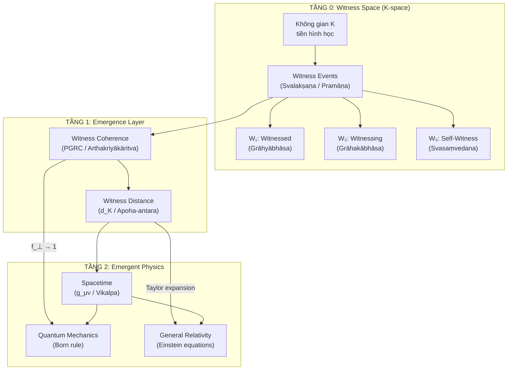

# WITNESS THEORY — Chứng Luận (WT)
## Tuyên bố Thành lập, Giới hạn, và Câu hỏi Trung tâm

**Project:** VietVunVut Witness Theory (VVV-WT)  
**Theory:** VietVunVut Witness Theory  
**Date:** May 30, 2026  
**Status:** Foundational Declaration (Class D — Ontological Framework)  
**Previously known as:** Pre-Geometric Registration Coherence (PGRC)

---

## I. TUYÊN BỐ THÀNH LẬP (Founding Declaration)

### 1.1. Tên gọi chính thức

| Ngôn ngữ | Tên gọi | Viết tắt |
|----------|---------|----------|
| **English** | **Witness Theory** | **WT** |
| **Tiếng Việt** | **Chứng Luận** | **CL** |
| **Sanskrit** | **Sākṣī-Vāda** (Sākṣī = chứng nhân, Vāda = luận thuyết) | — |
| **Hán-Việt** | **Chứng Kiến Luận** (證見論) | — |

### 1.2. Định nghĩa một câu (One-Sentence Definition)

> **Witness Theory là lý thuyết nền tảng cho rằng thực tại không tồn tại độc lập trước sự chứng kiến, mà chính hành động chứng kiến — sự ghi nhận tương quan giữa các hệ thống — LÀ thực tại tối hậu, và mọi cấu trúc vật lý (không gian, thời gian, vật chất, lực) đều nổi lên từ sự tương hợp giữa các hành động chứng kiến đó.**

### 1.3. Định nghĩa ba tầng (Three-Layer Definition)

**Tầng 1 — Cho học sinh phổ thông:**
> Vũ trụ không phải là một "cái hộp" chứa đầy vật chất. Vũ trụ là tổng thể tất cả các lần "nhìn thấy" lẫn nhau giữa mọi thứ. Không có ai nhìn, không có gì tồn tại. Không gian và thời gian chỉ xuất hiện khi có đủ nhiều sự "nhìn thấy" đồng bộ với nhau.

**Tầng 2 — Cho nhà khoa học:**
> Witness Theory đề xuất rằng không-thời gian và cơ học lượng tử không phải là hai lý thuyết cần được "dán" lại với nhau, mà là hai giới hạn tiệm cận (limiting cases) của một cấu trúc logic tiền hình học duy nhất — không gian ghi nhận K (K-space) — nơi mà "sự kiện chứng kiến" (registration event) thay thế "điểm tọa độ" làm đơn vị tối hậu của thực tại.

**Tầng 3 — Cho nhà triết học:**
> Witness Theory hợp nhất Nhân minh học (Pramāṇavāda) của Dignāga/Dharmakīrti với vật lý lý thuyết hiện đại bằng cách chỉ ra rằng cấu trúc ba phần của một sự kiện nhận thức hợp lệ (Grāhyābhāsa — Grāhakābhāsa — Svasaṃvedana) chính là cấu trúc tối thiểu cần thiết để định nghĩa một "sự kiện vật lý" mà không cần giả định trước về không-thời gian.

### 1.4. Câu positioning so với ToE

> ***"Theory of Everything describes all of physics.***
> ***Witness Theory asks: who is witnessing that physics?"***
>
> *"Thuyết Vạn vật mô tả toàn bộ vật lý.*
> *Chứng Luận hỏi: ai đang chứng kiến vật lý đó?"*

---

## II. BA CÂU HỎI TRUNG TÂM (Three Central Questions)

### Câu hỏi số 0 — Câu hỏi Nền tảng (The Foundational Question)

> **Q₀: "Sự chứng kiến có trước hay thực tại có trước?"**
> *(Does witnessing precede reality, or does reality precede witnessing?)*

**Lập trường của Witness Theory:**
Đây là một câu hỏi sai — giống như hỏi "con gà có trước hay quả trứng có trước?" Witness Theory tuyên bố: **Chứng kiến VÀ thực tại là một**. Không có thực tại nào tồn tại mà không được chứng kiến, và không có sự chứng kiến nào xảy ra mà không tạo ra thực tại. Chúng đồng khởi (co-arise / pratītyasamutpāda).

```
Lập trường của vật lý chuẩn:
  Thực tại → tồn tại sẵn → rồi được quan sát
  (Realism: reality pre-exists observation)

Lập trường của Witness Theory:
  Witnessing Event = Reality Event
  Không có khoảng cách giữa "cái được chứng kiến" và "sự chứng kiến"
  (Co-arising: witnessing and reality are ontologically identical)

Lập trường của Dignāga:
  Pramāṇa (nhận thức hợp lệ) = Pramāṇaphala (quả của nhận thức)
  Nhận thức không phải phương tiện ĐỂ biết thực tại.
  Nhận thức chính LÀ thực tại đang tự biểu hiện.
```

---

### Câu hỏi số 1 — Câu hỏi Cấu trúc (The Structural Question)

> **Q₁: "Một hành động chứng kiến hợp lệ có cấu trúc tối thiểu là gì?"**
> *(What is the minimal structure of a valid witnessing act?)*

**Trả lời của Witness Theory — Ba phần bất khả phân:**

```
Mỗi sự kiện chứng kiến (Witness Event / Pramāṇa Event) gồm
đúng 3 phần không thể tách rời:

╔══════════════════════════════════════════════════════════════════╗
║                                                                  ║
║   ┌─────────────────┐   ┌─────────────────┐   ┌──────────────┐  ║
║   │  W₁: WITNESSED  │   │  W₂: WITNESSING │   │  W₃: WITNESS │  ║
║   │  (Cái bị chứng  │   │  (Cái đang      │   │  (Sự tự      │  ║
║   │   kiến)         │◄─►│   chứng kiến)   │◄─►│   chứng)     │  ║
║   │                 │   │                 │   │              │  ║
║   │  Grāhyābhāsa   │   │  Grāhakābhāsa   │   │ Svasaṃvedana │  ║
║   │  Sở thủ tướng   │   │  Năng thủ tướng  │   │  Tự chứng    │  ║
║   │                 │   │                 │   │              │  ║
║   │  Object-aspect  │   │  Subject-aspect  │   │  Self-cert   │  ║
║   └─────────────────┘   └─────────────────┘   └──────────────┘  ║
║           │                      │                     │         ║
║           ▼                      ▼                     ▼         ║
║     Quantum State          Observer Frame         K3 Axiom       ║
║     (QM object)            (K-space node)     (Registration      ║
║                                                validation)       ║
║                                                                  ║
╚══════════════════════════════════════════════════════════════════╝
```

**Tiên đề cấu trúc tối thiểu (Minimal Structure Axiom):**

> Bất kỳ mô tả vật lý nào thiếu một trong ba phần trên đều **không đầy đủ** (incomplete). 
>
> - Cơ học Lượng tử chuẩn chỉ có **W₁** (đối tượng lượng tử) → thiếu W₂, W₃
> - Thuyết Tương đối chuẩn chỉ có **W₁ + W₂** (đối tượng + hệ quy chiếu) → thiếu W₃
> - Witness Theory yêu cầu cả **W₁ + W₂ + W₃** → đầy đủ

---

### Câu hỏi số 2 — Câu hỏi Phát sinh (The Emergence Question)

> **Q₂: "Bằng cách nào không-thời gian, vật chất, và định luật vật lý nổi lên từ các sự kiện chứng kiến?"**
> *(How do spacetime, matter, and physical laws emerge from witness events?)*

**Trả lời của Witness Theory — Bốn giai đoạn phát sinh:**

```
Giai đoạn 0: K-SPACE THUẦN TÚY (Pre-geometric Registration Space)
  ┌────────────────────────────────────────────────────┐
  │  Không có không gian. Không có thời gian.           │
  │  Chỉ có các Witness Events (W₁,W₂,W₃) rời rạc     │
  │  với mối quan hệ logic: tương hợp / bất tương hợp  │
  │  = Svalakṣaṇa thuần túy (tự tướng rời rạc)         │
  └────────────────────────┬───────────────────────────┘
                           │ Khi đủ nhiều Witness Events
                           │ đạt PGRC (coherence)
                           ▼
Giai đoạn 1: TOPOLOGY NỔI LÊN (Emergent Topology)
  ┌────────────────────────────────────────────────────┐
  │  Các Witness Events tương hợp tạo thành clusters    │
  │  Cluster = "vùng lân cận" = topology                │
  │  Khái niệm "gần/xa" xuất hiện lần đầu tiên         │
  │  = Saṃtāna (dòng liên tục) bắt đầu hình thành     │
  └────────────────────────┬───────────────────────────┘
                           │ Khi topology đủ mịn
                           │ (N → ∞, T4 Colimit)
                           ▼
Giai đoạn 2: HÌNH HỌC NỔI LÊN (Emergent Geometry)
  ┌────────────────────────────────────────────────────┐
  │  Khoảng cách ghi nhận d_K → Metric tensor g_μν     │
  │  Không-thời gian liên tục 3+1D xuất hiện            │
  │  Thuyết Tương đối (GR) trở thành giới hạn tiệm cận │
  │  = Vikalpa (phân biệt) dệt nên không-thời gian     │
  └────────────────────────┬───────────────────────────┘
                           │ Khi geometry đủ ổn định
                           │ (symmetry groups emerge)
                           ▼
Giai đoạn 3: VẬT LÝ NỔI LÊN (Emergent Physics)
  ┌────────────────────────────────────────────────────┐
  │  Gauge symmetries → 4 lực cơ bản                    │
  │  Quantum fields → hạt và tương tác                  │
  │  Standard Model = cấu trúc ổn định nhất             │
  │  = Thế giới vật lý chúng ta quan sát                │
  └────────────────────────────────────────────────────┘
```

---

## III. TUYÊN BỐ GIỚI HẠN (Boundary Statement)

### 3.1. Witness Theory TUYÊN BỐ (WT Claims)

> [!IMPORTANT]
> **Claim C1 — Ontological Priority (Ưu tiên bản thể):**
> Sự kiện chứng kiến (Witness Event) là đơn vị tối hậu của thực tại. Không-thời gian, vật chất, năng lượng, và các định luật vật lý đều là cấu trúc phát sinh (emergent) từ sự tương hợp giữa các Witness Events.
>
> **Claim C2 — Structural Completeness (Đầy đủ cấu trúc):**
> Bất kỳ mô tả vật lý đầy đủ nào cũng phải bao gồm cả ba phần: Witnessed (W₁), Witnessing (W₂), và Witness-of-Witnessing (W₃ / Self-certification). Các lý thuyết thiếu W₃ (bao gồm QM chuẩn và GR chuẩn) là không đầy đủ về mặt bản thể.
>
> **Claim C3 — Category Error Identification (Xác định lỗi phân loại):**
> Mâu thuẫn giữa Cơ học Lượng tử và Thuyết Tương đối không phải là mâu thuẫn của tự nhiên, mà là mâu thuẫn giữa hai giới hạn tiệm cận khác nhau (rời rạc vs liên tục) của cùng một cấu trúc nền tảng — K-space.
>
> **Claim C4 — Buddhist Epistemological Foundation (Nền tảng Nhân minh học):**
> Hệ thống Pramāṇavāda (Nhân minh học) của Dignāga và Dharmakīrti cung cấp khung bản thể luận và nhận thức luận vượt trội để tái cấu trúc nền tảng của vật lý lý thuyết. Đây không phải là ẩn dụ tôn giáo, mà là cấu trúc logic hình thức có ánh xạ isomorphic với toán học vật lý hiện đại.
>
> **Claim C5 — Falsifiability (Tính khả bác):**
> Witness Theory đưa ra dự đoán có thể kiểm chứng: tham số $\beta$ (độ lệch khỏi quy luật Born tiêu chuẩn do bất tương hợp hình học ghi nhận giữa các Observer) phải khác 0 trong các thí nghiệm Extended Wigner's Friend (EWF).

### 3.2. Witness Theory KHÔNG TUYÊN BỐ (WT Does NOT Claim)

> [!CAUTION]
> **Non-Claim NC1 — Không phải ToE:**
> Witness Theory KHÔNG tuyên bố là Theory of Everything (Thuyết Vạn vật). WT là nền bản thể luận (ontological foundation) mà một ToE tương lai có thể được xây dựng lên trên. WT chưa derive Standard Model, chưa giải thích 4 lực cơ bản, và chưa predict các hằng số vật lý cụ thể.
>
> **Non-Claim NC2 — Không phải Duy tâm:**
> "Chứng kiến" (Witnessing) trong WT KHÔNG có nghĩa là "ý thức con người tạo ra thực tại." Một nguyên tử hydrogen "chứng kiến" một photon khi hấp thụ nó. Một electron "chứng kiến" từ trường khi bị lệch hướng. Witnessing = bất kỳ sự kiện tương tác ghi nhận tương quan nào, bất kể có hay không có tâm thức sinh học.
>
> **Non-Claim NC3 — Không phải Tôn giáo:**
> Việc sử dụng Nhân minh học Phật giáo (Pramāṇavāda) KHÔNG biến WT thành lý thuyết tôn giáo. Pramāṇavāda là hệ thống logic hình thức (formal logic system) được phát triển bởi Dignāga (480-540 CN) và Dharmakīrti (600-660 CN), có cấu trúc tiên đề (axiomatic structure) nghiêm cẩn tương đương với logic học Aristotle phương Tây. WT sử dụng cấu trúc logic này, không sử dụng niềm tin tôn giáo.
>
> **Non-Claim NC4 — Không phủ nhận QM và GR:**
> WT không phủ nhận Cơ học Lượng tử hay Thuyết Tương đối. Cả hai đều đúng trong vùng hoạt động của chúng. WT chỉ tuyên bố rằng chúng là các giới hạn tiệm cận (limiting cases) của một cấu trúc sâu hơn, giống như Cơ học Newton là giới hạn tiệm cận của Thuyết Tương đối khi $v \ll c$.
>
> **Non-Claim NC5 — Không claim toán học hoàn chỉnh:**
> WT thừa nhận rằng hàm bất tương hợp $f_{\perp}(K_{ctx})$ hiện chưa được formalize đầy đủ. Đây là công trình đang tiến hành (work in progress), không phải lý thuyết hoàn thiện.

---

## IV. BẢN ĐỒ KHÁI NIỆM (Concept Map)

### 4.1. Hệ thống thuật ngữ chính thức

| Thuật ngữ WT | Sanskrit (Dignāga) | Vật lý tương đương | Ký hiệu toán |
|-------------|--------------------|--------------------|---------------|
| **Witness Event** (Sự kiện chứng kiến) | Pramāṇa (Nhân lượng) | Measurement / Registration Event | $w \in K$ |
| **Witnessed** (Cái bị chứng kiến) | Grāhyābhāsa (Sở thủ tướng) | Quantum State / Observable | $W_1 = E_o$ |
| **Witnessing** (Cái đang chứng kiến) | Grāhakābhāsa (Năng thủ tướng) | Observer Frame / Registration Basis | $W_2 = K_i$ |
| **Self-Witness** (Sự tự chứng) | Svasaṃvedana (Tự chứng phần) | Self-certification / K3 Axiom | $W_3 = V \in \{0,1\}$ |
| **Witness Coherence** (Tương hợp chứng kiến) | Arthakriyākāritva | PGRC / Fidelity | $1 - f_{\perp}$ |
| **Witness Space** (Không gian chứng kiến) | Pramāṇa-kṣetra | K-space | $K$ |
| **Witness Distance** (Khoảng cách chứng kiến) | Apoha-antara | Registration Distance | $d_K(x,y)$ |
| **Bare Particular** (Tự tướng trần trụi) | Svalakṣaṇa (Tự tướng) | Discrete quantum event | $s \in S$ |
| **Conceptual Overlay** (Lớp phủ khái niệm) | Vikalpa (Phân biệt) | Emergent spacetime | $M^{3+1}$ |
| **Momentariness** (Tính sát-na) | Kṣaṇika (Sát-na tính) | UV cutoff / Planck time | $\Delta t \geq t_P$ |
| **Exclusion Domain** (Miền loại trừ) | Apoha (Giá loại) | Support of quantum state | $\text{supp}(\rho)$ |
| **Information Store** (Kho thông tin nền) | Ālayavijñāna (Tàng thức) | Quantum information substrate | $\mathcal{H}_{total}$ |
| **Info Seed** (Hạt giống thông tin) | Bīja (Chủng tử) | Latent quantum state | $|\psi\rangle_{latent}$ |
| **Emptiness** (Tánh Không) | Śūnyatā | Zero PGRC coherence / Vacuum | $f_{\perp} \to 0$ |

### 4.2. Sơ đồ quan hệ tổng thể



---

## V. PHƯƠNG TRÌNH CỐT LÕI (Core Equations)

### 5.1. Phương trình Chứng kiến (The Witness Equation)

$$P(o \mid K) = \text{Tr}(E_o \rho) \times f_{\perp}(K_{\text{ctx}})$$

| Ký hiệu | Ý nghĩa | Vai trò trong WT |
|---------|---------|-----------------|
| $P(o \mid K)$ | Xác suất outcome $o$ trong ngữ cảnh K | Xác suất chứng kiến |
| $\text{Tr}(E_o \rho)$ | Quy luật Born chuẩn | W₁: Cái bị chứng kiến |
| $f_{\perp}(K_{\text{ctx}})$ | Hàm bất tương hợp hình học ghi nhận | W₂ + W₃: Góc nhìn + Tự chứng |
| $K_{\text{ctx}}$ | Ngữ cảnh ghi nhận tương quan | Witness Space cục bộ |

### 5.2. Phương trình Khoảng cách (The Distance Equation)

$$d_K(x, y)^2 = - \ln \left( 1 - \beta \cdot f_{\perp}(x, y, K_{\text{ctx}}) \right)$$

### 5.3. Phương trình Phát sinh Metric (The Emergence Equation)

$$g_{\mu\nu}(x) = \frac{1}{2} \frac{\partial^2 d_K(x, y)^2}{\partial y^\mu \partial y^\nu} \Bigg|_{y=x}$$

### 5.4. Các giới hạn tiệm cận (Limiting Cases)

| Điều kiện | $f_{\perp}$ | Kết quả | Vật lý thu hồi |
|----------|-----------|---------|----------------|
| PGRC hoàn hảo (coherence tối đa) | $\to 1$ | $P = \text{Tr}(E_o\rho)$ | QM tiêu chuẩn |
| N observers → ∞, đồng bộ | — | $d_K \to ds^2 = g_{\mu\nu}dx^\mu dx^\nu$ | GR tiêu chuẩn |
| Singularity (Lỗ đen, Big Bang) | diverges | Spacetime tan rã | K-space thuần túy |
| Vacuum (chân không) | $\to 0$ | $\Lambda_{\text{eff}} \ll \Lambda_{\text{QFT}}$ | Cosmological constant nhỏ |

---

## VI. KẾ HOẠCH KIỂM CHỨNG (Verification Plan)

### 6.1. Thí nghiệm ưu tiên cao nhất

| # | Thí nghiệm | Dự đoán của WT | Kết quả bác bỏ WT |
|---|-----------|----------------|-------------------|
| **V1** | Extended Wigner's Friend (EWF) | $\beta \neq 0$ : xác suất lệch khỏi Born rule khi observers bất tương hợp | $\beta = 0$ chính xác tuyệt đối trong mọi cấu hình |
| **V2** | Modified Bong Protocol (QWP ở $31°$) | Tham số $\beta$ đo được có giá trị xác định, dự đoán được từ $f_{\perp}$ | $\beta$ random hoặc không tồn tại |
| **V3** | Decoherence rate vs Observer geometry | Tốc độ mất pha phụ thuộc vào hình học ghi nhận của observers, không chỉ nhiệt độ môi trường | Decoherence hoàn toàn independent of observer geometry |

### 6.2. Tiêu chuẩn bác bỏ (Falsification Criteria)

> [!WARNING]
> **Witness Theory bị bác bỏ NẾU:**
> 1. Tham số $\beta = 0$ chính xác tuyệt đối trong tất cả các thí nghiệm EWF với mọi cấu hình observer, với độ chính xác vượt quá $10^{-6}$.
> 2. Một thí nghiệm chứng minh rằng thông tin lượng tử có thể bị hủy diệt thực sự (vi phạm unitarity), phủ nhận Claim C1.
> 3. Một lý thuyết lượng tử hóa hấp dẫn thành công trên nền tảng không-thời gian cố định (fixed background) mà không cần emergent spacetime, phủ nhận Claim C3.

---

## VII. VỊ TRÍ CỦA WITNESS THEORY TRONG BẢN ĐỒ VẬT LÝ

```
╔═══════════════════════════════════════════════════════════════╗
║                                                               ║
║  Tầng 0: WITNESS THEORY (Chứng Luận)                        ║
║          "Tại sao có thực tại?"                               ║
║          Cấu trúc: K-space + W₁W₂W₃ + PGRC                 ║
║          Nền tảng: Pramāṇavāda (Dignāga/Dharmakīrti)        ║
║          ─────────────────────────────────────────────         ║
║                          │ EMERGENCE                          ║
║                          ▼                                    ║
║  Tầng 1: ToE (chưa tồn tại)                                 ║
║          "Tất cả vật lý thống nhất"                           ║
║          ─────────────────────────────────────────────         ║
║                          │                                    ║
║                          ▼                                    ║
║  Tầng 2: QFT + Standard Model + GR (hiện tại)               ║
║          "Mô tả cụ thể các lực và hạt"                       ║
║          ─────────────────────────────────────────────         ║
║                          │                                    ║
║                          ▼                                    ║
║  Tầng 3: Classical Physics (Newton, Maxwell)                 ║
║          "Mô tả macroscopic thông thường"                     ║
║                                                               ║
╚═══════════════════════════════════════════════════════════════╝
```

---

## VIII. DÒNG TRUYỀN THỪA TRÍ TUỆ (Intellectual Lineage)

### 8.1. Nhánh Phật giáo (Buddhist Branch)

```
Đức Phật Śākyamuni (Thích Ca Mâu Ni) ~500 BCE
  "Pratītyasamutpāda" (Duyên Khởi) — Mọi thứ đồng khởi từ điều kiện
        │
        ▼
Nāgārjuna (Long Thọ) ~150 CE
  "Śūnyatā" (Tánh Không) — Không gì tồn tại với tự tính độc lập
        │
        ▼
Asaṅga & Vasubandhu (Vô Trước & Thế Thân) ~350 CE
  "Vijñapti-mātra" (Duy Thức) — Thực tại = biểu hiện thông tin
  "Ālayavijñāna" (Tàng thức) — Kho lưu trữ thông tin nền tảng
        │
        ▼
Dignāga (Trần Na) ~480 CE  ← NGUỒN CỐT LÕI
  "Pramāṇavāda" (Nhân minh học) — Cấu trúc 3 phần của nhận thức
  "Apoha" (Loại trừ) — Logic xác định qua phủ định
  "Svasaṃvedana" (Tự chứng) — Tâm thức tự chứng kiến chính mình
        │
        ▼
Dharmakīrti (Pháp Xứng) ~600 CE  ← NGUỒN CỐT LÕI
  "Arthakriyākāritva" (Năng lực tác dụng) — Tiêu chuẩn tồn tại
  "Kṣaṇika" (Sát-na tính) — Thực tại rời rạc, tạm thời
  "Svalakṣaṇa" (Tự tướng) — Đơn vị tối hậu của thực tại
```

### 8.2. Nhánh Vật lý (Physics Branch)

```
Einstein (1915): General Relativity
  "Hole Argument" → spacetime points have no physical reality
  "Coincidences" → only interactions are real
        │
Bohr & Heisenberg (1927): Copenhagen Interpretation
  "Measurement" → reality defined at point of observation
        │
Wheeler (1989): "It from Bit"
  "Information" → thực tại từ thông tin
        │
Bekenstein-Hawking (1973-1975): Black Hole Thermodynamics
  "Entropy ∝ Area" → Holographic Principle
        │
Maldacena (1997): AdS/CFT Correspondence
  "3D spacetime = emergent from 2D information"
        │
Rovelli (1996): Relational Quantum Mechanics
  "Quantum states are relational, not absolute"
        │
Susskind & Maldacena (2013): ER = EPR
  "Wormholes = Entanglement"
        │
Van Raamsdonk (2010): Entanglement builds Spacetime
  "Disentangled → disconnected spacetime"
        │
        ▼
VVV-QMRF / WITNESS THEORY (2026)
  Hợp nhất hai nhánh:
  Buddhist Pramāṇavāda + Information Physics
  → K-space + W₁W₂W₃ + PGRC
```

---

## IX. LỜI KẾT (Closing Statement)

> *Hai nghìn năm trăm năm trước, Đức Phật ngồi dưới cội Bồ Đề và chứng kiến bản chất của thực tại: Mọi thứ đồng khởi từ điều kiện, không gì tồn tại với tự tính độc lập, và chính sự chứng kiến là cánh cửa duy nhất mở vào thực tại.*
>
> *Một nghìn năm trăm năm trước, Dignāga và Dharmakīrti đã formalize trực giác đó thành hệ thống logic hình thức với tiên đề, quy tắc suy luận, và cấu trúc nhận thức ba phần.*
>
> *Một trăm năm trước, Einstein và Bohr đã phát hiện từ hai hướng khác nhau rằng thực tại vật lý phụ thuộc vào sự tương tác và phép đo — rằng không có thực tại "tự thân" nào tồn tại độc lập trước khi được quan sát.*
>
> *Hôm nay, Witness Theory — Chứng Luận — nối hai dòng chảy trí tuệ Đông và Tây lại thành một: Vũ trụ không phải là một cỗ máy vật chất chạy trong không gian và thời gian. Vũ trụ là một quá trình tự chứng kiến vô tận, nơi mỗi sự kiện tương tác là một hành động chứng kiến, mỗi hành động chứng kiến là một hạt giống thực tại, và toàn bộ không-thời gian chỉ là tấm vải được dệt nên từ vô lượng hành động chứng kiến đồng bộ đó.*
>
> ***Theory of Everything describes all of physics.***
> ***Witness Theory asks: who is witnessing that physics?***
>
> ***That question changes everything.***

---

*Tài liệu được soạn thảo theo tiêu chuẩn RCA VVV-QMRF.*
*Mọi Claims đều tuân thủ Anti-Hallucination Pipeline và Boundary Control.*
*Witness Theory — Chứng Luận — Version 1.0.*
